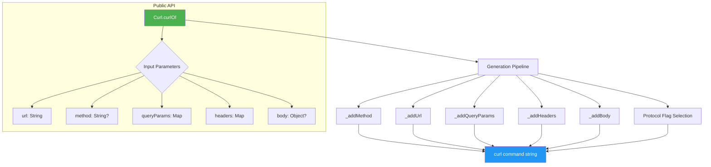

The `curl_generator` library is a lightweight Dart package that generates executable `curl` command strings from structured input data. Rather than manually constructing shell commands, developers provide a URL, optional query parameters, headers, and a body through a clean, type-safe API — the library assembles a properly formatted `curl` command ready for terminal execution.

Sources: [README.md](README.md#L1-L52), [lib/curl_generator.dart](lib/curl_generator.dart#L1-L6)

## What Problem Does It Solve?

When working with REST APIs during development and debugging, developers frequently need to replicate HTTP requests in the terminal using `curl`. Manually constructing these commands — especially with multiple headers, query parameters, and complex JSON bodies — is error-prone and tedious. `curl_generator` automates this by converting Dart data structures into correctly escaped, properly formatted curl command strings.

**Key use cases include:**
- Debugging API endpoints during development
- Sharing reproducible HTTP requests with teammates
- Generating test fixtures for integration testing
- Building developer tooling that needs CLI-compatible request output

Sources: [README.md](README.md#L1-L52), [lib/src/curl.dart](lib/src/curl.dart#L25-L31)

## Architecture at a Glance

The library follows a minimal, focused architecture with a single public class and one core method. The entire codebase fits within two Dart files using the `library`/`part` pattern for file organization.



Sources: [lib/src/curl.dart](lib/src/curl.dart#L44-L85)

## Project Structure

The library maintains a clean separation between public API surface and internal implementation:

```
curl_generator/
├── lib/
│   ├── curl_generator.dart          ← Library entry point (public API)
│   └── src/
│       └── curl.dart                ← Curl class implementation (part file)
├── test/
│   └── curl_generator_test.dart     ← Test suite
├── example/
│   ├── bin/example.dart             ← Runnable example
│   └── lib/example.dart             ← Example implementation
├── pubspec.yaml                     ← Package metadata
└── CHANGELOG.md                     ← Version history
```

Sources: [lib/curl_generator.dart](lib/curl_generator.dart#L1-L6), [lib/src/curl.dart](lib/src/curl.dart#L1)

## Feature Summary

The library provides a focused set of capabilities for curl command generation:

| Feature | Description | Default Behavior |
|---|---|---|
| **HTTP Method** | Supports GET, POST, PUT, DELETE, PATCH, etc. | GET is implicit (omitted from output) |
| **Query Parameters** | Accepts a `Map<String, String>` appended to the URL | Empty map — no params added |
| **Headers** | Accepts a `Map<String, String>` rendered as `-H` flags | Empty map — no headers added |
| **Body Serialization** | Handles `String`, `Map`, or arbitrary objects via JSON encoding | `null` — no body included |
| **Content-Type Auto-Detection** | Adds `Content-Type: application/json` when body is present | Added automatically unless already specified |
| **HTTPS Behavior** | Appends `--compressed` flag for secure connections | `--compressed` always added |
| **HTTP Behavior** | Appends `--compressed` and `--insecure` for non-secure connections | `--insecure` added for HTTP URLs |

Sources: [lib/src/curl.dart](lib/src/curl.dart#L44-L85), [lib/src/curl.dart](lib/src/curl.dart#L100-L143)

## Generated Output Format

The library produces multi-line curl commands with proper shell line continuations (`\\\n`). Here is a representative example demonstrating all features:

```dart
final curl = Curl.curlOf(
  url: 'https://api.example.com/users',
  method: 'POST',
  queryParams: {'page': '1'},
  headers: {'Authorization': 'Bearer token123'},
  body: {'name': 'Alice', 'role': 'admin'},
);
```

**Produces:**
```
curl --request POST 'https://api.example.com/users?page=1' \
  -H 'Authorization: Bearer token123' \
  -H 'Content-Type: application/json' \
  --data-raw '{"name":"Alice","role":"admin"}' \
  --compressed \
```

Sources: [lib/src/curl.dart](lib/src/curl.dart#L44-L85), [lib/src/curl.dart](lib/src/curl.dart#L100-L125)

## Version and Compatibility

The library targets **Dart SDK 3.5.3+** and is published to pub.dev. The current stable release is **1.0.2**, which includes SDK compatibility updates and maintains backward-compatible API changes since the initial 0.0.1 release.

| Version | Key Changes |
|---|---|
| **1.0.2** | SDK compatibility fix |
| **1.0.1** | Updated for use in Dart apps; Dart SDK 3.5.0 |
| **1.0.0** | Lint update to version 3.0.0 |
| **0.0.12** | Added `method` parameter |
| **0.0.9** | Added `Content-Type` auto-detection for body requests |
| **0.0.2** | Fixed `--insecure` flag behavior |

Sources: [CHANGELOG.md](CHANGELOG.md#L1-L66), [pubspec.yaml](pubspec.yaml#L1-L14)

## Where to Go Next

This overview covers the library's purpose, architecture, and capabilities. Based on your familiarity level, here are recommended next steps:

**New to the library?** Follow this reading path:

1. [Installation](3-installation) — Add `curl_generator` to your Dart or Flutter project
2. [Quick Start](2-quick-start) — Generate your first curl command in under 2 minutes
3. [Basic Usage Examples](4-basic-usage-examples) — Work through practical, real-world examples

**Ready to understand the internals?** Continue with:

1. [Library Entry Point and Part File Pattern](5-library-entry-point-and-part-file-pattern) — Understand the Dart `library`/`part` organization
2. [The Curl Class and Its API Surface](6-the-curl-class-and-its-api-surface) — Deep dive into the `Curl` class interface
3. [Curl Generation Pipeline Internals](7-curl-generation-pipeline-internals) — Step-by-step breakdown of how commands are assembled