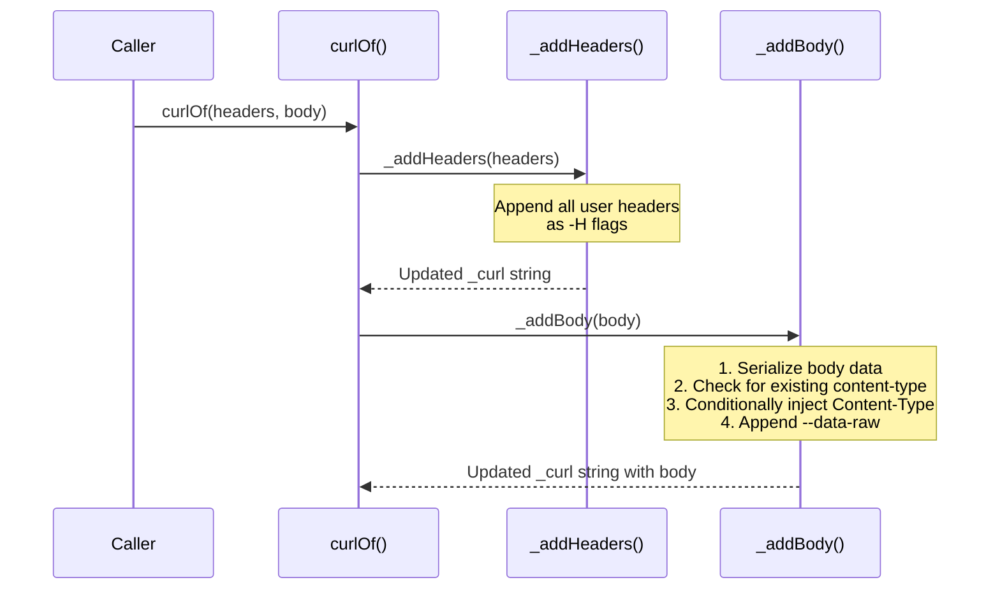

This page explains how the `curl_generator` library handles HTTP headers and automatically detects when to add a `Content-Type` header based on request body characteristics. The library provides a systematic approach to header formatting while implementing intelligent heuristics to avoid duplicate Content-Type declarations.

## Header Input Format and Processing

Headers are accepted as a `Map<String, String>` parameter through the `headers` named argument of `Curl.curlOf`. The library processes each header entry sequentially, formatting them into curl's `-H` flag syntax with consistent indentation and proper shell line continuations.

```dart
final curl = Curl.curlOf(
  url: 'https://api.example.com/users',
  headers: {
    'Accept': 'application/json',
    'Authorization': 'Bearer token123',
    'X-Custom-Header': 'value',
  },
);
```

The `_addHeaders` method iterates over every entry in the provided map and appends each as a separate `-H` flag. Each header is enclosed in single quotes, with the key and value separated by a colon and space. The method ensures that every header appears on its own line with proper backslash continuation, maintaining readability for multi-line curl commands.

Sources: [lib/src/curl.dart#L95-L100](lib/src/curl.dart#L95-L100)

| Aspect | Behavior |
|--------|----------|
| **Input type** | `Map<String, String>` (const by default) |
| **Empty map** | No headers appended; no formatting changes |
| **Single header** | One `-H` line appended after the URL |
| **Multiple headers** | Each on its own line, preserving insertion order |
| **Quote style** | Single quotes around the full `Key: Value` pair |
| **Indentation** | Two-space indent before `-H` flag |

Sources: [test/curl_generator_test.dart#L51-L65](test/curl_generator_test.dart#L51-L65)

## Content-Type Auto-Detection Algorithm

The most sophisticated aspect of the header system is the automatic `Content-Type` detection that occurs during body serialization. Rather than always injecting a Content-Type header, the library applies a multi-step decision algorithm inside `_addBody`.

### Decision Flow

```mermaid
flowchart TD
    A[Body provided?] -->|No| B[Skip Content-Type entirely]
    A -->|Yes| C{Is body a non-empty type?}
    C -->|Empty String or Empty Map| B
    C -->|Non-empty String| D{Does string look like JSON?}
    C -->|Map or Object| E[Always add Content-Type: application/json]
    D -->|Starts with \{ or \[| F[Add Content-Type: application/json]
    D -->|Other string content| G[Skip Content-Type — let user decide]
    F --> H{Already has Content-Type in headers?}
    E --> H
    G --> H
    H -->|Yes| I[Use user-provided Content-Type]
    H -->|No| J[Insert auto-detected Content-Type]
```

Sources: [lib/src/curl.dart#L108-L141](lib/src/curl.dart#L108-L141)

### Three Detection Categories

The algorithm classifies the body into three categories, each with distinct Content-Type behavior:

| Body Type | Example | Auto-Detect Content-Type? | Rationale |
|-----------|---------|--------------------------|-----------|
| **Map / Object** | `{'key': 'value'}` | ✅ Always `application/json` | Objects are always JSON-encoded internally |
| **String starting with `{` or `[` | `'{"key":"value"}'` | ✅ `application/json` | Heuristic: resembles serialized JSON |
| **Plain String** | `'raw data'` or `'form=field'` | ❌ No auto-detection | Could be any format — preserve user control |

Sources: [lib/src/curl.dart#L132-L138](lib/src/curl.dart#L132-L138)

### Duplicate Prevention Mechanism

Before inserting an auto-detected Content-Type header, the algorithm checks whether one already exists. This check is **case-insensitive**, using `toLowerCase()` on the entire curl string to detect any variation of the `content-type` key — including `Content-Type`, `content-type`, `CONTENT-TYPE`, or any mixed-case variant.

```dart
if (!_curl.toLowerCase().contains('content-type')) {
  // Only add auto-detected Content-Type if none exists
}
```

This means that if a user explicitly provides a Content-Type header (at any casing), the auto-detection logic respects it and does not add a duplicate. This is critical for scenarios like `multipart/form-data`, `text/plain`, or `application/x-www-form-urlencoded` requests where JSON Content-Type would be incorrect.

Sources: [lib/src/curl.dart#L132](lib/src/curl.dart#L132)

Sources: [test/curl_generator_test.dart#L165-L197](test/curl_generator_test.dart#L165-L197)

## Header Ordering in Generated Output

The order in which headers appear in the generated curl command follows a deterministic sequence: user-provided headers appear first (in insertion order), followed by the auto-detected Content-Type (if applicable), followed by the body data.

```
curl 'https://api.example.com/users' \
  -H 'Accept: application/json' \          ← user-provided
  -H 'Authorization: Bearer token123' \    ← user-provided
  -H 'Content-Type: application/json' \    ← auto-detected
  --data-raw '{"name":"Alice"}' \
  --compressed \
  --insecure
```

Sources: [test/curl_generator_test.dart#L103-L134](test/curl_generator_test.dart#L103-L134)

This ordering guarantees that the auto-detected Content-Type never shadows a user-provided one, because the case-insensitive check scans the **entire accumulated curl string** before deciding whether to insert.

## Edge Cases and Test Coverage

The test suite validates several important edge cases to ensure header management behaves predictably:

| Test Scenario | Expected Behavior | Test Reference |
|---------------|-------------------|----------------|
| No headers, no body | No `-H` flags at all | [test/curl_generator_test.dart#L156-L163](test/curl_generator_test.dart#L156-L163) |
| Body present, no headers | Content-Type auto-injected for Map/String-that-looks-like-JSON | [test/curl_generator_test.dart#L145-L154](test/curl_generator_test.dart#L145-L154) |
| Content-Type provided by user | Auto-detection suppressed; user value preserved | [test/curl_generator_test.dart#L165-L180](test/curl_generator_test.dart#L165-L180) |
| Lowercase `content-Type` in headers | Still detected as duplicate; no double insertion | [test/curl_generator_test.dart#L182-L197](test/curl_generator_test.dart#L182-L197) |
| Object with non-serializable fields | JSON encoding with `toEncodable` fallback, Content-Type still added | [test/curl_generator_test.dart#L199-L216](test/curl_generator_test.dart#L199-L216) |

## Interaction with Body Serialization

Header management is tightly coupled with the body serialization pipeline. The `_addBody` method handles both content formatting **and** Content-Type decision-making in a single pass. This design means Content-Type detection is context-aware — it knows the exact body type and serialization format.



Sources: [lib/src/curl.dart#L49-L67](lib/src/curl.dart#L49-L67)

## Summary of Design Decisions

The header management system reflects several deliberate architectural choices:

1. **User precedence over automation** — User-provided Content-Type headers always take priority, preventing incorrect overrides for non-JSON content types like form data or file uploads.

2. **Case-insensitive duplicate prevention** — The `toLowerCase().contains()` approach handles all common casing conventions without requiring normalized header key storage.

3. **Heuristic string analysis** — String bodies are only assumed to be JSON if they start with `{` or `[`, a pragmatic heuristic that avoids false positives for plain text, XML, or form-encoded data.

4. **Integrated body-aware detection** — Content-Type logic lives inside `_addBody` rather than in `_addHeaders`, ensuring the detection context includes knowledge of the actual body type and serialized format.

## Next Steps

For a deeper understanding of how body serialization interacts with Content-Type detection, see [Body Serialization Strategies](11-body-serialization-strategies). To understand the full curl generation pipeline in which header management operates, refer to [Curl Generation Pipeline Internals](7-curl-generation-pipeline-internals). For HTTPS-specific behavior and the `--insecure` flag that accompanies header formatting, consult [HTTPS vs HTTP Behavior and --insecure Flag](12-https-vs-http-behavior-and-insecure-flag).