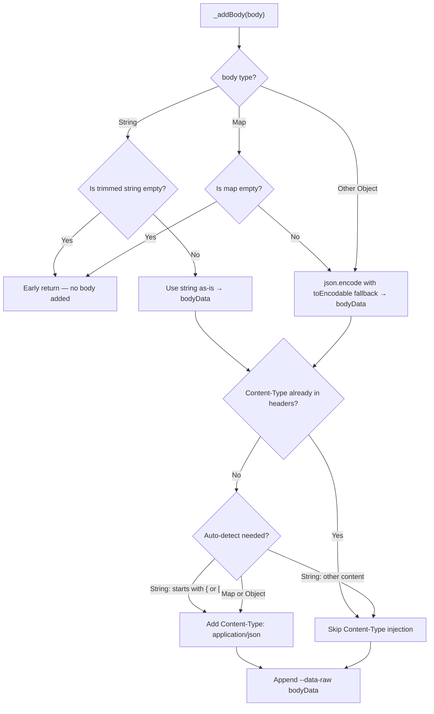

The `curl_generator` library supports multiple body types through a polymorphic serialization strategy implemented in the `_addBody()` method. This page explains how different input types are transformed into curl's `--data-raw` payload, how the library decides when to auto-inject a `Content-Type` header, and how edge cases like non-serializable objects and empty payloads are handled gracefully. Understanding these strategies is essential for generating accurate curl commands for POST, PUT, PATCH, and other request methods that carry a payload.

For related information on how Content-Type auto-detection interacts with the broader header pipeline, see [Header Management and Content-Type Auto-Detection](10-header-management-and-content-type-auto-detection). For the full generation pipeline context, see [Curl Generation Pipeline Internals](7-curl-generation-pipeline-internals).

Sources: [lib/src/curl.dart#L102-L141](lib/src/curl.dart#L102-L141)

## Body Type Detection and Serialization Flow

The `_addBody()` method accepts an `Object?` parameter and applies a three-phase strategy: **type detection**, **serialization**, and **Content-Type negotiation**. The body type determines both the serialization method and the Content-Type behavior.



Sources: [lib/src/curl.dart#L108-L141](lib/src/curl.dart#L108-L141)

The flowchart reveals a critical architectural detail: the method performs **early returns** for empty payloads before any serialization or header logic executes. This means empty strings and empty maps produce a curl command identical to one with no body at all — no `--data-raw` flag, no `Content-Type` header.

Sources: [test/curl_generator_test.dart#L156-L163](test/curl_generator_test.dart#L156-L163)

## Serialization Strategies by Input Type

The library employs three distinct serialization strategies depending on the runtime type of the `body` parameter. Each strategy trades fidelity for simplicity, reflecting the library's goal of producing human-readable curl commands rather than byte-perfect request replicas.

| Input Type | Serialization Method | Output Format | Empty Handling |
|:-----------|:--------------------:|:-------------:|:---------------|
| `String` | Passthrough (no transformation) | Raw string preserved exactly | `trim().isEmpty` → early return |
| `Map` (non-empty) | `json.encode()` with `toEncodable` fallback | Compact JSON string | N/A |
| Other Object | `json.encode()` with `toEncodable` fallback | JSON with `toString()` fallback for non-serializable fields | N/A |

### String Body: Direct Passthrough

When the body is a `String`, the library uses it verbatim — no encoding, no transformation. This is the simplest path and preserves the caller's exact intent.

```dart
// Input
Curl.curlOf(
  url: 'https://api.example.com/data',
  body: 'name=Alice&age=30',
);

// Output
// curl 'https://api.example.com/data' \
//   --data-raw 'name=Alice&age=30' \
//   --compressed \
//   --insecure
```

The empty-string guard uses `trim()` before checking emptiness, meaning a body containing only whitespace (`"   "`) is treated as empty and silently ignored. This prevents generation of a curl command with a pointless empty `--data-raw ''` flag.

Sources: [lib/src/curl.dart#L111-L117](lib/src/curl.dart#L111-L117)

### Map and Object Body: JSON Encoding

When the body is a `Map` or any other non-String object, it is serialized via `dart:convert`'s `json.encode()`. The resulting JSON is compact (no pretty-printing) and uses standard Dart JSON encoding rules.

```dart
// Input
Curl.curlOf(
  url: 'https://api.example.com/users',
  body: {'some': 'some', 'value': 'value', 'intValue': 1234},
);

// Output
// curl 'https://api.example.com/users' \
//   -H 'Content-Type: application/json' \
//   --data-raw '{"some":"some","value":"value","intValue":1234}' \
//   --compressed \
//   --insecure
```

Notice the compact JSON format — no spaces after colons, no line breaks. This matches the output of `json.encode()` without passing a `toEncodable` or using `JsonEncoder.withIndent()`.

Sources: [test/curl_generator_test.dart#L88-L101](test/curl_generator_test.dart#L88-L101)

### The `toEncodable` Fallback: Handling Non-Serializable Objects

The most nuanced aspect of the serialization strategy is the `toEncodable` callback passed to `json.encode()`:

```dart
bodyData = json.encode(
  body,
  toEncodable: (object) => object.toString(),
);
```

By default, `json.encode()` throws a `JsonUnsupportedObjectError` when it encounters an object it cannot serialize (e.g., a `DateTime`, a custom class, or even the `Curl` class itself). The `toEncodable` callback intercepts this failure and falls back to `object.toString()`, producing a string representation instead.

This is tested explicitly with the `Curl` class as a body value:

```dart
// Input — Curl class itself as a body value
Curl.curlOf(
  url: 'http://some.api.com/some/api',
  body: {
    'some': 'value',
    'test': Curl,  // Curl is a class, not serializable
  },
);

// Output
// curl 'http://some.api.com/some/api' \
//   -H 'content-Type: application/json' \
//   --data-raw '{"some":"value","test":"Curl"}' \
//   --compressed \
//   --insecure
```

The `Curl` class instance serializes to the string `"Curl"` (its `toString()` output), and the surrounding map is still valid JSON because the value is now a JSON string. This prevents runtime exceptions while producing a curl command that is at least structurally valid.

| Scenario | Without `toEncodable` | With `toEncodable` |
|:---------|:---------------------:|:------------------:|
| `{key: DateTime(2024)}` | `JsonUnsupportedObjectError` thrown | `{"key":"2024-01-01 00:00:00.000"}` |
| `{key: SomeClass()}` | `JsonUnsupportedObjectError` thrown | `{"key":"SomeClass"}` |
| `{key: Curl}` | `JsonUnsupportedObjectError` thrown | `{"key":"Curl"}` |

Sources: [lib/src/curl.dart#L122-L127](lib/src/curl.dart#L122-L127), [test/curl_generator_test.dart#L199-L216](test/curl_generator_test.dart#L199-L216)

## Content-Type Auto-Detection Logic

The Content-Type header is **not always added** — it depends on the body type and whether the caller already provided one. This three-tier decision system prevents duplicate headers while ensuring JSON payloads always have the correct Content-Type.

```mermaid
flowchart LR
    subgraph "Tier 1: Existing Header Check"
        A{"_curl contains<br/>content-type (case-insensitive)?"}
        A -->|Yes| B["Use user-provided value"]
        A -->|No| C{Proceed to Tier 2}
    end
    subgraph "Tier 2: Body Type Analysis"
        C -->|Map or Object| D["Always add<br/>application/json"]
        C -->|"String body"| E{Starts with { or [ ?}
        E -->|Yes| D
        E -->|No| F["No Content-Type added"]
    end
    subgraph "Tier 3: Header Insertion"
        D --> G["Insert before --data-raw"]
        B --> H["No insertion needed"]
        F --> H
    end
```

Sources: [lib/src/curl.dart#L129-L138](lib/src/curl.dart#L129-L138)

### The Case-Insensitive Duplicate Guard

The first check scans the accumulated `_curl` string for the substring `content-type` (lowercased). This handles all common casing conventions:

| User-Provided Header Key | Detected by `toLowerCase().contains('content-type')`? | Auto-Detection Suppressed? |
|:------------------------:|:----------------------------------------------------:|:--------------------------:|
| `Content-Type` | ✅ Yes | ✅ Yes |
| `content-type` | ✅ Yes | ✅ Yes |
| `CONTENT-TYPE` | ✅ Yes | ✅ Yes |
| `content-Type` | ✅ Yes | ✅ Yes |
| `ContentType` (no hyphen) | ❌ No | ❌ No (auto-added) |

This is a pragmatic approach — it trades strict HTTP header parsing for simplicity, relying on the fact that virtually all real-world Content-Type headers contain a hyphen.

Sources: [test/curl_generator_test.dart#L165-L197](test/curl_generator_test.dart#L165-L197)

### The JSON Heuristic for String Bodies

For String bodies, the library applies a simple heuristic: if the trimmed string starts with `{` or `[`, it is assumed to be JSON and receives an auto-detected `Content-Type: application/json` header. Any other string content — form-encoded data, XML, plain text — does not trigger Content-Type injection.

| String Body Example | Starts with `{` or `[`? | Auto Content-Type? |
|:-------------------|:-----------------------:|:-------------------:|
| `'{"name":"Alice"}'` | ✅ Yes (`{`) | ✅ `application/json` |
| `'["item1","item2"]'` | ✅ Yes (`[`) | ✅ `application/json` |
| `'name=Alice&age=30'` | ❌ No | ❌ None |
| `'<xml><data/></xml>'` | ❌ No | ❌ None |
| `'raw text body'` | ❌ No | ❌ None |

When no Content-Type is auto-detected for a plain string, the caller must provide one explicitly via the `headers` parameter if the target server requires it. This design respects the caller's authority over content negotiation for ambiguous payloads.

Sources: [lib/src/curl.dart#L132-L138](lib/src/curl.dart#L132-L138)

## The `--data-raw` Flag Choice

All body payloads are emitted using curl's `--data-raw` flag rather than `--data` or `--data-binary`. This is a deliberate and significant choice:

| Flag | Behavior | Library Choice |
|:-----|:---------|:--------------:|
| `--data` | Interprets `\n`, `\t` and other escape sequences; URL-decodes `@filename` | ❌ Not used |
| `--data-binary` | Preserves exact bytes but adds `0x00` handling | ❌ Not used |
| `--data-raw` | Sends the data exactly as provided, no escape interpretation | ✅ Used |

The `--data-raw` flag ensures that the body string is transmitted verbatim. A body containing literal `\n` characters, `@` symbols, or other escape sequences is not reinterpreted by curl. This makes `--data-raw` the safest choice for a library that generates curl commands from arbitrary string inputs.

Sources: [lib/src/curl.dart#L140](lib/src/curl.dart#L140)

## Complete Body Handling Examples

The following table demonstrates how different body inputs produce distinct curl output, illustrating the full interaction between serialization, Content-Type detection, and the `--data-raw` flag.

| Body Input | Serialization Result | Content-Type Header | `--data-raw` Value |
|:-----------|:--------------------:|:-------------------:|:------------------:|
| `{'key': 'value'}` | `{"key":"value"}` | Auto-added | `'{"key":"value"}'` |
| `'raw string'` | `"raw string"` | Not added | `'raw string'` |
| `'{"json":"string"}'` | `'{"json":"string"}'` | Auto-added | `'{"json":"string"}'` |
| `null` (omitted) | N/A | Not added | No `--data-raw` |
| `{}` (empty map) | N/A | Not added | No `--data-raw` |
| `''` (empty string) | N/A | Not added | No `--data-raw` |

Sources: [test/curl_generator_test.dart#L88-L163](test/curl_generator_test.dart#L88-L163)

## Limitations and Design Trade-offs

The body serialization strategy reflects several conscious simplifications that prioritize correctness and readability over exhaustive feature coverage:

**No URL encoding of body data.** Unlike `--data-urlencode`, the `--data-raw` flag sends the body verbatim. The library does not perform any URL encoding on the serialized payload, which means callers must ensure that special characters in string bodies are pre-encoded if the target server expects URL-encoded form data.

**No pretty-printing of JSON.** The `json.encode()` call produces compact JSON without indentation. This keeps the generated curl command concise but sacrifices human readability for deeply nested objects. Callers who need pretty-printed JSON should pass a pre-formatted String body.

**No multipart/form-data support.** The library generates `--data-raw` commands exclusively. For file uploads or multipart form data, callers must construct the curl command manually or provide the raw `--data-raw` string as a String body.

**`toEncodable` fallback may produce unexpected output.** While the `toString()` fallback prevents runtime exceptions, the resulting string representation may not be valid JSON for complex objects. A `DateTime` serializes to a human-readable string (e.g., `"2024-01-15 10:30:00.000"`) rather than an ISO 8601 format, which many APIs expect.

Sources: [lib/src/curl.dart#L122-L127](lib/src/curl.dart#L122-L127), [lib/src/curl.dart#L108-L141](lib/src/curl.dart#L108-L141)

## Next Steps

- [HTTPS vs HTTP Behavior and --insecure Flag](12-https-vs-http-behavior-and-insecure-flag) — How the protocol scheme affects the final flags appended after body serialization
- [Header Management and Content-Type Auto-Detection](10-header-management-and-content-type-auto-detection) — Deep dive into the header pipeline that interacts with Content-Type negotiation
- [Test Coverage Walkthrough](14-test-coverage-walkthrough) — How the body serialization edge cases are validated in the test suite