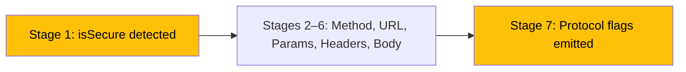

The `curl_generator` library makes a protocol-aware decision during curl command generation: it detects whether a URL uses HTTPS or HTTP and appends different flags accordingly. Most notably, the `--insecure` flag is included for HTTP URLs but omitted for HTTPS URLs — a design choice that warrants close examination.

## Protocol Detection Mechanism

At the very start of the generation pipeline, before any construction begins, `curlOf()` inspects the URL string to determine the transport protocol:

```dart
final isSecure = url.startsWith('https');
```

This boolean flag is captured on [line 51 of curl.dart](lib/src/curl.dart#L51) and remains in scope for the entire pipeline execution. The check is a simple string prefix test — it does not parse the URL or validate its structure. Any URL beginning with the literal characters `https` is treated as secure; everything else is treated as insecure.

| URL Input | `isSecure` Value | Flags Appended |
|:----------|:----------------:|:---------------|
| `https://api.example.com/users` | `true` | `--compressed \` |
| `http://api.example.com/users` | `false` | `--compressed \` + `--insecure` |
| `https://` (incomplete) | `true` | `--compressed \` |
| `ftp://server.com` | `false` | `--compressed \` + `--insecure` |

This means the detection is purely syntactic — it does not distinguish between HTTP, FTP, or any other non-HTTPS scheme. All non-HTTPS URLs receive identical treatment.

Sources: [lib/src/curl.dart#L51](lib/src/curl.dart#L51)

## Flag Emission Logic

The protocol decision manifests in the final stage of the `curlOf()` pipeline. After all headers, body, and query parameters have been assembled, the method appends two flags — one unconditional and one conditional:

```dart
// Add --compressed with backslash only if URL is not secure (to add --insecure)
if (!isSecure) {
  _curl = '$_curl  --compressed \\\n';
  _curl = '$_curl  --insecure';
} else {
  _curl = '$_curl  --compressed \\';
}
```

The branching logic on [lines 59–65 of curl.dart](lib/src/curl.dart#L59-L65) produces structurally different output depending on the protocol. The difference is twofold: which flags appear, and how the command string terminates.

**HTTPS path** (line 64): Appends `--compressed \` — a single line with a trailing backslash. The backslash signals shell line continuation, but no further lines follow. This is syntactically valid but produces a trailing backslash on the last line.

**HTTP path** (lines 61–62): Appends `--compressed \` with a newline escape (`\\\n`), then appends `--insecure` as a bare final line with no trailing backslash. The `--insecure` flag becomes the terminal argument.

| Aspect | HTTPS | HTTP |
|:-------|:-----:|:----:|
| `--compressed` present | ✅ | ✅ |
| `--insecure` present | ❌ | ✅ |
| Trailing backslash on `--compressed` | Yes | Yes |
| Final line terminus | `--compressed \` | `--insecure` |
| Shell continuation after last flag | Yes (dangling) | No (clean) |

Sources: [lib/src/curl.dart#L59-L65](lib/src/curl.dart#L59-L65)

## Understanding the --insecure Flag

The `--insecure` flag in curl tells the tool to **skip SSL/TLS certificate verification**. This flag is relevant only to connections that use TLS — namely HTTPS. When curl connects to an `https://` endpoint, it validates the server's certificate against a chain of trusted Certificate Authorities. The `--insecure` flag disables this validation, allowing connections to servers with self-signed, expired, or otherwise untrusted certificates.

For HTTP connections (`http://`), no TLS handshake occurs and no certificate verification takes place. The `--insecure` flag has **no effect** on HTTP requests — curl ignores it silently because there is no certificate to verify.

This creates an interesting semantic situation in the library's output:

| Scenario | Flag Added | Practical Effect |
|:---------|:----------:|:-----------------|
| HTTPS URL | No `--insecure` | Certificate verification is **enabled** (default curl behavior) |
| HTTP URL | `--insecure` appended | Flag is **ignored** by curl (no TLS involved) |

The `--insecure` flag on HTTP requests is harmless but redundant — it does not change curl's behavior. Its presence in the generated command does not introduce security risks or functional differences.

Sources: [test/curl_generator_test.dart#L136-L143](test/curl_generator_test.dart#L136-L143)

## Generated Output Comparison

To see the behavioral difference in concrete terms, here are the exact outputs for identical request parameters with different protocols:

**HTTPS request:**

```
curl 'https://some.api.com/some/api' \
  --compressed \
```

**HTTP request:**

```
curl 'http://some.api.com/some/api' \
  --compressed \
  --insecure
```

The HTTP variant includes `--insecure` as a final, standalone line. The HTTPS variant terminates after `--compressed \` with no additional flags.

When body and headers are present, the structural difference persists:

**HTTPS with body:**

```
curl 'https://some.api.com/some/api' \
  -H 'Content-Type: application/json' \
  --data-raw '{"some":"value"}' \
  --compressed \
```

**HTTP with body:**

```
curl 'http://some.api.com/some/api' \
  -H 'Content-Type: application/json' \
  --data-raw '{"some":"value"}' \
  --compressed \
  --insecure
```

Sources: [test/curl_generator_test.dart#L136-L153](test/curl_generator_test.dart#L136-L153), [test/curl_generator_test.dart#L88-L101](test/curl_generator_test.dart#L88-L101)

## Test Coverage for Protocol Behavior

The test suite validates protocol-specific behavior through dedicated test cases that cover both HTTP and HTTPS URLs across various scenarios:

| Test | URL Scheme | Validates |
|:-----|:----------:|:----------|
| `test http call` (line 136) | HTTP | `--insecure` is present, `--compressed` has newline |
| `test if content-type will aded to post calls` (line 145) | HTTP | `--insecure` present with body and Content-Type |
| `test if content-type will not aded to calls that have no body` (line 156) | HTTP | `--insecure` present without body |
| `test method if it is not null` (line 5) | HTTPS | No `--insecure`, POST method works |
| `test ignore get method` (line 14) | HTTPS | No `--insecure`, GET ignored |
| `test GET method with no query params and headers` (line 21) | HTTPS | No `--insecure`, bare GET |

The HTTP test cases exclusively use `http://some.api.com/some/api` as the base URL, while the HTTPS test cases use `https://some.api.com/some/api`. This consistent separation ensures the protocol detection path is exercised independently.

Sources: [test/curl_generator_test.dart#L5-L27](test/curl_generator_test.dart#L5-L27), [test/curl_generator_test.dart#L136-L163](test/curl_generator_test.dart#L136-L163)

## Architectural Context Within the Pipeline

The protocol detection and conditional flag emission occurs at the boundaries of the generation pipeline. The `isSecure` variable is created at the **very beginning** (stage 1) and consumed at the **very end** (stage 7), bookending the entire construction process.



This design means that protocol detection has no influence over intermediate stages — it does not affect header formatting, body serialization, or query parameter encoding. The only downstream impact is on the final flag set.

For deeper insight into the complete pipeline stages, refer to [Curl Generation Pipeline Internals](7-curl-generation-pipeline-internals).

Sources: [lib/src/curl.dart#L50-L66](lib/src/curl.dart#L50-L66)

## Practical Implications for Developers

When using the `curl_generator` library, developers should be aware of three key points regarding protocol handling.

**HTTPS requests require no special configuration.** The library generates standard curl commands for HTTPS URLs with full certificate verification enabled. The generated commands behave identically to manually typed curl commands for HTTPS endpoints.

**HTTP requests include a harmless `--insecure` flag.** While this flag has no practical effect on HTTP connections, it does add an extra line to the generated command. If the output is being used in contexts where command structure matters (e.g., automated pipelines that parse curl commands), the presence of `--insecure` on HTTP requests should be anticipated.

**Non-HTTP schemes are not specially handled.** URLs using `ftp://`, `ws://`, or other schemes are treated as insecure and receive the `--insecure` flag. Since the library is designed for HTTP API debugging, this edge case is unlikely to arise in practice, but it is a consequence of the simple `startsWith('https')` detection.

| Concern | HTTPS Behavior | HTTP Behavior |
|:--------|:---------------|:--------------|
| Certificate verification | Enabled (default) | N/A (no TLS) |
| `--insecure` in output | Absent | Present |
| Command length | Shorter | Longer by one line |
| Functional difference vs manual curl | None | None |

Sources: [lib/src/curl.dart#L51](lib/src/curl.dart#L51), [test/curl_generator_test.dart#L136-L143](test/curl_generator_test.dart#L136-L143)

## Next Steps

Now that you understand how the library handles protocol-specific behavior, explore how the overall generation pipeline orchestrates all its stages in [Curl Generation Pipeline Internals](7-curl-generation-pipeline-internals), or learn about the HTTP method handling logic in [HTTP Method Handling](8-http-method-handling).