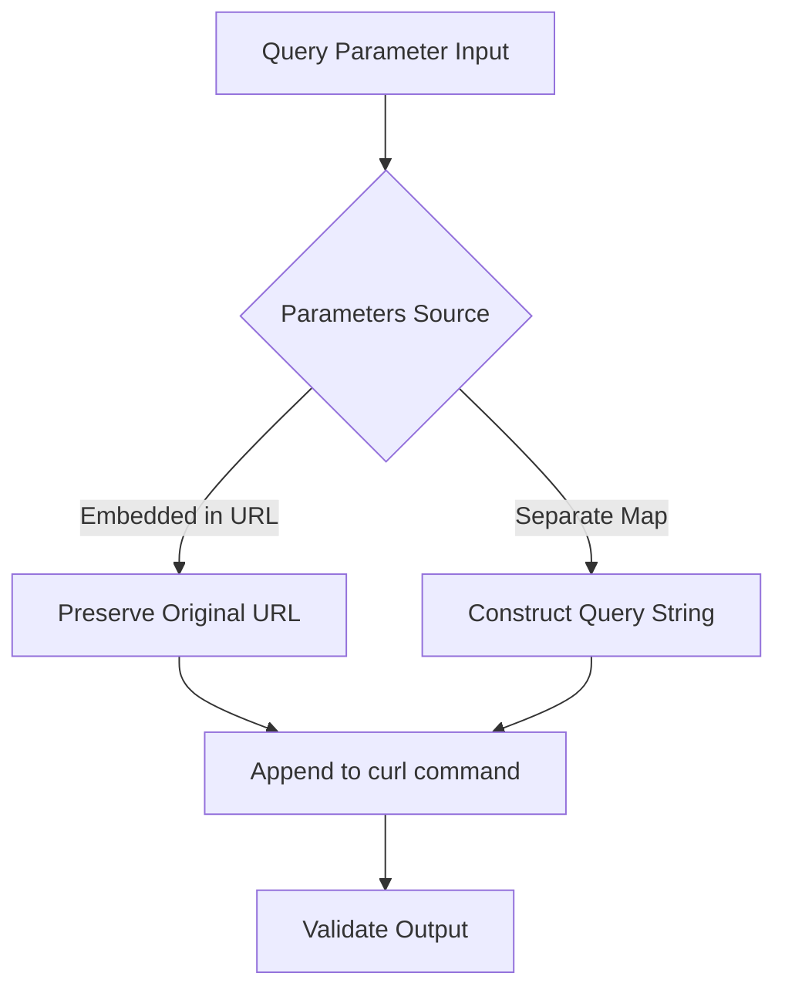

This walkthrough examines how the curl_generator library's test suite validates its functionality through systematic scenario coverage. The test file provides comprehensive validation of the `Curl.curlOf()` method across diverse input combinations, ensuring reliable curl command generation.

## Test Suite Architecture

The test suite follows an **input-output contract pattern**, where each test defines specific inputs, constructs an expected curl command string, and validates the actual output against this expectation. This approach ensures deterministic behavior verification without mocking dependencies.

```
Test Structure Pattern:
┌─────────────────────────────────────────────────────────────┐
│  1. Define inputs (url, method, headers, params, body)     │
│  2. Construct expected curl string                          │
│  3. Call Curl.curlOf() with inputs                          │
│  4. Assert output matches expected string                   │
└─────────────────────────────────────────────────────────────┘
```

Sources: [curl_generator_test.dart](test/curl_generator_test.dart#L1-L12)

## HTTP Method Handling Coverage

The test suite validates HTTP method behavior through three distinct scenarios. The first test confirms that explicitly passing `method: 'POST'` correctly includes `--request POST` in the generated curl command. The second test validates that passing `method: 'GET'` produces no method flag, since GET is the default behavior and should be omitted for cleaner output. The third test establishes the baseline behavior when no method is specified, confirming the implicit GET default.

| Scenario | Input Method | Expected Flag | Test Line |
|----------|--------------|---------------|-----------|
| Explicit POST | `'POST'` | `--request POST` | L5-L12 |
| Explicit GET | `'GET'` | (omitted) | L14-L18 |
| Default (null) | `null` | (omitted) | L19-L22 |

This coverage ensures the `_addMethod()` private method correctly filters GET requests while preserving all other HTTP verbs in the output.

Sources: [curl_generator_test.dart](test/curl_generator_test.dart#L5-L22) | [curl.dart](lib/src/curl.dart#L62-L68)

## Query Parameter Encoding Validation

Query parameter handling receives thorough testing across three configurations. The first scenario tests URL-embedded parameters where the query string is part of the input URL itself, verifying the library preserves pre-existing query strings without duplication. The second scenario validates the `queryParams` map parameter, confirming the library correctly constructs query strings by joining key-value pairs with `&` and prefixing with `?`. The third scenario combines both headers and query parameters, ensuring proper ordering in the final output.



Sources: [curl_generator_test.dart](test/curl_generator_test.dart#L24-L44) | [curl.dart](lib/src/curl.dart#L70-L75)

## Header Management and Content-Type Detection

Header handling tests validate two critical behaviors: explicit header inclusion and automatic Content-Type detection. The header tests confirm that each key-value pair is formatted as `-H 'Key: Value'` with proper line continuation backslashes. The Content-Type tests establish the auto-detection logic that adds `application/json` when a body is present but no Content-Type header is explicitly provided.

The Content-Type detection tests are particularly important as they validate case-insensitive header matching. The library checks `content-type` in lowercase against the accumulated curl string to prevent duplicate headers when users explicitly provide Content-Type in their headers map.

| Test Scenario | Body Present | Content-Type Header | Result |
|---------------|--------------|---------------------|--------|
| Body only | Yes | No | Auto-added |
| Body + explicit header | Yes | Yes (exact case) | Not duplicated |
| Body + lowercase header | Yes | Yes (lowercase) | Not duplicated |
| No body | No | No | Not added |

Sources: [curl_generator_test.dart](test/curl_generator_test.dart#L46-L68) | [curl.dart](lib/src/curl.dart#L115-L128)

## Body Serialization Coverage

The body serialization tests validate multiple data type handling. The primary test confirms that Map objects are correctly JSON-encoded with proper key-value formatting. A more advanced test validates the `toEncodable` fallback mechanism by passing a `Curl` class instance (which cannot be directly JSON-encoded) as a body value, confirming the library gracefully converts it to its string representation.

This edge case testing ensures the library handles real-world scenarios where body objects might contain non-serializable types. The `_addBody()` method uses `json.encode()` with a custom `toEncodable` callback that falls back to `object.toString()` for unsupported types.

```dart
// From curl.dart - The toEncodable fallback
bodyData = json.encode(
  body,
  toEncodable: (object) => object.toString(),
);
```

Sources: [curl_generator_test.dart](test/curl_generator_test.dart#L82-L92) | [curl.dart](lib/src/curl.dart#L130-L135)

## HTTPS vs HTTP Protocol Behavior

The protocol handling tests validate the security flag differentiation between HTTPS and HTTP URLs. HTTPS requests generate curl commands without the `--insecure` flag, maintaining secure connection defaults. HTTP requests automatically include `--insecure` to bypass SSL certificate verification, acknowledging that development HTTP endpoints typically lack valid certificates.

The tests also verify that HTTP requests include a trailing newline before `--insecure` (via `\\\n`), while HTTPS requests end with a single backslash. This formatting difference ensures the curl command remains valid across both protocol types.

| Protocol | URL Example | Security Flag | Line Ending |
|----------|-------------|---------------|-------------|
| HTTPS | `https://api.com` | None | `\\` |
| HTTP | `http://api.com` | `--insecure` | `\\\n--insecure` |

Sources: [curl_generator_test.dart](test/curl_generator_test.dart#L120-L125) | [curl.dart](lib/src/curl.dart#L54-L60)

## Integration Test Coverage

The comprehensive integration test combines all features: query parameters, headers, and body in a single request. This test validates the complete output ordering: URL with query string, followed by headers (including auto-detected Content-Type), followed by the JSON-encoded body, and finally the compression and security flags.

This end-to-end validation ensures the pipeline stages execute in the correct sequence and that no feature interferes with another. The test serves as a regression anchor, catching any ordering bugs introduced during refactoring.

Sources: [curl_generator_test.dart](test/curl_generator_test.dart#L94-L118)

## Coverage Gap Analysis

While the test suite provides solid coverage of the primary use cases, certain scenarios remain untested. Edge cases such as empty header maps, empty query parameter maps, and null body values are implicitly tested through default parameter values but lack explicit test cases. Additionally, URL encoding for special characters in query parameters and header values is not validated. These gaps represent opportunities for future test expansion to improve robustness guarantees.

Sources: [curl.dart](lib/src/curl.dart#L40-L50)

## Next Steps

Having reviewed the test coverage patterns, explore the testing infrastructure in [Running Tests](13-running-tests) for execution instructions, or examine the core implementation details in [The Curl Class and Its API Surface](6-the-curl-class-and-its-api-surface) to understand the methods under test.