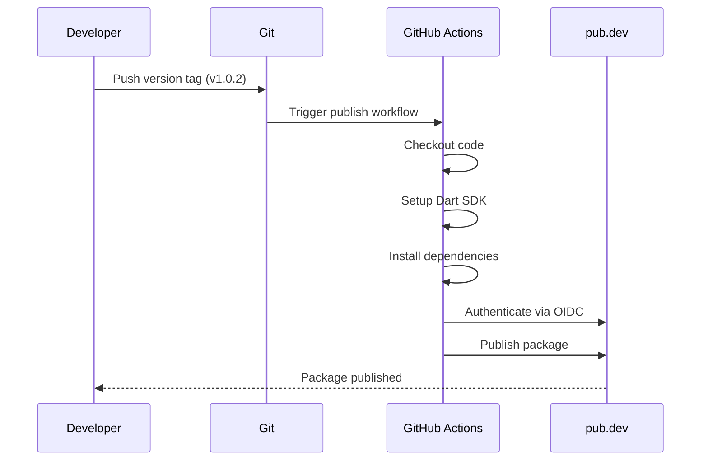
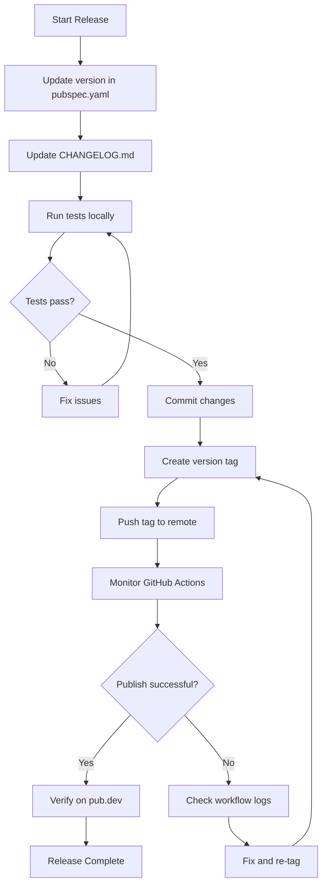

This page documents the automated CI/CD pipeline that publishes the `curl_generator` package to pub.dev. Understanding this workflow is essential for maintainers who need to release new versions, modify the publishing process, or troubleshoot deployment failures.

## Workflow Architecture Overview

The publishing pipeline uses GitHub Actions with OIDC (OpenID Connect) authentication to publish the Dart package automatically when a semantic version tag is pushed. This approach eliminates the need for long-lived credentials stored as secrets.



Sources: [.github/workflows/publish.yml](.github/workflows/publish.yml#L1-L21)

## Trigger Mechanism

The workflow activates exclusively on tag pushes matching the semantic versioning pattern. This controlled trigger prevents accidental publications during regular development.

| Trigger Pattern | Example | Purpose |
|----------------|---------|---------|
| `v[0-9]+.[0-9]+.[0-9]+` | `v1.0.2` | Major.Minor.Patch release |
| `v0.1.0` | Pre-1.0 releases | Early development versions |
| `v2.0.0` | Major version bump | Breaking changes |

The regex pattern ensures only properly formatted version tags initiate the publishing process. Tags like `v1.0` or `test-v1.0.0` will be ignored.

Sources: [.github/workflows/publish.yml](.github/workflows/publish.yml#L4-L6)

## Authentication Model

The workflow employs OIDC-based authentication, a modern approach that provides short-lived credentials without storing long-lived tokens as GitHub secrets.

**How OIDC Works:**

1. GitHub Actions requests an OIDC token from GitHub's identity provider
2. The token is presented to pub.dev's authentication endpoint
3. pub.dev validates the token and grants publish permissions
4. The package is published with the authenticated session

**Required Permission:**

```yaml
permissions:
  id-token: write  # Required for OIDC authentication
```

This permission allows the workflow to request OIDC tokens. Unlike traditional token-based authentication, OIDC tokens are ephemeral and scoped to the specific workflow run.

Sources: [.github/workflows/publish.yml](.github/workflows/publish.yml#L12-L13)

## Workflow Steps Breakdown

Each step in the workflow serves a specific purpose in the publishing pipeline:

### 1. Code Checkout

```yaml
- uses: actions/checkout@v4
```

Retrieves the repository code at the tag's commit. Using `@v4` ensures compatibility with the latest checkout action features.

### 2. Dart SDK Setup

```yaml
- uses: dart-lang/setup-dart@v1
```

Installs the Dart SDK on the runner. The `dart-lang/setup-dart` action is the official action maintained by the Dart team.

### 3. Dependency Installation

```yaml
- name: Install dependencies
  run: dart pub get
```

Resolves and downloads all package dependencies. This ensures the package can be analyzed and tested before publishing.

### 4. Package Publishing

```yaml
- name: Publish
  run: dart pub publish --force
```

The `--force` flag bypasses interactive prompts, enabling fully automated publishing. Without this flag, the command would pause for user confirmation.

Sources: [.github/workflows/publish.yml](.github/workflows/publish.yml#L15-L21)

## Package Configuration

The `pubspec.yaml` defines metadata that pub.dev uses to display and categorize the package.

| Field | Value | Purpose |
|-------|-------|---------|
| `name` | `curl_generator` | Unique package identifier |
| `version` | `1.0.2` | Current version (must match tag) |
| `homepage` | `https://b1101-portfolio.web.app` | Developer/portfolio link |
| `repository` | `https://github.com/P-B1101/curl_generator` | Source code location |
| `publish_to` | `https://pub.zuzu.dev` | Target registry |

**Important:** The `publish_to` field points to `pub.zuzu.dev`, a custom pub registry. For standard pub.dev publishing, this field should be `https://pub.dev` or omitted entirely.

Sources: [pubspec.yaml](pubspec.yaml#L1-L14)

## Publishing Checklist

Follow this checklist for each release:



**Step-by-step commands:**

```bash
# 1. Update version in pubspec.yaml to 1.0.3
# 2. Add changelog entry for 1.0.3 in CHANGELOG.md
# 3. Run tests
dart test

# 4. Commit changes
git add pubspec.yaml CHANGELOG.md
git commit -m "Prepare release 1.0.3"

# 5. Create and push tag
git tag v1.0.3
git push origin v1.0.3
```

## Versioning Strategy

The project follows Semantic Versioning (SemVer):

| Version Type | Pattern | Example | When to Use |
|-------------|---------|---------|-------------|
| Major | `X.0.0` | `2.0.0` | Breaking API changes |
| Minor | `0.X.0` | `1.1.0` | New features, backward compatible |
| Patch | `0.0.X` | `1.0.3` | Bug fixes, no API changes |

**Version History from CHANGELOG.md:**

| Version | Change Type | Description |
|---------|-------------|-------------|
| 1.0.2 | Patch | Fix sdk issue |
| 1.0.1 | Minor | Update package for Dart apps, update SDK |
| 1.0.0 | Major | Update lint to version 3.0.0 |
| 0.0.13 | Patch | Bug fix on cache old request curl |

Sources: [CHANGELOG.md](CHANGELOG.md#L1-L66)

## Legacy Authentication Script

The repository includes `pub_login.sh`, a script for manual/local publishing that creates a `credentials.json` file. This script is **not used** by the GitHub Actions workflow.

**Required Environment Variables:**

| Variable | Purpose |
|----------|---------|
| `PUB_DEV_PUBLISH_ACCESS_TOKEN` | OAuth access token |
| `PUB_DEV_PUBLISH_REFRESH_TOKEN` | OAuth refresh token |
| `PUB_DEV_PUBLISH_TOKEN_ENDPOINT` | Token endpoint URL |
| `PUB_DEV_PUBLISH_EXPIRATION` | Token expiration timestamp |

**Usage (local publishing only):**

```bash
# Set environment variables
export PUB_DEV_PUBLISH_ACCESS_TOKEN="your_token"
export PUB_DEV_PUBLISH_REFRESH_TOKEN="your_refresh"
export PUB_DEV_PUBLISH_TOKEN_ENDPOINT="your_endpoint"
export PUB_DEV_PUBLISH_EXPIRATION=1234567890

# Run the script
./pub_login.sh

# Publish manually
dart pub publish
```

Sources: [pub_login.sh](pub_login.sh#L1-L36)

## Troubleshooting Guide

| Issue | Cause | Solution |
|-------|-------|----------|
| Workflow not triggering | Tag pattern mismatch | Ensure tag matches `v[0-9]+.[0-9]+.[0-9]+` |
| Authentication failure | Missing OIDC permission | Verify `id-token: write` in workflow |
| `--force` errors | Package validation failed | Check `pubspec.yaml` for errors |
| Version mismatch | Tag ≠ pubspec version | Update `pubspec.yaml` version field |
| Dart SDK errors | Dependency issues | Run `dart pub get` locally first |

**Common Debugging Steps:**

1. Check GitHub Actions logs for the specific failure
2. Verify the tag format matches the trigger pattern
3. Ensure `pubspec.yaml` version matches the tag
4. Run `dart pub publish --dry-run` locally to preview issues

## Related Pages

For a complete understanding of the release process, review these related topics:

- [Versioning and Changelog](16-versioning-and-changelog) — Detailed versioning conventions and changelog format
- [Running Tests](13-running-tests) — Test execution before publishing
- [Installation](3-installation) — Package installation instructions for consumers