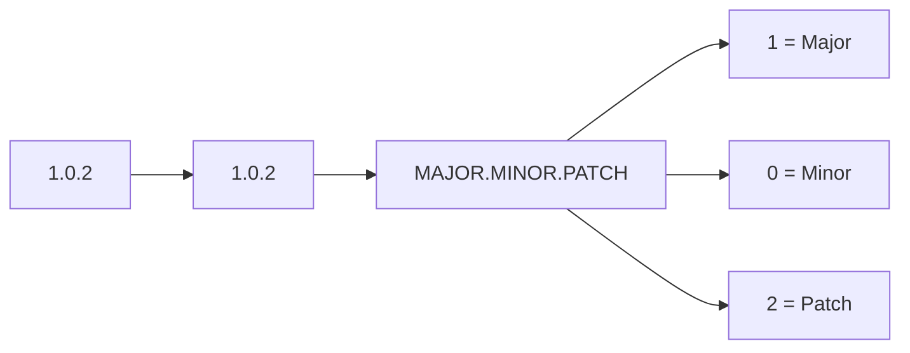
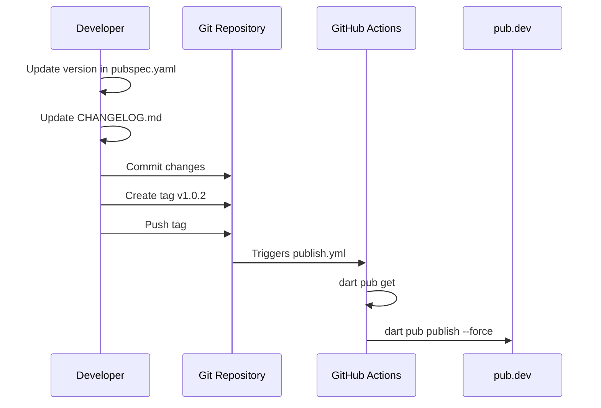
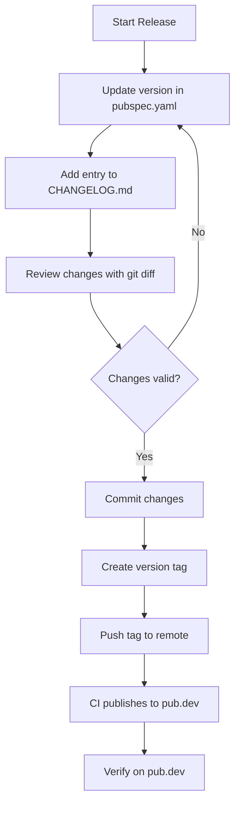
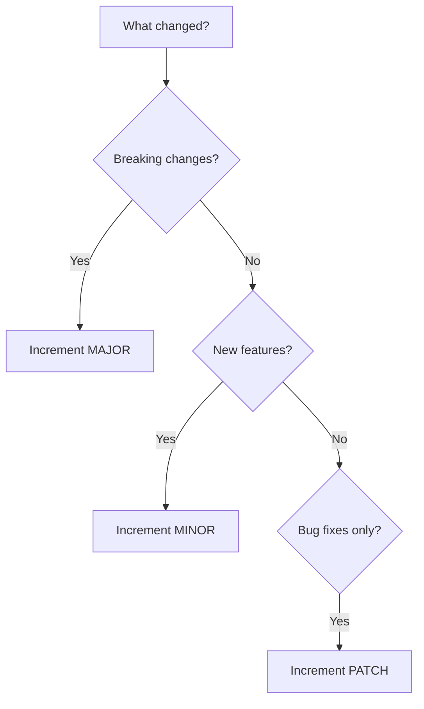

Understanding how a software project tracks its evolution is fundamental to responsible development. This page explains the versioning strategy and changelog conventions used in the `curl_generator` package — knowledge that helps you contribute, debug, and understand release history.

## Semantic Versioning (SemVer) in Practice

The project follows **Semantic Versioning** (SemVer), a standardized version numbering system that communicates the nature of changes through three numeric components: `MAJOR.MINOR.PATCH`.



| Component | Meaning | When to Increment | Example from Project |
|-----------|---------|-------------------|----------------------|
| **MAJOR** | Breaking changes | API incompatible with previous version | `0.0.13` → `1.0.0` (lint upgrade) |
| **MINOR** | New features | Backward-compatible functionality added | `0.0.1` → `0.0.2` (added features) |
| **PATCH** | Bug fixes | Backward-compatible issue resolution | `1.0.1` → `1.0.2` (SDK fix) |

The current version is **1.0.2**, as declared in `pubspec.yaml`. The project reached its first major release (`1.0.0`) when it updated linting to version 3.0.0, signaling production stability. [Sources: [pubspec.yaml](pubspec.yaml#L4)](pubspec.yaml#L4)

## CHANGELOG.md Structure

The changelog serves as a human-readable history of all releases, organized from newest to oldest. Each entry follows a consistent format:

```markdown
## [VERSION]

* Change description
* Another change
```

### Version History Summary

| Version | Type | Key Changes |
|---------|------|-------------|
| `1.0.2` | Patch | Fixed SDK compatibility issue |
| `1.0.1` | Patch | Package adapted for Dart apps; SDK updated to 3.5.0 |
| `1.0.0` | Major | Lint updated to version 3.0.0 |
| `0.0.13` | Patch | Fixed cache bug for old request curls |
| `0.0.12` | Minor | Added HTTP method support |
| `0.0.11` | Patch | Fixed body serialization for non-JSON values |
| `0.0.10` | Patch | Removed debug print statements |
| `0.0.9` | Minor | Auto-add `Content-Type` header for body requests |
| `0.0.8` | Minor | Added usage examples |
| `0.0.7` | Minor | Added class documentation |
| `0.0.6` | Minor | Added docs; fixed Dart Formatter issue |
| `0.0.5` | Minor | Updated homepage |
| `0.0.4` | Patch | License update |
| `0.0.3` | Patch | License update |
| `0.0.2` | Patch | Fixed `--insecure` flag issue |
| `0.0.1` | — | Initial release |

Sources: [CHANGELOG.md](CHANGELOG.md#L1-L66)

## Tag-Based Publishing Pipeline

Version management integrates directly with the CI/CD system through git tags. When a tag matching the pattern `v[0-9]+.[0-9]+.[0-9]+` is pushed, the GitHub Actions workflow automatically publishes to pub.dev.



### Publishing Workflow Steps

| Step | Command | Purpose |
|------|---------|---------|
| 1. Checkout | `actions/checkout@v4` | Fetch repository code |
| 2. Setup Dart | `dart-lang/setup-dart@v1` | Install Dart SDK |
| 3. Dependencies | `dart pub get` | Install package dependencies |
| 4. Publish | `dart pub publish --force` | Upload to pub.dev registry |

The workflow uses **OIDC authentication** (via `id-token: write` permission) for secure, token-free publishing. This eliminates the need for manual API key management. [Sources: [.github/workflows/publish.yml](.github/workflows/publish.yml#L1-L21)](.github/workflows/publish.yml#L1-L21)

## Release Process Checklist

Before creating a release, follow these steps in order:



### Critical Files to Update

| File | What to Change | Example |
|------|----------------|---------|
| `pubspec.yaml` | `version:` field | `version: 1.0.3` |
| `CHANGELOG.md` | Add new section at top | `## 1.0.3` with bullet points |

## Changelog Writing Conventions

The project uses these conventions for changelog entries:

| Convention | Description | Example |
|------------|-------------|---------|
| **Bullet lists** | Each change is a separate bullet | `* Fixed body serialization` |
| **Present tense** | Describe what the change does | `Add`, `Fix`, `Update` |
| **Concise descriptions** | One line per change | `Bug fix on cache old request curl` |
| **Technical specificity** | Reference components when helpful | `Update dart sdk to 3.5.0` |

### Writing Effective Changelog Entries

| Quality | Poor Example | Good Example |
|---------|--------------|--------------|
| Specificity | "Fixed stuff" | "Fixed `--insecure` flag issue" |
| Clarity | "Changed things" | "Updated package to use in Dart apps" |
| Completeness | "Bug fix" | "Bug fix on body that contains value that cannot be converted to json" |

Sources: [CHANGELOG.md](CHANGELOG.md#L1-L66)

## Semantic Versioning Decision Guide

When deciding what version number to use, consider these questions:



| Scenario | Action | Example |
|----------|--------|---------|
| Removed a public method | MAJOR bump | `1.x.x` → `2.0.0` |
| Added new optional parameter | MINOR bump | `1.0.x` → `1.1.0` |
| Fixed existing behavior | PATCH bump | `1.0.0` → `1.0.1` |
| Fixed security vulnerability | PATCH bump | `1.0.0` → `1.0.1` |
| Updated internal dependencies | PATCH bump | `1.0.1` → `1.0.2` |

## Related Topics

For deeper understanding of the publishing ecosystem and testing practices:

- **[GitHub Actions Publishing Workflow](15-github-actions-publishing-workflow)** — Detailed breakdown of the CI/CD pipeline configuration
- **[Running Tests](13-running-tests)** — Verify your changes before release
- **[Library Entry Point and Part File Pattern](5-library-entry-point-and-part-file-pattern)** — Understand the code structure you're versioning
- **[The Curl Class and Its API Surface](6-the-curl-class-and-its-api-surface)** — Public API that SemVer protects

## Summary

The `curl_generator` project uses Semantic Versioning with a tag-triggered CI/CD pipeline for automated publishing. Maintaining accurate version numbers in `pubspec.yaml` and clear change descriptions in `CHANGELOG.md` ensures users can trust and understand each release. The tag pattern `v[0-9]+.[0-9]+.[0-9]+` connects version control directly to the publishing workflow, creating a reliable release process.