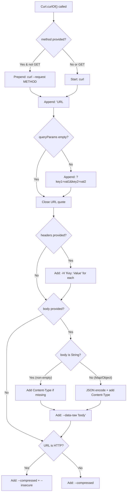

Welcome to the practical guide for **curl_generator** — a lightweight Dart package that transforms your API calls into ready-to-run `curl` commands. This page demonstrates real-world patterns you'll use daily, from simple GET requests to complex POST calls with headers and bodies. Each example includes both the Dart code and the generated curl output, so you can see exactly what to expect.

> **Prerequisite**: If you haven't installed the package yet, refer to [Installation](3-installation) first.

---

## Quick Start: Your First curl Command

The simplest way to generate a curl command is calling `Curl.curlOf()` with just a URL. This produces a clean `curl` command ready for your terminal.

```dart
import 'package:curl_generator/curl_generator.dart';

void main() {
  final curl = Curl.curlOf(url: 'https://api.example.com/users');
  print(curl);
}
```

**Output:**
```bash
curl 'https://api.example.com/users' \
  --compressed \
```

This minimal example demonstrates the library's default behavior: it wraps your URL in single quotes, adds the `--compressed` flag for automatic decompression, and uses backslashes for multi-line formatting. The command is ready to paste directly into your terminal. Sources: [lib/src/curl.dart](lib/src/curl.dart#L42-L68)

---

## The Core API: `Curl.curlOf()`

The entire public API revolves around a single static method. Understanding its parameters gives you full control over curl generation.

### Parameter Reference

| Parameter | Type | Required | Default | Description |
|-----------|------|----------|---------|-------------|
| `url` | `String` | ✅ | — | The API endpoint URL. Supports both `http://` and `https://` schemes. |
| `method` | `String?` | ❌ | `null` | HTTP method: `GET`, `POST`, `PUT`, `PATCH`, `DELETE`, etc. |
| `queryParams` | `Map<String, String>` | ❌ | `const {}` | Query parameters appended to the URL as `?key=value&...` |
| `headers` | `Map<String, String>` | ❌ | `const {}` | HTTP headers added as `-H 'Key: Value'` flags. |
| `body` | `Object?` | ❌ | `null` | Request body — accepts `String`, `Map`, or any JSON-encodable object. |

Sources: [lib/src/curl.dart](lib/src/curl.dart#L24-L36)

---

## Curl Generation Flow

Before diving into examples, here's how the library assembles your curl command:



This flowchart reveals the library's decision logic: it auto-detects when to add `Content-Type` headers, when to include `--insecure` for HTTP URLs, and how to serialize different body types. Sources: [lib/src/curl.dart](lib/src/curl.dart#L42-L68)

---

## Pattern 1: GET Requests

GET requests are the simplest case. Since GET is the default curl method, you don't need to specify it explicitly.

### Basic GET

```dart
final curl = Curl.curlOf(url: 'https://api.example.com/status');
// Output: curl 'https://api.example.com/status' \
//           --compressed \
```

### GET with Query Parameters

You can add query parameters in two ways — inline in the URL or using the `queryParams` parameter. Both produce identical output.

**Option A: Parameters in URL string**
```dart
final curl = Curl.curlOf(
  url: 'https://api.example.com/search?q=dart&lang=en',
);
```

**Option B: Parameters as Map**
```dart
final curl = Curl.curlOf(
  url: 'https://api.example.com/search',
  queryParams: {'q': 'dart', 'lang': 'en'},
);
```

**Both produce:**
```bash
curl 'https://api.example.com/search?q=dart&lang=en' \
  --compressed \
```

The `queryParams` approach is preferable when parameters are dynamic or come from a data structure, as it keeps the URL clean and lets the library handle the `?` and `&` formatting. Sources: [test/curl_generator_test.dart](test/curl_generator_test.dart#L30-L55)

### GET with Custom Headers

```dart
final curl = Curl.curlOf(
  url: 'https://api.example.com/users',
  headers: {
    'Authorization': 'Bearer token123',
    'Accept': 'application/json',
  },
);
// Output:
// curl 'https://api.example.com/users' \
//   -H 'Authorization: Bearer token123' \
//   -H 'Accept: application/json' \
//   --compressed \
```

Each header becomes a separate `-H` flag, following curl's standard format. Sources: [test/curl_generator_test.dart](test/curl_generator_test.dart#L57-L75)

---

## Pattern 2: POST Requests with Bodies

POST requests require specifying the HTTP method and providing a body. The library automatically adds the `Content-Type: application/json` header when you include a body.

### POST with JSON Body (Map)

```dart
final curl = Curl.curlOf(
  url: 'https://api.example.com/users',
  method: 'POST',
  body: {
    'name': 'Alice',
    'email': 'alice@example.com',
    'age': 30,
  },
);
// Output:
// curl 'https://api.example.com/users' \
//   -H 'Content-Type: application/json' \
//   --data-raw '{"name":"Alice","email":"alice@example.com","age":30}' \
//   --compressed \
```

Notice how the library automatically inserted `-H 'Content-Type: application/json'` — you don't need to add it manually. Sources: [lib/src/curl.dart](lib/src/curl.dart#L107-L120)

### POST with Nested Objects

The body parameter accepts arbitrarily nested Maps. All values are JSON-encoded automatically.

```dart
final curl = Curl.curlOf(
  url: 'https://api.example.com/orders',
  method: 'POST',
  body: {
    'customer': {'id': 123, 'name': 'Bob'},
    'items': ['widget', 'gadget'],
    'total': 99.99,
  },
);
// Output:
// curl 'https://api.example.com/orders' \
//   -H 'Content-Type: application/json' \
//   --data-raw '{"customer":{"id":123,"name":"Bob"},"items":["widget","gadget"],"total":99.99}' \
//   --compressed \
```

Sources: [lib/src/curl.dart](lib/src/curl.dart#L122-L135)

### POST with Raw String Body

If you pass a `String` as the body, it's used as-is without JSON encoding. This is useful for form data or pre-formatted payloads.

```dart
final curl = Curl.curlOf(
  url: 'https://api.example.com/form',
  method: 'POST',
  body: 'field1=value1&field2=value2',
);
// Output:
// curl 'https://api.example.com/form' \
//   --data-raw 'field1=value1&field2=value2' \
//   --compressed \
```

**Key difference**: When the body is a plain string that doesn't look like JSON (doesn't start with `{` or `[`), the `Content-Type` header is not added automatically. Sources: [lib/src/curl.dart](lib/src/curl.dart#L108-L118)

### POST with Explicit Content-Type Header

If you provide your own `Content-Type` header, the library won't add a duplicate.

```dart
final curl = Curl.curlOf(
  url: 'https://api.example.com/upload',
  method: 'POST',
  headers: {'Content-Type': 'multipart/form-data'},
  body: {'file': 'data'},
);
// Output:
// curl 'https://api.example.com/upload' \
//   -H 'Content-Type: multipart/form-data' \
//   --data-raw '{"file":"data"}' \
//   --compressed \
```

The library checks case-insensitively for existing `Content-Type` headers before adding one. Sources: [lib/src/curl.dart](lib/src/curl.dart#L107-L110)

---

## Pattern 3: PUT, PATCH, DELETE Requests

Non-GET methods are explicitly added to the command using `--request METHOD`.

```dart
// PUT request
final put = Curl.curlOf(
  url: 'https://api.example.com/users/123',
  method: 'PUT',
  body: {'name': 'Updated Name'},
);

// PATCH request
final patch = Curl.curlOf(
  url: 'https://api.example.com/users/123',
  method: 'PATCH',
  body: {'email': 'new@example.com'},
);

// DELETE request (no body needed)
final delete = Curl.curlOf(
  url: 'https://api.example.com/users/123',
  method: 'DELETE',
);
```

**PUT Output:**
```bash
curl 'https://api.example.com/users/123' \
  -H 'Content-Type: application/json' \
  --data-raw '{"name":"Updated Name"}' \
  --compressed \
```

**DELETE Output:**
```bash
curl 'https://api.example.com/users/123' \
  --compressed \
```

Note: When `method` is `GET` (case-insensitive), it's treated as the default and omitted from the command. Sources: [lib/src/curl.dart](lib/src/curl.dart#L69-L74)

---

## Pattern 4: Complete Request with Everything

Here's a realistic example combining all parameters — a typical API call with authentication, query filters, custom headers, and a JSON body.

```dart
final curl = Curl.curlOf(
  url: 'https://api.example.com/v2/products',
  method: 'POST',
  queryParams: {'category': 'electronics', 'page': '1'},
  headers: {
    'Authorization': 'Bearer sk_live_abc123',
    'Accept': 'application/json',
    'X-Request-Id': 'req_789xyz',
  },
  body: {
    'name': 'Wireless Mouse',
    'price': 29.99,
    'inStock': true,
    'tags': ['peripheral', 'bluetooth'],
  },
);

print(curl);
```

**Generated Output:**
```bash
curl 'https://api.example.com/v2/products?category=electronics&page=1' \
  -H 'Authorization: Bearer sk_live_abc123' \
  -H 'Accept: application/json' \
  -H 'X-Request-Id: req_789xyz' \
  -H 'Content-Type: application/json' \
  --data-raw '{"name":"Wireless Mouse","price":29.99,"inStock":true,"tags":["peripheral","bluetooth"]}' \
  --compressed \
```

This is exactly what you'd paste into your terminal to replicate the API call. Sources: [example/lib/example.dart](example/lib/example.dart#L1-L32)

---

## HTTPS vs HTTP Behavior

The library behaves differently based on the URL scheme — this is an important detail for local development vs production.

| URL Scheme | `--compressed` | `--insecure` | Use Case |
|------------|----------------|--------------|----------|
| `https://` | ✅ Added | ❌ Not added | Production APIs |
| `http://` | ✅ Added | ✅ Added | Local/dev servers |

The `--insecure` flag is added to HTTP URLs because curl requires it for certain HTTP configurations. For HTTPS URLs, SSL verification works normally without this flag.

```dart
// HTTPS (production)
final https = Curl.curlOf(url: 'https://api.example.com/data');
// curl 'https://api.example.com/data' \
//   --compressed \

// HTTP (local development)
final http = Curl.curlOf(url: 'http://localhost:8080/api');
// curl 'http://localhost:8080/api' \
//   --compressed \
//   --insecure
```

Sources: [lib/src/curl.dart](lib/src/curl.dart#L55-L67)

---

## Troubleshooting Common Scenarios

| Scenario | Expected Behavior | Solution |
|----------|-------------------|----------|
| Method is `GET` | Method flag omitted | This is intentional — GET is curl's default |
| Empty string body | Body ignored | Pass `null` or omit `body` parameter instead |
| Empty Map body | Body ignored | Pass `null` or omit `body` parameter instead |
| Custom Content-Type needed | Add to `headers` map | Library won't duplicate if header exists |
| Object that can't be JSON-encoded | `toString()` called | Ensure objects have meaningful `toString()` |

Sources: [lib/src/curl.dart](lib/src/curl.dart#L107-L135)

---

## Next Steps

Now that you understand the basic patterns, you might want to explore:

- **[The Curl Class and Its API Surface](6-the-curl-class-and-its-api-surface)** — Deep dive into the class internals and all method behaviors
- **[Header Management and Content-Type Auto-Detection](10-header-management-and-content-type-auto-detection)** — Understand exactly when and how headers are added
- **[Body Serialization Strategies](11-body-serialization-strategies)** — Learn about String vs Map vs Object body handling
- **[HTTPS vs HTTP Behavior and --insecure Flag](12-https-vs-http-behavior-and-insecure-flag)** — Complete details on scheme-dependent behavior