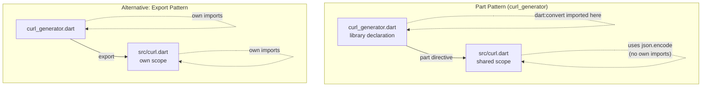
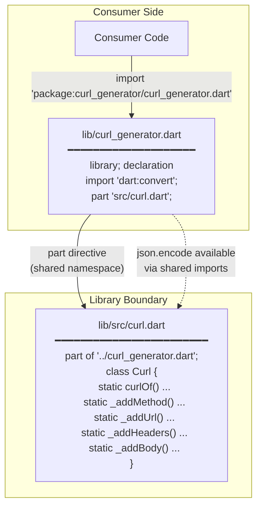

Understanding how `curl_generator` organizes its source code is essential for anyone looking to maintain, extend, or learn from this package. The library employs Dart's **part/part of** pattern — a deliberate architectural decision that balances API simplicity with implementation encapsulation. This page examines the structure, rationale, and practical implications of this organizational approach.

## The Two-File Architecture

At first glance, the `lib/` directory appears deceptively simple: a single entry-point file and one source file in a subdirectory. This is by design. The entire public API of `curl_generator` flows through a single gateway.

```
lib/
├── curl_generator.dart    ← Library entry point (public API surface)
└── src/
    └── curl.dart          ← Part file (implementation details)
```

The entry point file, [curl_generator.dart](lib/curl_generator.dart#L1-L6), is remarkably concise — only six lines total:

```dart
library;

import 'dart:convert';

part 'src/curl.dart';
```

The `part` directive at the bottom is the linchpin: it instructs the Dart compiler to treat `src/curl.dart` as if its contents were physically pasted into the library file at compile time. The result is a single logical library split across two physical files.

Sources: [curl_generator.dart](lib/curl_generator.dart#L1-L6)

## How the Part Directive Works

The relationship between library and part file is formalized through two complementary directives. The library file declares ownership with `part`, and the part file declares allegiance with `part of`.

In [curl.dart](lib/src/curl.dart#L1), the very first line establishes this relationship:

```dart
part of '../curl_generator.dart';
```

This creates a **shared namespace**. Variables, functions, and private members declared in either file are accessible to both — but only within the boundaries of this library. The part file can reference the `_curl` static field and all private methods because they share the same library scope.

The critical distinction: part files do **not** have their own import statements. All dependencies must be imported in the library file. This is why `dart:convert` is imported at the library level in [curl_generator.dart](lib/curl_generator.dart#L3), even though it is only consumed within the `json.encode` call deep inside the `_addBody` method in [curl.dart](lib/src/curl.dart#L117-L132).

Sources: [curl.dart](lib/src/curl.dart#L1)

## The Curl Class: Public API Within a Part File

The `Curl` class in [curl.dart](lib/src/curl.dart#L6-L143) contains both the public API surface and private implementation details. The class uses a **private constructor** pattern to enforce a static-only usage model:

```dart
class Curl {
  Curl._();              // Private constructor prevents instantiation
  static String _curl = '';  // Shared mutable state
  ...
}
```

The public interface consists of a single static method, `Curl.curlOf`, while seven private static methods handle the incremental construction of the curl command string. This architecture achieves two goals simultaneously:

1. **Consumer simplicity** — users interact with one class and one method
2. **Implementation encapsulation** — internal helpers remain hidden

| Member | Visibility | Purpose |
|--------|-----------|---------|
| `Curl._()` | Private constructor | Prevents class instantiation |
| `Curl.curlOf()` | Public static | Single entry point for curl generation |
| `Curl._curl` | Private static | Mutable string accumulator |
| `Curl._addMethod()` | Private static | Prepends HTTP method to curl string |
| `Curl._addUrl()` | Private static | Appends URL to curl string |
| `Curl._addQueryParams()` | Private static | Encodes query parameters |
| `Curl._addHeaders()` | Private static | Appends header flags |
| `Curl._addBody()` | Private static | Handles body serialization and Content-Type |

Sources: [curl.dart](lib/src/curl.dart#L6-L143)

## Why Part Files Over Exports

Dart offers two primary mechanisms for organizing multi-file libraries: `part`/`part of` and `export`. The `curl_generator` package chooses `part` — a decision with specific trade-offs:



The `part` pattern offers several advantages for a focused, single-class library:

- **Unified scope** — private members (`_curl`, `_addMethod`, etc.) remain truly private across all files
- **Simpler mental model** — consumers see one library, one API surface
- **Import efficiency** — dependencies are declared once, not duplicated across files
- **Atomic compilation** — the entire library is analyzed as a single unit

The trade-off is reduced modularity: part files cannot be independently imported, and all code within them shares mutable state. For a library of this scale — a single class with a focused purpose — this is an appropriate choice. The pattern becomes problematic in larger codebases where independent testing and loose coupling become priorities.

Sources: [curl_generator.dart](lib/curl_generator.dart#L1-L6), [curl.dart](lib/src/curl.dart#L1)

## Consumer Impact

From the consumer's perspective, the part file pattern is entirely invisible. Import statements reference only the library file:

```dart
import 'package:curl_generator/curl_generator.dart';
```

This is evident in both the [example code](example/lib/example.dart#L1-L3) and the [test suite](test/curl_generator_test.dart#L1-L3). The consumer never interacts with `src/curl.dart` directly — it exists solely as an organizational mechanism for the library author.

The `src/` directory convention signals to consumers that these files are internal implementation details. Dart's package convention treats `src/` as a private directory: other packages should not import from it directly, though the `part` mechanism makes this irrelevant in this case since the part file is not independently addressable.

Sources: [example.dart](example/lib/example.dart#L1-L3), [curl_generator_test.dart](test/curl_generator_test.dart#L1-L3)

## Architectural Diagram



## Summary

The `curl_generator` package uses Dart's `part`/`part of` pattern to split a single-class library across two files while maintaining a unified namespace and clean public API. The entry point file ([curl_generator.dart](lib/curl_generator.dart#L1-L6)) handles library declaration and imports, while the part file ([curl.dart](lib/src/curl.dart#L1-L143)) contains the full implementation. This approach is well-suited to small, focused libraries where the simplicity of a single import and a single class outweighs the benefits of modular file organization.

## Next Steps

To understand the API surface exposed by this architecture, continue to [The Curl Class and Its API Surface](6-the-curl-class-and-its-api-surface). For a detailed look at how the generation pipeline works internally, see [Curl Generation Pipeline Internals](7-curl-generation-pipeline-internals).