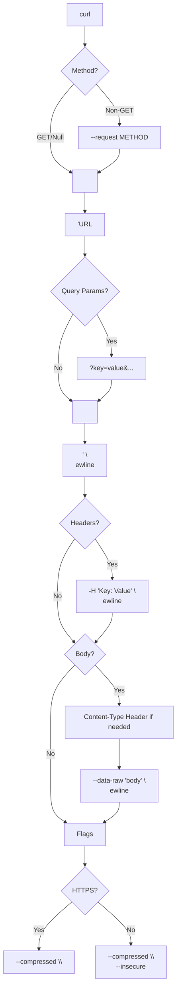
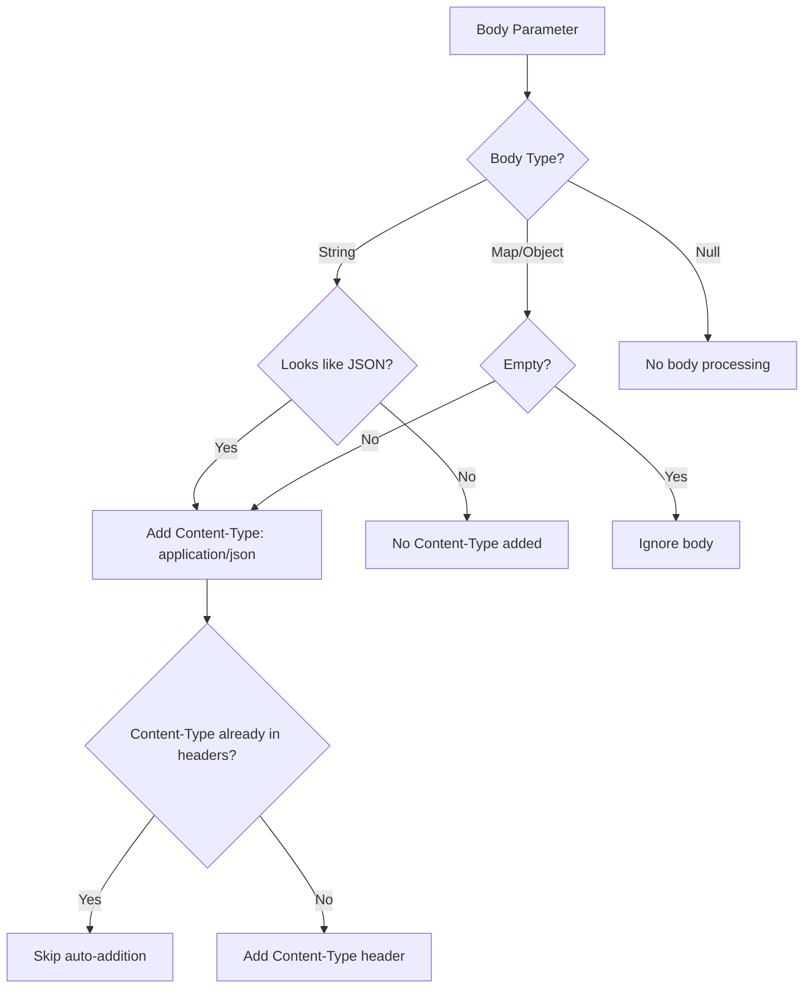

The `Curl` class is the central component of the `curl_generator` package, serving as both the architectural anchor and the sole public API surface. Despite containing multiple private methods for incremental command construction, it exposes a deliberately minimalist interface: a single static method that transforms HTTP request parameters into a properly formatted curl command string. Understanding this class's design decisions, parameter semantics, and output format is essential for both using and extending the library.

## Class Architecture and Design Philosophy

The `Curl` class employs a **static-only utility pattern** through a private constructor, preventing instantiation while maintaining a clean namespace for its public API. This design choice reflects the library's fundamental purpose: stateless transformation of request data into curl commands, with no need for object lifecycle management.

```dart
class Curl {
  Curl._();              // Private constructor prevents instantiation
  static String _curl = '';  // Shared mutable state accumulator
  ...
}
```

The class structure reveals a clear separation of concerns: one public method orchestrates the generation process, while seven private methods handle specific aspects of curl command construction. This encapsulation keeps the API surface clean while maintaining implementation flexibility.

| Member | Visibility | Purpose |
|--------|-----------|---------|
| `Curl._()` | Private constructor | Prevents class instantiation |
| `Curl.curlOf()` | Public static | Single entry point for curl generation |
| `Curl._curl` | Private static | Mutable string accumulator for building commands |
| `Curl._addMethod()` | Private static | Prepends HTTP method to curl string |
| `Curl._addUrl()` | Private static | Appends URL to curl string |
| `Curl._addQueryParams()` | Private static | Encodes query parameters |
| `Curl._addHeaders()` | Private static | Appends header flags |
| `Curl._addBody()` | Private static | Handles body serialization and Content-Type detection |

Sources: [curl.dart](lib/src/curl.dart#L6-L143)

## The `curlOf` Method: Primary API Surface

The `Curl.curlOf` method is the library's single public entry point, designed as a factory function that accepts HTTP request parameters and returns a formatted curl command. Its signature reveals the complete API surface available to consumers:

```dart
static String curlOf({
  required String url,
  String? method,
  Map<String, String> queryParams = const {},
  Map<String, String> headers = const {},
  Object? body,
})
```

The method uses named parameters exclusively, enhancing readability when multiple parameters are provided. Only `url` is required, while all other parameters have sensible defaults, allowing for progressively more complex requests.

### Parameter Reference

| Parameter | Type | Required | Default | Description |
|-----------|------|----------|---------|-------------|
| `url` | `String` | ✅ | - | Target URL for the curl command. Determines HTTPS/HTTP behavior. |
| `method` | `String?` | ❌ | `null` | HTTP method (GET, POST, PUT, DELETE, etc.). GET is treated as default. |
| `queryParams` | `Map<String, String>` | ❌ | `const {}` | URL query parameters appended as `?key=value&key=value`. |
| `headers` | `Map<String, String>` | ❌ | `const {}` | HTTP headers formatted as `-H 'Key: Value'` flags. |
| `body` | `Object?` | ❌ | `null` | Request body. Accepts String, Map, or JSON-encodable objects. |

Sources: [curl.dart](lib/src/curl.dart#L43-L49)

### Parameter Semantics and Edge Cases

**HTTP Method Handling**: The method parameter undergoes specific normalization logic. If `null`, no `--request` flag is added (implicit GET). If provided, it's converted to uppercase. The string "GET" is specifically ignored to avoid redundant `--request GET` flags, as curl defaults to GET requests.

**Query Parameters**: The `queryParams` map is joined with `&` and appended to the URL with a `?` separator. This happens before URL quoting, so parameters become part of the URL string itself rather than separate arguments.

**Header Handling**: Headers are added as individual `-H` flags, each quoted with single quotes. The order of headers in the output matches the iteration order of the input map.

**Body Processing**: The `body` parameter accepts three distinct types with different handling:
- **String**: Used verbatim (supports raw JSON, form data, or any string)
- **Map/Other Objects**: Automatically JSON-encoded using `json.encode`
- **Empty values**: Empty strings or empty maps are ignored

Sources: [curl.dart](lib/src/curl.dart#L108-L141)

## Return Value and Output Format

The method returns a `String` containing a complete, shell-ready curl command. The output format follows specific conventions that ensure compatibility with standard shell environments:

1. **Single quotes** around URLs and header values prevent shell interpolation
2. **Line continuations** (`\`) at command boundaries enable multi-line readability
3. **Proper spacing** with consistent indentation for headers and flags
4. **Automatic flags**: `--compressed` always added; `--insecure` conditionally added for HTTP URLs

### Output Structure Patterns

The generated command follows this general structure:



Sources: [curl.dart](lib/src/curl.dart#L50-L66)

## Usage Patterns and Examples

### Minimal GET Request

The simplest usage requires only a URL, producing a basic curl command:

```dart
final curl = Curl.curlOf(url: 'https://api.example.com/data');
// Output: curl 'https://api.example.com/data' \
//           --compressed \
```

### POST Request with Body

Adding a body automatically triggers Content-Type detection and JSON encoding:

```dart
final curl = Curl.curlOf(
  url: 'https://api.example.com/users',
  body: {'name': 'John', 'email': 'john@example.com'},
);
// Output: curl 'https://api.example.com/users' \
//           -H 'Content-Type: application/json' \
//           --data-raw '{"name":"John","email":"john@example.com"}' \
//           --compressed \
```

### Complete Request with All Parameters

The method supports full HTTP request specification:

```dart
final curl = Curl.curlOf(
  url: 'https://api.example.com/search',
  method: 'POST',
  queryParams: {'page': '1', 'limit': '10'},
  headers: {
    'Accept': 'application/json',
    'Authorization': 'Bearer token123',
  },
  body: {'query': 'search term', 'filters': {'active': true}},
);
```

Sources: [curl_generator_test.dart](test/curl_generator_test.dart#L88-L134)

## Content-Type Auto-Detection Logic

One of the most sophisticated aspects of the API is the automatic Content-Type header management. The method intelligently determines when to add headers based on body type and existing headers.

### Detection Rules

1. **String bodies**: Content-Type added only if the string looks like JSON (starts with `{` or `[`)
2. **Map/Object bodies**: Content-Type always set to `application/json`
3. **Existing headers**: If any header contains "content-type" (case-insensitive), no auto-addition occurs
4. **Empty bodies**: No Content-Type header added for null, empty string, or empty map

This logic prevents duplicate headers while ensuring proper content type specification for most common use cases.



Sources: [curl.dart](lib/src/curl.dart#L129-L138)

## Security Flag Behavior

The method automatically handles security-related curl flags based on the URL scheme:

- **HTTPS URLs**: Standard behavior with `--compressed` flag only
- **HTTP URLs**: Adds both `--compressed` and `--insecure` flags

This design choice acknowledges that HTTP endpoints typically don't require certificate verification, while HTTPS endpoints should maintain standard security practices. The `--insecure` flag prevents SSL certificate validation errors when testing against HTTP development servers.

Sources: [curl.dart](lib/src/curl.dart#L59-L65)

## Thread Safety Considerations

The `Curl` class uses a **static mutable field** (`_curl`) as an accumulator during command generation. This design choice has important implications:

1. **Not thread-safe**: Concurrent calls to `curlOf` could interfere with each other
2. **Stateless between calls**: The field is reset to empty string at the start of each call
3. **Single-threaded assumption**: The library assumes typical Dart single-threaded execution

For most use cases in Dart applications (which are typically single-threaded with async event loops), this design works correctly. However, in isolate-based concurrency scenarios, each isolate would have its own copy of the static field.

Sources: [curl.dart](lib/src/curl.dart#L50)

## Integration with Library Architecture

The `Curl` class exists within the library's part file pattern, sharing namespace with the library entry point. This architecture means:

- The class is accessible via the library import: `import 'package:curl_generator/curl_generator.dart';`
- Private members remain private across the library boundary
- The `json.encode` function from `dart:convert` is available through the shared import

This integration ensures the API feels cohesive while maintaining proper encapsulation of implementation details.

Sources: [curl_generator.dart](lib/curl_generator.dart#L1-L6), [curl.dart](lib/src/curl.dart#L1)

## Common Usage Patterns

### Debugging HTTP Requests

The primary use case is generating curl commands for debugging API interactions:

```dart
// Generate from existing request parameters
final debugCurl = Curl.curlOf(
  url: 'https://api.stripe.com/v1/charges',
  method: 'POST',
  headers: {'Authorization': 'Bearer sk_test_...'},
  body: {'amount': 2000, 'currency': 'usd'},
);
print(debugCurl); // Copy to terminal for testing
```

### Documentation Generation

The output format is ideal for including in API documentation:

```dart
/// Create a user account
/// 
/// Example curl command:
/// ```bash
/// ${Curl.curlOf(
///   url: 'https://api.example.com/users',
///   method: 'POST',
///   body: {'name': 'John'},
/// )}
/// ```
Future<User> createUser(Map<String, dynamic> userData) async {
  // Implementation
}
```

### Testing and Validation

The deterministic output format makes it useful in test suites:

```dart
test('generates correct curl for POST request', () {
  final result = Curl.curlOf(
    url: 'https://api.test.com/endpoint',
    method: 'POST',
    body: {'key': 'value'},
  );
  
  expect(result, contains('--request POST'));
  expect(result, contains('--data-raw'));
  expect(result, contains('Content-Type: application/json'));
});
```

Sources: [curl_generator_test.dart](test/curl_generator_test.dart#L1-L218)

## Summary

The `Curl` class provides a focused, single-purpose API for transforming HTTP request parameters into shell-ready curl commands. Its design prioritizes simplicity through a single public method while maintaining sophisticated internal logic for body handling, header management, and security flags. The class integrates seamlessly with Dart's library system through the part file pattern, offering a clean API surface that handles the complexity of curl command generation internally.

The API surface is deliberately minimal—five parameters covering all common HTTP request scenarios—while the implementation handles edge cases like empty bodies, JSON detection, and protocol-specific flags automatically.

## Next Steps

To understand how the `curlOf` method orchestrates its internal pipeline, continue to [Curl Generation Pipeline Internals](7-curl-generation-pipeline-internals). For specific deep dives into individual aspects like [HTTP Method Handling](8-http-method-handling), [Query Parameter Encoding](9-query-parameter-encoding), or [Body Serialization Strategies](11-body-serialization-strategies), explore the Feature Details section of this documentation.