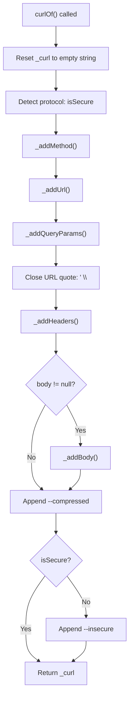
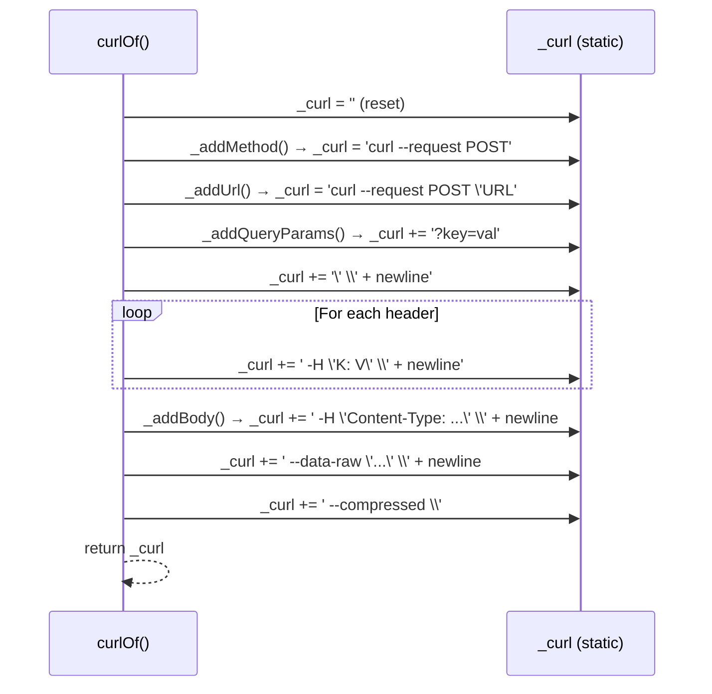

The `curl_generator` library constructs curl command strings through a **sequential pipeline pattern** — a series of specialized private methods that progressively mutate a shared static string. This page dissects the pipeline's stages, examines how state flows through each transformation, and explores the conditional logic that produces correct output for diverse input combinations.

For a primer on the class structure that hosts this pipeline, see [The Curl Class and Its API Surface](6-the-curl-class-and-its-api-surface). If you need background on how the library organizes its files, refer to [Library Entry Point and Part File Pattern](5-library-entry-point-and-part-file-pattern).

## Pipeline Overview

The entire generation logic lives within `Curl.curlOf()`, which orchestrates eight distinct stages. Each stage appends its contribution to the static `_curl` accumulator string, and the final result is returned to the caller.



The pipeline is **linear and deterministic** — given the same inputs, the output is always identical. There is no branching on previously accumulated state except for Content-Type detection within `_addBody()`, which inspects whether the `_curl` string already contains a `content-type` header.

Sources: [curl.dart](lib/src/curl.dart#L45-L78)

## Stage 1: State Initialization and Protocol Detection

Before any construction begins, `curlOf()` resets the static accumulator to an empty string and inspects the URL for the protocol scheme:

```dart
_curl = '';
final isSecure = url.startsWith('https');
```

This is a critical design decision. Because `_curl` is a **static field** shared across all invocations, every call must begin with a clean slate. Without this reset, a previous generation's string would persist, producing corrupted output. The `isSecure` flag is captured early because it influences two downstream behaviors: the final `--insecure` flag (only for HTTP) and the trailing line-continuation character at the end of the command.

Sources: [curl.dart](lib/src/curl.dart#L55-L56)

## Stage 2: Method Prefix

The `_addMethod()` stage determines whether the HTTP method needs explicit representation in the curl command:

```dart
static void _addMethod(String? method) {
  if (method == null) return;
  if (method.toUpperCase() == 'GET') return;
  _curl = 'curl --request ${method.toUpperCase()}';
}
```

Two early returns handle the common cases. When `method` is `null`, the pipeline proceeds without any prefix — curl defaults to GET when no method is specified. When the method is explicitly `GET`, it is also skipped, since `curl 'URL'` already implies a GET request. For any other method (POST, PUT, DELETE, PATCH, etc.), the string begins with `curl --request METHOD`.

Notice the subtle state dependency: when `_addMethod()` does nothing (null or GET), `_curl` remains empty. This directly affects how `_addUrl()` behaves in the next stage.

| Input Method | `_curl` After `_addMethod()` | Effect on `_addUrl()` |
|:------------:|:-----------------------------:|:---------------------:|
| `null` | `''` (empty) | Prefixes with `curl` |
| `'GET'` | `''` (empty) | Prefixes with `curl` |
| `'POST'` | `'curl --request POST'` | Appends URL only |
| `'DELETE'` | `'curl --request DELETE'` | Appends URL only |

Sources: [curl.dart](lib/src/curl.dart#L82-L87)

## Stage 3: URL Appending

The `_addUrl()` stage handles the URL with awareness of whether the command prefix already exists:

```dart
static void _addUrl(String url) {
  if (_curl.isEmpty) {
    _curl = 'curl \'$url';
    return;
  }
  _curl = '$_curl \'$url';
}
```

When `_curl` is empty (no method was added), this method creates the full `curl 'URL` string. When `_curl` already contains the method prefix, it simply appends `'URL` — note the opening single quote that will be closed later. The URL is wrapped in single quotes to protect shell-special characters such as `&`, `?`, and spaces.

After `_addUrl()`, the `_addQueryParams()` stage appends any query parameters directly onto the URL (before the closing quote), and then the main `curlOf()` method closes the quote with `' \` to complete the first line of the command.

Sources: [curl.dart](lib/src/curl.dart#L90-L97)

## Stage 4: Query Parameter Assembly

Query parameters are injected as a URL query string rather than as separate curl flags. The `_addQueryParams()` method builds the string by joining all key-value pairs with `&`:

```dart
static void _addQueryParams(Map<String, String> queryParams) {
  if (queryParams.isEmpty) return;
  final params =
      queryParams.entries.map((e) => '${e.key}=${e.value}').join('&');
  _curl = '$_curl?$params';
}
```

The method appends `?key1=value1&key2=value2` directly to the accumulated URL string. There is **no URL encoding** applied to either keys or values — they are inserted verbatim. This is a conscious simplification: the library assumes pre-encoded or simple ASCII parameter values. If a consumer needs encoded parameters, they must encode them before passing them to `curlOf()`.

The query string is appended **before** the URL quote is closed in the main `curlOf()` flow, so the final URL in the generated command correctly includes the full query string within its single quotes.

Sources: [curl.dart](lib/src/curl.dart#L100-L105)

## Stage 5: Header Emission

The `_addHeaders()` stage iterates over the headers map and appends each entry as a `-H` flag:

```dart
static void _addHeaders(Map<String, String> headers) {
  final headerEntries = headers.entries.toList();
  for (int i = 0; i < headerEntries.length; i++) {
    _curl = '$_curl  -H \'${headerEntries[i].key}: ${headerEntries[i].value}\' \\\n';
  }
}
```

Each header is formatted as `-H 'Key: Value' \` with two leading spaces for indentation and a trailing backslash-newline for shell line continuation. The entries are converted to a list to allow indexed iteration, though no index-dependent logic exists — a simple `for-in` loop would be functionally equivalent.

Header keys are **not** normalized or validated. The library passes them through exactly as provided, preserving the caller's casing. This means `Content-Type` and `content-type` are both valid, and both will produce a functioning header flag. The Content-Type auto-detection in `_addBody()` relies on a case-insensitive substring check against `_curl` to determine whether a Content-Type header already exists.

Sources: [curl.dart](lib/src/curl.dart#L108-L113)

## Stage 6: Body Serialization and Content-Type Auto-Detection

The `_addBody()` stage is the most complex part of the pipeline, handling multiple body types and performing Content-Type negotiation:

```dart
static void _addBody(Object body) {
  String bodyData;

  if (body is String) {
    if (body.trim().isEmpty) return;
    bodyData = body;
  } else if (body is Map && body.isEmpty) {
    return;
  } else {
    bodyData = json.encode(
      body,
      toEncodable: (object) => object.toString(),
    );
  }

  if (!_curl.toLowerCase().contains('content-type')) {
    final trimmedBody = bodyData.trim();
    final looksLikeJson = trimmedBody.startsWith('{') || trimmedBody.startsWith('[');
    if (body is! String || looksLikeJson) {
      _curl = '$_curl  -H \'Content-Type: application/json\' \\\n';
    }
  }

  _curl = '$_curl  --data-raw \'$bodyData\' \\\n';
}
```

The body undergoes a three-phase process:

### Phase A: Serialization

The method handles three distinct body types with different serialization strategies:

| Body Type | Serialization | Result |
|:---------:|:------------:|:------:|
| `String` (non-empty) | Used as-is | Raw string preserved |
| `Map` (non-empty) or other object | `json.encode()` with `toEncodable` fallback | JSON string |
| `String` (empty) or `Map` (empty) | Early return | No body added |

The `toEncodable` callback in `json.encode()` provides a safety net: any object that cannot be natively serialized (such as the `Curl` class itself) falls back to its `toString()` representation. This prevents `json.encode()` from throwing an exception on non-serializable objects.

### Phase B: Content-Type Auto-Detection

Before adding the body to the command, the method checks whether a `Content-Type` header is already present — either explicitly set by the caller or automatically added by a previous invocation (which cannot happen in practice, but the check is defensive). The check is **case-insensitive** via `toLowerCase()`:

- If the caller already provided a `Content-Type` header, the auto-detection is skipped entirely.
- For **non-String bodies** (Maps, objects), `application/json` is always auto-added.
- For **String bodies**, the method inspects the string: if it starts with `{` or `[`, it "looks like JSON" and `application/json` is auto-added. Plain strings (form data, XML, etc.) receive no Content-Type.

### Phase C: Flag Appending

The serialized body is appended as `--data-raw 'bodyData'` — using `--data-raw` rather than `--data` to prevent curl from interpreting escape sequences or performing URL decoding on the payload.

Sources: [curl.dart](lib/src/curl.dart#L118-L143)

## Stage 7: Protocol-Conditional Flag Emission

The final stage in `curlOf()` appends the `--compressed` flag and conditionally appends `--insecure`:

```dart
if (!isSecure) {
  _curl = '$_curl  --compressed \\\n';
  _curl = '$_curl  --insecure';
} else {
  _curl = '$_curl  --compressed \\';
}
```

The `--compressed` flag tells curl to request compressed responses and decompress them automatically. It is always present regardless of protocol.

The `--insecure` flag is **only** added for HTTP URLs (non-HTTPS). For HTTPS URLs, curl performs standard certificate verification; for HTTP URLs, the `--insecure` flag is appended. The difference in trailing characters is also significant: HTTP commands end with a bare line (`--insecure` with no trailing backslash), while HTTPS commands end with `--compressed \` (a trailing backslash suggesting more content, though none follows).

This produces the visible structural difference in the generated output:

| Protocol | Final Lines | Trailing Character |
|:--------:|:-----------:|:------------------:|
| HTTPS | `--compressed \` | Backslash (no newline) |
| HTTP | `--compressed \` + `--insecure` | No backslash |

Sources: [curl.dart](lib/src/curl.dart#L69-L76)

## Complete String Assembly Example

To illustrate how all stages compose, consider a full POST request with all parameters:

```dart
Curl.curlOf(
  url: 'https://some.aoi.com/some/api',
  method: 'POST',
  queryParams: {'some': 'some', 'param': 'param'},
  headers: {
    'Accept': 'application/json',
    'Accept-Language': 'en-US,en;q=0.9',
    'Connection': 'keep-alive',
  },
  body: {'some': 'some', 'value': 'value', 'intValue': 1234},
)
```

The pipeline produces this output, with each stage's contribution annotated:

```
curl --request POST 'https://some.aoi.com/some/api?some=some&param=param' \
│       │               │                                        │
│       │               │                                        └─ Stage 4: _addQueryParams
│       │               └────────────────────────────────────────── Stage 3: _addUrl
│       └────────────────────────────────────────────────────────── Stage 2: _addMethod
└────────────────────────────────────────────────────────────────── Base command prefix
  -H 'Accept: application/json' \
│  -H 'Accept-Language: en-US,en;q=0.9' \                          ── Stage 5: _addHeaders
│  -H 'Connection: keep-alive' \
│  -H 'Content-Type: application/json' \                           ── Stage 6b: Content-Type auto-detection
│  --data-raw '{"some":"some","value":"value","intValue":1234}' \  ── Stage 6c: body flag
│  --compressed \                                                  ── Stage 7: final flags
```

Sources: [curl_generator_test.dart](test/curl_generator_test.dart#L120-L137)

## State Mutation Sequence

The pipeline uses a **mutable static accumulator** pattern. Rather than building fragments and composing them at the end, each stage directly mutates the `_curl` string. This creates an implicit ordering dependency — stages must execute in the exact sequence shown, because later stages depend on the string state produced by earlier ones.



This pattern has a notable characteristic: the static `_curl` field means the class is **not reentrant**. Two concurrent calls to `curlOf()` would interfere with each other. In practice this is not a concern because curl generation is a synchronous, fast operation, but it is an important architectural constraint to be aware of.

Sources: [curl.dart](lib/src/curl.dart#L38)

## Edge Cases and Defensive Behavior

The pipeline includes several defensive checks that handle edge cases gracefully:

| Edge Case | Handling | Location |
|:----------|:--------:|:--------:|
| Empty query params map | Early return, no `?` appended | `_addQueryParams()` |
| Empty headers map | Loop does not execute | `_addHeaders()` |
| Empty String body | `trim().isEmpty` check, early return | `_addBody()` |
| Empty Map body | Explicit empty-map check, early return | `_addBody()` |
| Non-serializable object in body | `toEncodable` fallback to `toString()` | `_addBody()` |
| Duplicate Content-Type in headers | Case-insensitive detection prevents duplication | `_addBody()` |
| Method is `GET` | Explicit skip (redundant with curl default) | `_addMethod()` |
| `method` parameter omitted (`null`) | Early return, no prefix | `_addMethod()` |

Sources: [curl.dart](lib/src/curl.dart#L118-L143), [curl_generator_test.dart](test/curl_generator_test.dart#L170-L186)

## Testing the Pipeline

The test suite in [curl_generator_test.dart](test/curl_generator_test.dart#L1-L218) validates the pipeline through 14 test cases that cover each stage individually and in combination. Key test categories include:

- **Method handling** — POST prefix presence, GET prefix absence
- **Query parameter composition** — URL-embedded params vs. separately provided params
- **Header emission** — Multiple headers, case-sensitivity behavior
- **Body serialization** — Map encoding, String passthrough, Content-Type auto-detection
- **Protocol behavior** — HTTPS vs. HTTP flag differences

The tests assert exact string equality against expected outputs, providing strong regression protection for the pipeline's behavior. Each test constructs a `Curl.curlOf()` call with specific inputs and compares the result character-by-character against a pre-built expected string.

Sources: [curl_generator_test.dart](test/curl_generator_test.dart#L1-L218)

## Next Steps

With an understanding of the generation pipeline, explore the feature-specific pages that examine individual stages in greater depth:
- [HTTP Method Handling](8-http-method-handling) — Detailed behavior of method prefix logic
- [Query Parameter Encoding](9-query-parameter-encoding) — URL construction with query strings
- [Header Management and Content-Type Auto-Detection](10-header-management-and-content-type-auto-detection) — Header emission and negotiation rules
- [Body Serialization Strategies](11-body-serialization-strategies) — Body type handling in depth
- [HTTPS vs HTTP Behavior and --insecure Flag](12-https-vs-http-behavior-and-insecure-flag) — Protocol-dependent flag logic