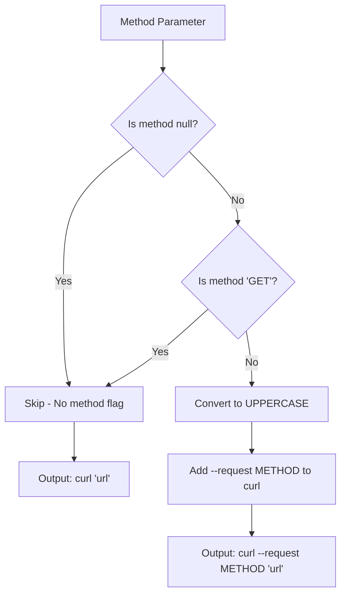
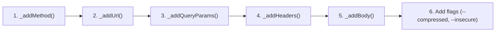

Understanding how HTTP methods work is fundamental to making API requests. This page explains how the curl generator handles different HTTP methods — from the default GET requests to explicitly specifying POST, PUT, DELETE, and other methods.

## Overview

Every HTTP request must specify a method that tells the server what action to perform. The `curl_generator` library provides a simple way to include this in your generated curl commands through the optional `method` parameter.

Sources: [lib/src/curl.dart](lib/src/curl.dart#L43-L49)

## Method Parameter

The `method` parameter in `Curl.curlOf()` accepts a `String?` (nullable String) that specifies the HTTP method to use. This parameter is **completely optional**.

```dart
static String curlOf({
  required String url,
  String? method,           // ← Optional HTTP method
  Map<String, String> queryParams = const {},
  Map<String, String> headers = const {},
  Object? body,
})
```

| Parameter | Type     | Required | Default | Description                          |
|-----------|----------|----------|---------|--------------------------------------|
| `url`     | `String` | Yes      | —       | The target URL for the request       |
| `method`  | `String?`| No       | `null`  | HTTP method (GET, POST, PUT, DELETE, etc.) |

Sources: [lib/src/curl.dart](lib/src/curl.dart#L43-L49)

## How Method Selection Works

The library uses a simple decision logic for method handling, implemented in the internal `_addMethod` helper function:



Sources: [lib/src/curl.dart](lib/src/curl.dart#L70-L74)

## Default Behavior: GET Requests

When you omit the `method` parameter or pass `null`, the library generates a curl command without any explicit method flag. This is correct because **curl defaults to GET** when no method is specified.

```dart
// These two calls produce identical output:
Curl.curlOf(url: 'https://api.example.com/users');
Curl.curlOf(url: 'https://api.example.com/users', method: null);
```

**Generated output:**
```bash
curl 'https://api.example.com/users' \
  --compressed
```

The same result occurs when you explicitly pass `'GET'` as the method — the library recognizes GET as the default and omits the redundant `--request GET` flag.

Sources: [lib/src/curl.dart](lib/src/curl.dart#L70-L74), [test/curl_generator_test.dart](test/curl_generator_test.dart#L14-L27)

## Specifying Non-Default Methods

For any method other than GET, the library adds the `--request` flag to the curl command. The method string is automatically converted to **uppercase** regardless of how you pass it.

### Examples by HTTP Method

| HTTP Method | Input Value | Generated Flag    | Use Case                        |
|-------------|-------------|-------------------|---------------------------------|
| GET         | `'GET'` or omitted | *(none)*    | Retrieving resources            |
| POST        | `'post'` or `'POST'` | `--request POST` | Creating new resources     |
| PUT         | `'Put'` or `'PUT'` | `--request PUT`  | Updating existing resources    |
| PATCH       | `'patch'` or `'PATCH'` | `--request PATCH` | Partial updates           |
| DELETE      | `'delete'` or `'DELETE'` | `--request DELETE` | Removing resources       |
| HEAD        | `'head'` or `'HEAD'` | `--request HEAD` | Headers only, no body   |

### POST Request Example

```dart
final curl = Curl.curlOf(
  url: 'https://api.example.com/users',
  method: 'POST',
  body: {'name': 'Alice', 'email': 'alice@example.com'},
);
```

**Generated output:**
```bash
curl --request POST 'https://api.example.com/users' \
  -H 'Content-Type: application/json' \
  --data-raw '{"name":"Alice","email":"alice@example.com"}' \
  --compressed
```

### PUT Request Example

```dart
final curl = Curl.curlOf(
  url: 'https://api.example.com/users/123',
  method: 'put',  // Case doesn't matter!
  body: {'name': 'Bob'},
);
```

**Generated output:**
```bash
curl --request PUT 'https://api.example.com/users/123' \
  -H 'Content-Type: application/json' \
  --data-raw '{"name":"Bob"}' \
  --compressed
```

### DELETE Request Example

```dart
final curl = Curl.curlOf(
  url: 'https://api.example.com/users/123',
  method: 'DELETE',
);
```

**Generated output:**
```bash
curl --request DELETE 'https://api.example.com/users/123' \
  --compressed
```

Sources: [lib/src/curl.dart](lib/src/curl.dart#L70-L74), [test/curl_generator_test.dart](test/curl_generator_test.dart#L5-L12)

## Case Insensitivity

The library normalizes all method names to uppercase using Dart's `toUpperCase()` method. This means you can pass the method in any case format and get the correct result:

```dart
// All of these produce identical output:
Curl.curlOf(url: '...', method: 'post');
Curl.curlOf(url: '...', method: 'POST');
Curl.curlOf(url: '...', method: 'Post');
Curl.curlOf(url: '...', method: 'pOsT');
```

Sources: [lib/src/curl.dart](lib/src/curl.dart#L73)

## Method and Body Interaction

The HTTP method and request body work together, but they are independent features. You can use any method with or without a body:

| Scenario | Method Behavior | Body Handling |
|----------|-----------------|---------------|
| GET with no body | No `--request` flag | No `--data-raw` |
| GET with body | No `--request` flag | Adds `--data-raw` |
| POST with body | Adds `--request POST` | Adds `--data-raw` |
| POST without body | Adds `--request POST` | No `--data-raw` |
| DELETE with body | Adds `--request DELETE` | Adds `--data-raw` |

**Note:** While technically possible to send a body with GET or DELETE, many servers may ignore or reject it. The library does not enforce any method-body restrictions.

Sources: [lib/src/curl.dart](lib/src/curl.dart#L57), [test/curl_generator_test.dart](test/curl_generator_test.dart#L88-L101)

## Pipeline Position

Method handling is the **first step** in the curl generation pipeline. The internal processing order is:



This ordering ensures that the `--request METHOD` flag appears at the beginning of the curl command, which is the conventional position.

Sources: [lib/src/curl.dart](lib/src/curl.dart#L52-L57)

## Quick Reference

| Input | Generated Command Start |
|-------|------------------------|
| `method: null` | `curl 'url'` |
| `method: 'GET'` | `curl 'url'` |
| `method: 'POST'` | `curl --request POST 'url'` |
| `method: 'PUT'` | `curl --request PUT 'url'` |
| `method: 'DELETE'` | `curl --request DELETE 'url'` |
| `method: 'PATCH'` | `curl --request PATCH 'url'` |
| `method: 'HEAD'` | `curl --request HEAD 'url'` |
| `method: 'OPTIONS'` | `curl --request OPTIONS 'url'` |

## Related Pages

- **[The Curl Class and Its API Surface](6-the-curl-class-and-its-api-surface)** — Complete reference for the `Curl` class and all its parameters
- **[Curl Generation Pipeline Internals](7-curl-generation-pipeline-internals)** — Deep dive into the full curl generation process
- **[Body Serialization Strategies](11-body-serialization-strategies)** — How request bodies are handled and serialized
- **[Running Tests](13-running-tests)** — How to verify HTTP method handling with the test suite