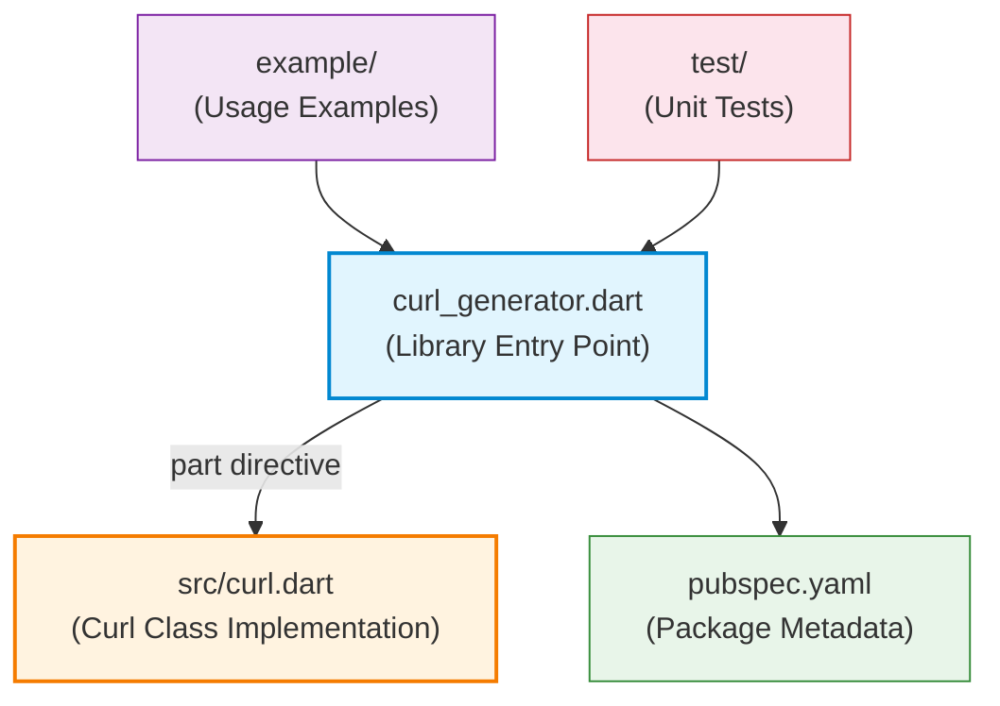
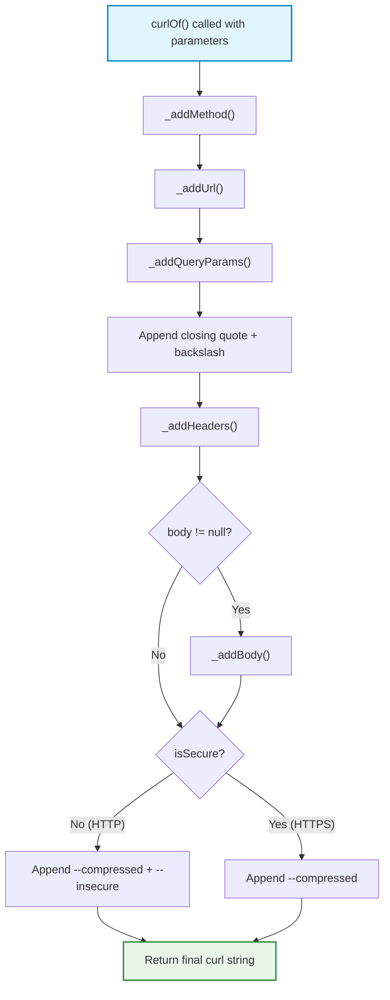

**curl_generator** is a lightweight Dart package that programmatically generates `curl` command strings from structured input — URL, query parameters, headers, and request body. It eliminates the repetitive manual construction of curl commands during API development and debugging, giving developers a single static method call that produces a copy-paste-ready bash curl command. Sources: [README.md](README.md#L1-L5), [pubspec.yaml](pubspec.yaml#L1-L14)

## What curl_generator Does

At its core, curl_generator solves one focused problem: **take structured Dart data and produce a valid curl command string**. Rather than manually assembling curl flags, escaping quotes, and formatting multi-line commands, you pass your API details into `Curl.curlOf()` and receive a properly formatted curl command ready to run in your terminal.

This is particularly valuable in scenarios such as:

- **API debugging**: Quickly generate curl commands from your existing Dart code to test endpoints independently
- **Documentation**: Produce runnable examples for API documentation
- **Testing**: Create reproducible HTTP request strings for manual or automated verification
- **Migration**: Export existing Dart HTTP call configurations into shell commands

Sources: [lib/src/curl.dart](lib/src/curl.dart#L1-L10), [README.md](README.md#L1-L5)

## Key Features at a Glance

| Feature | Description |
|---|---|
| **HTTP Method Support** | Generates commands for any HTTP method (GET, POST, PUT, DELETE, PATCH, etc.) with explicit `--request` flag |
| **Query Parameters** | Accepts a `Map<String, String>` and correctly encodes them into the URL query string |
| **Custom Headers** | Adds any number of headers via `-H` flags with proper formatting |
| **Flexible Body** | Accepts `String`, `Map`, or any JSON-encodable object as the request body |
| **Auto Content-Type** | Automatically adds `Content-Type: application/json` when a body is present and no Content-Type header is already specified |
| **HTTP vs HTTPS Handling** | Automatically appends `--insecure` for HTTP URLs while omitting it for HTTPS |
| **Compression Flag** | Includes `--compressed` in every generated command |

Sources: [lib/src/curl.dart](lib/src/curl.dart#L35-L56), [test/curl_generator_test.dart](test/curl_generator_test.dart#L1-L50)

## Project Architecture

The library follows a minimalist two-file structure with Dart's `part` directive connecting them into a single library unit:



The public API surface is intentionally narrow — a single class (`Curl`) with a single public static method (`curlOf`). The class uses a private constructor to prevent instantiation, enforcing its role as a **static utility class**. All internal state is managed through a private static `_curl` string variable that gets built incrementally by private helper methods. Sources: [lib/curl_generator.dart](lib/curl_generator.dart#L1-L6), [lib/src/curl.dart](lib/src/curl.dart#L12-L20)

## How It Works Internally

The `curlOf` method orchestrates the curl string construction through a **sequential builder pattern** using private static methods:



Each private method (`_addMethod`, `_addUrl`, `_addQueryParams`, `_addHeaders`, `_addBody`) appends its portion to the shared `_curl` static string. This stepwise construction ensures the generated curl command follows the correct flag ordering. Sources: [lib/src/curl.dart](lib/src/curl.dart#L35-L56), [lib/src/curl.dart](lib/src/curl.dart#L60-L143)

## Generated Command Structure

A typical output from `Curl.curlOf()` produces a multi-line, properly escaped curl command:

```
curl 'https://example.com/api?query=value' \
  -H 'Accept: application/json' \
  -H 'Authorization: Bearer token' \
  -H 'Content-Type: application/json' \
  --data-raw '{"key":"value"}' \
  --compressed \
```

The structure follows standard curl conventions with backslash line continuations for readability. For HTTP (non-HTTPS) URLs, an additional `--insecure` flag is appended at the end. Sources: [lib/src/curl.dart](lib/src/curl.dart#L104-L143), [test/curl_generator_test.dart](test/curl_generator_test.dart#L155-L165)

## Quick Example

Here is the simplest possible usage — generating a GET request curl command:

```dart
import 'package:curl_generator/curl_generator.dart';

final result = Curl.curlOf(url: 'https://api.example.com/users');
print(result);
// curl 'https://api.example.com/users' \
//   --compressed \
```

And here is a full-featured example with all parameters:

```dart
final result = Curl.curlOf(
  url: 'https://api.example.com/users',
  method: 'POST',
  queryParams: {'page': '1', 'limit': '10'},
  headers: {
    'Accept': 'application/json',
    'Authorization': 'Bearer my-token',
  },
  body: {'name': 'Alice', 'email': 'alice@example.com'},
);
```

Sources: [README.md](README.md#L10-L52), [lib/src/curl.dart](lib/src/curl.dart#L35-L56)

## Reading Progression

This overview covers the big picture. To learn how to use curl_generator effectively, follow this recommended path:

1. **[Installation](3-installation)** — Add curl_generator to your Dart project
2. **[Quick Start](2-quick-start)** — Generate your first curl command in under a minute
3. **[The Curl.curlOf Method](4-the-curl-curlof-method)** — Understand the complete API signature and parameters

Once comfortable with the basics, explore the Deep Dive section for detailed behavior of each feature — from [Generating Basic GET Requests](5-generating-basic-get-requests) through [HTTP Method Support](11-http-method-support). For developers interested in the library's internals, the final two pages explain [Library Architecture & Part Directive](12-library-architecture-and-part-directive) and [Static Class Pattern & String Building Strategy](13-static-class-pattern-and-string-building-strategy).