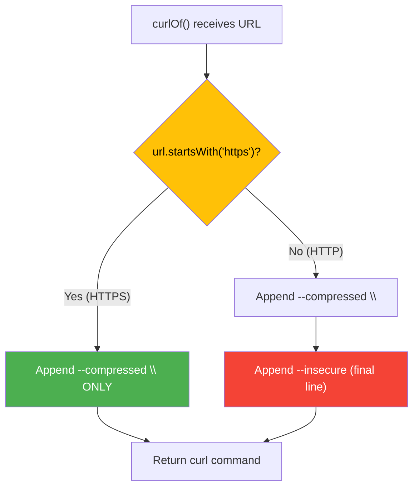
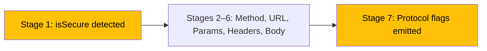

The `curl_generator` library makes a protocol-aware decision when building curl commands: it detects whether a URL uses HTTPS or HTTP and conditionally appends different flags to the final output. This page explains the detection mechanism, the conditional flag emission logic, and the practical implications for developers using the library.

## Protocol Detection Mechanism

At the very beginning of the curl generation pipeline — before any construction begins — the `curlOf()` method inspects the URL string to determine the transport protocol:

```dart
final isSecure = url.startsWith('https');
```

This single line at [lib/src/curl.dart#L51](lib/src/curl.dart#L51) captures a boolean that persists throughout the entire generation process. The check is a **purely syntactic string prefix test**: it does not parse the URL, validate its structure, or resolve the scheme against any standard library. Any URL beginning with the literal characters `https` is treated as secure; everything else is treated as insecure.

This design has a direct consequence — the detection is scheme-agnostic for non-HTTPS inputs:

| URL Input | `isSecure` Value | Implication |
|:----------|:----------------:|:------------|
| `https://api.example.com/users` | `true` | Treated as secure (HTTPS) |
| `http://api.example.com/users` | `false` | Treated as insecure (HTTP) |
| `https://` (incomplete) | `true` | Treated as secure despite malformed URL |
| `ftp://server.com/file` | `false` | Treated as insecure (no HTTPS prefix) |
| `ws://socket.example.com` | `false` | Treated as insecure (no HTTPS prefix) |

Non-HTTP schemes such as FTP and WebSocket are not specially handled — they fall into the insecure branch purely because they lack the `https` prefix. Since this library is purpose-built for HTTP API debugging, this edge case is unlikely to surface in practice, but it is a direct consequence of the simple prefix check.

Sources: [lib/src/curl.dart#L51](lib/src/curl.dart#L51)

## Conditional Flag Emission Logic

The protocol decision manifests in the final stage of the `curlOf()` pipeline. After all headers, body, and query parameters have been assembled, the method appends two flags — one unconditional and one conditional:

```dart
// Add --compressed with backslash only if URL is not secure (to add --insecure)
if (!isSecure) {
  _curl = '$_curl  --compressed \\\n';
  _curl = '$_curl  --insecure';
} else {
  _curl = '$_curl  --compressed \\';
}
```

The branching logic at [lib/src/curl.dart#L59-L65](lib/src/curl.dart#L59-L65) produces structurally different output depending on the protocol. The difference is twofold: which flags appear, and how the command string terminates.



**HTTPS path** (line 64): Appends `--compressed \` — a single line with a trailing backslash. The backslash signals shell line continuation, but no further lines follow. This is syntactically valid but produces a dangling backslash on the last line.

**HTTP path** (lines 61–62): Appends `--compressed \` with a newline escape (`\\\n`), then appends `--insecure` as a bare final line with no trailing backslash. The `--insecure` flag becomes the terminal argument, producing a cleanly terminated command.

| Aspect | HTTPS | HTTP |
|:-------|:-----:|:----:|
| `--compressed` present | ✅ | ✅ |
| `--insecure` present | ❌ | ✅ |
| Trailing backslash on `--compressed` | Yes | Yes |
| Final line terminus | `--compressed \` | `--insecure` |
| Shell continuation after last flag | Dangling (harmless) | Clean |

Sources: [lib/src/curl.dart#L59-L65](lib/src/curl.dart#L59-L65)

## Understanding the `--insecure` Flag

The `--insecure` flag in curl tells the tool to **skip SSL/TLS certificate verification**. This flag is relevant only to connections that use TLS — namely HTTPS. When curl connects to an `https://` endpoint, it validates the server's certificate against a chain of trusted Certificate Authorities.

For HTTP connections (`http://`), no TLS handshake occurs and no certificate verification takes place. The `--insecure` flag has **no effect** on HTTP requests — curl ignores it silently because there is no certificate to verify.

This creates an interesting semantic situation in the library's output:

| Scenario | Flag Added | Practical Effect |
|:---------|:----------:|:-----------------|
| HTTPS URL | No `--insecure` | Certificate verification is **enabled** (default curl behavior) |
| HTTP URL | `--insecure` appended | Flag is **ignored** by curl (no TLS involved) |

The `--insecure` flag on HTTP requests is **harmless but redundant** — it does not change curl's behavior, introduce security risks, or affect functional output. Its presence in the generated command is a quirk of the implementation rather than a meaningful behavioral choice.

Sources: [test/curl_generator_test.dart#L136-L143](test/curl_generator_test.dart#L136-L143)

## Generated Output Comparison

To see the behavioral difference in concrete terms, here are the exact outputs for identical request parameters with different protocols.

**HTTPS request (no body):**

```
curl 'https://some.api.com/some/api' \
  --compressed \
```

**HTTP request (no body):**

```
curl 'http://some.api.com/some/api' \
  --compressed \
  --insecure
```

The HTTP variant includes `--insecure` as a final, standalone line. The HTTPS variant terminates after `--compressed \` with no additional flags.

When body and headers are present, the structural difference persists:

**HTTPS with body:**

```
curl 'https://some.api.com/some/api' \
  -H 'Content-Type: application/json' \
  --data-raw '{"some":"value"}' \
  --compressed \
```

**HTTP with body:**

```
curl 'http://some.api.com/some/api' \
  -H 'Content-Type: application/json' \
  --data-raw '{"some":"value"}' \
  --compressed \
  --insecure
```

Notice that the body processing and header rendering stages are identical regardless of protocol — the only difference appears in the final flag emission stage. The `isSecure` variable has no influence over intermediate stages like header formatting, body serialization, or query parameter encoding.

Sources: [test/curl_generator_test.dart#L136-L153](test/curl_generator_test.dart#L136-L153), [test/curl_generator_test.dart#L88-L101](test/curl_generator_test.dart#L88-L101)

## Test Coverage for Protocol Behavior

The test suite validates protocol-specific behavior through dedicated test cases that cover both HTTP and HTTPS URLs across various scenarios:

| Test Name | Line | URL Scheme | What It Validates |
|:----------|:----:|:----------:|:------------------|
| `test http call` | [L136](test/curl_generator_test.dart#L136) | HTTP | `--insecure` is present, `--compressed` has newline |
| `test if content-type will aded to post calls` | [L145](test/curl_generator_test.dart#L145) | HTTP | `--insecure` present with body and Content-Type |
| `test if content-type will not aded to calls that have no body` | [L156](test/curl_generator_test.dart#L156) | HTTP | `--insecure` present without body |
| `test method if it is not null` | [L5](test/curl_generator_test.dart#L5) | HTTPS | No `--insecure`, POST method works |
| `test ignore get method` | [L14](test/curl_generator_test.dart#L14) | HTTPS | No `--insecure`, GET ignored |
| `test GET method with no query params and headers` | [L21](test/curl_generator_test.dart#L21) | HTTPS | No `--insecure`, bare GET |

The HTTP test cases exclusively use `http://some.api.com/some/api` as the base URL, while the HTTPS test cases use `https://some.api.com/some/api`. This consistent separation ensures the protocol detection path is exercised independently.

Sources: [test/curl_generator_test.dart#L5-L27](test/curl_generator_test.dart#L5-L27), [test/curl_generator_test.dart#L136-L163](test/curl_generator_test.dart#L136-L163)

## Architectural Context Within the Pipeline

The protocol detection and conditional flag emission occurs at the boundaries of the generation pipeline. The `isSecure` variable is created at the **very beginning** (stage 1) and consumed at the **very end** (stage 7), bookending the entire construction process.



This design means that protocol detection has **no influence over intermediate stages** — it does not affect header formatting, body serialization, query parameter encoding, or method detection. The only downstream impact is on the final flag set appended to the curl command.

For deeper insight into the complete pipeline stages, refer to [The Curl.curlOf Method](4-the-curl-curlof-method).

Sources: [lib/src/curl.dart#L50-L66](lib/src/curl.dart#L50-L66)

## Practical Implications for Developers

When using the `curl_generator` library, developers should be aware of three key points regarding protocol handling:

**HTTPS requests require no special configuration.** The library generates standard curl commands for HTTPS URLs with full certificate verification enabled. The generated commands behave identically to manually typed curl commands for HTTPS endpoints.

**HTTP requests include a harmless `--insecure` flag.** While this flag has no practical effect on HTTP connections, it does add an extra line to the generated command. If the output is being used in contexts where command structure matters (e.g., automated pipelines that parse curl commands), be aware that HTTP commands will be one line longer than their HTTPS equivalents.

**Non-HTTP schemes are not specially handled.** URLs using `ftp://`, `ws://`, or other schemes are treated as insecure and receive the `--insecure` flag. Since the library is designed for HTTP API debugging, this edge case is unlikely to arise in practice.

| Concern | HTTPS Behavior | HTTP Behavior |
|:--------|:---------------|:--------------|
| Certificate verification | Enabled (default) | N/A (no TLS) |
| `--insecure` in output | Absent | Present |
| Command length | Shorter | Longer by one line |
| Functional difference vs manual curl | None | None |

Sources: [lib/src/curl.dart#L51](lib/src/curl.dart#L51), [test/curl_generator_test.dart#L136-L143](test/curl_generator_test.dart#L136-L143)

## Next Steps

Now that you understand how the library handles protocol-specific behavior, you can explore adjacent topics. Learn how the HTTP method parameter affects output in [HTTP Method Support](11-http-method-support), or dive into the internal file organization in [Library Architecture & Part Directive](12-library-architecture-and-part-directive). For a holistic view of how all generation stages work together, see [The Curl.curlOf Method](4-the-curl-curlof-method).