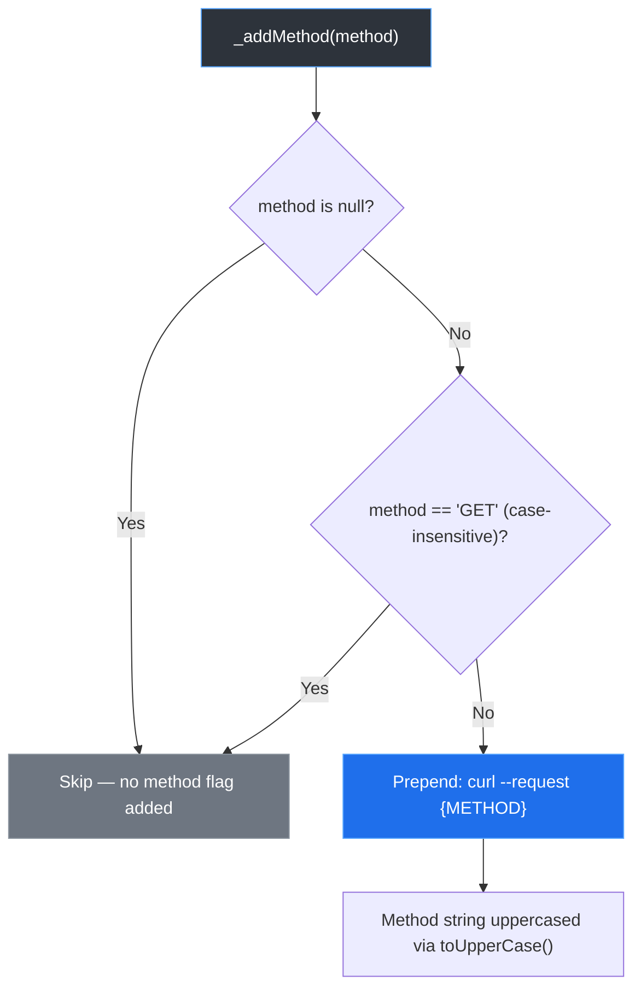
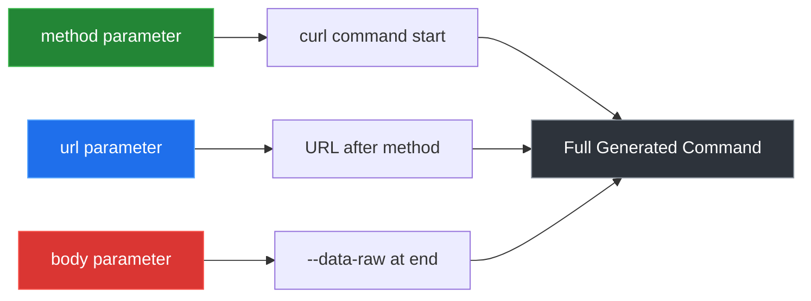

This page explains how the `curl_generator` library handles different HTTP methods — GET, POST, PUT, PATCH, DELETE, and others — and how the method parameter influences the generated curl command structure.

## How HTTP Methods Are Processed

The library accepts an optional `method` parameter via the `Curl.curlOf()` function. The core logic resides in the private `_addMethod()` method, which applies three distinct behaviors depending on the input:



The design is intentional: `GET` is the default HTTP method in curl, so specifying it explicitly would produce redundant output. The library omits it for cleaner, more conventional curl commands. For every other method — POST, PUT, PATCH, DELETE, OPTIONS, HEAD — the `--request` flag is prepended. Sources: [lib/src/curl.dart#L70-L74](lib/src/curl.dart#L70-L74)

## Supported HTTP Methods

The library does not enforce a fixed list of methods. Any string passed to the `method` parameter is accepted, uppercased, and inserted into the `--request` flag. This makes it compatible with standard and custom HTTP methods alike.

| Method | Behavior | Generated Flag | Example Output |
|---|---|---|---|
| *(omitted or null)* | Implicit GET | *(none)* | `curl 'https://api.example.com/data'` |
| `GET` | Explicitly ignored | *(none)* | `curl 'https://api.example.com/data'` |
| `POST` | Added | `--request POST` | `curl --request POST 'https://api.example.com/data'` |
| `PUT` | Added | `--request PUT` | `curl --request PUT 'https://api.example.com/data'` |
| `PATCH` | Added | `--request PATCH` | `curl --request PATCH 'https://api.example.com/data'` |
| `DELETE` | Added | `--request DELETE` | `curl --request DELETE 'https://api.example.com/data'` |
| `OPTIONS` | Added | `--request OPTIONS` | `curl --request OPTIONS 'https://api.example.com/data'` |
| `HEAD` | Added | `--request HEAD` | `curl --request HEAD 'https://api.example.com/data'` |

**Key insight**: The case of your input does not matter. Passing `'post'`, `'Post'`, or `'POST'` all produce the same `--request POST` flag. The `toUpperCase()` call normalizes everything. Sources: [lib/src/curl.dart#L73](lib/src/curl.dart#L73)

## GET Requests: The Implicit Default

When you omit the `method` parameter or pass `null`, the library generates a standard curl command without any `--request` flag. This follows the curl convention where the absence of a method flag implies GET.

```dart
// These two calls produce identical output:
final a = Curl.curlOf(url: 'https://api.example.com/users');
final b = Curl.curlOf(url: 'https://api.example.com/users', method: 'GET');
```

Both produce:

```bash
curl 'https://api.example.com/users' \
  --compressed
```

The `GET` string is specifically checked and rejected in `_addMethod()` to prevent the redundant `--request GET` pattern. This is confirmed by dedicated test cases that verify both the omission path and the explicit `GET` string path yield identical results. Sources: [test/curl_generator_test.dart#L14-L27](test/curl_generator_test.dart#L14-L27)

## Non-GET Methods: POST and Beyond

When a non-GET method is specified, the `--request` flag is prepended before the URL. This is particularly important for methods like POST that commonly carry a request body.

```dart
final postCurl = Curl.curlOf(
  url: 'https://api.example.com/users',
  method: 'POST',
  body: {'name': 'Alice', 'role': 'admin'},
);
```

Generates:

```bash
curl --request POST 'https://api.example.com/users' \
  -H 'Content-Type: application/json' \
  --data-raw '{"name":"Alice","role":"admin"}' \
  --compressed
```

The `--request POST` flag appears at the very beginning of the command, before the URL. This follows the standard curl argument ordering where the method flag precedes the target URL. Sources: [test/curl_generator_test.dart#L5-L12](test/curl_generator_test.dart#L5-L12)

## Method and Body Interaction

The `method` parameter operates independently from the `body` parameter. The library does not enforce any method-body association — you can attach a body to any method, and the method flag will always be placed at the command start regardless of body presence.



This separation means that:

- **POST with body**: `--request POST` at start, `--data-raw` at end — standard REST pattern
- **PUT with body**: Same structure, method flag swaps to `--request PUT`
- **DELETE without body**: `--request DELETE` at start, no data flag — clean resource deletion
- **GET with body**: Technically possible (some APIs support it), the library will generate `curl --request GET '...' --data-raw '...'` if explicitly requested

Sources: [lib/src/curl.dart#L43-L67](lib/src/curl.dart#L43-L67)

## Common Patterns and Examples

The following table demonstrates real-world usage patterns combining different methods with other features:

| Scenario | Method | Key Features | Use Case |
|---|---|---|---|
| Fetch a resource | `null` / `GET` | URL + query params | Read operations |
| Create a resource | `POST` | Body with JSON payload | Create operations |
| Update entire resource | `PUT` | Body with JSON payload | Full replace updates |
| Partial update | `PATCH` | Body with JSON payload | Partial field updates |
| Remove a resource | `DELETE` | No body | Delete operations |
| CORS preflight | `OPTIONS` | Custom headers | Browser preflight checks |
| Check resource existence | `HEAD` | No body, headers only | Lightweight existence checks |

The test suite validates these patterns across both HTTPS and HTTP endpoints. For HTTP endpoints, the `--insecure` flag is automatically appended regardless of the method used. For HTTPS endpoints, the method flag placement remains consistent — always at the command start. Sources: [test/curl_generator_test.dart#L136-L143](test/curl_generator_test.dart#L136-L143)

## Next Steps

Now that you understand HTTP method handling, explore how these methods interact with other request components:
- [Including Request Body](8-including-request-body) — understand body serialization and Content-Type detection
- [Adding Headers](7-adding-headers) — learn how headers compose alongside the method flag
- [HTTPS vs HTTP Handling](10-https-vs-http-handling) — see how protocol affects flag generation