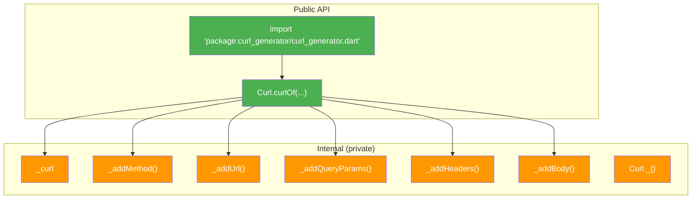
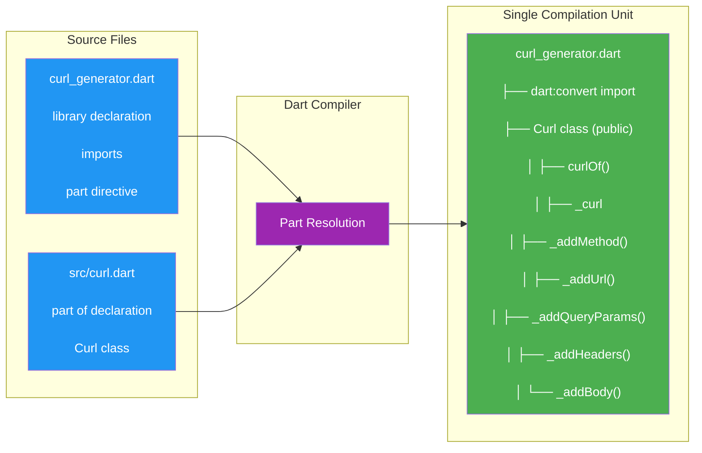

This page explains how `curl_generator` is structured at the file-system and language levels. Understanding the library's internal architecture helps advanced developers navigate the codebase, contribute effectively, and appreciate the design decisions behind this compact Dart package. Specifically, we will examine the Dart `part` directive — a powerful but often misunderstood mechanism — and how it shapes the public API surface of this library.

## Project Layout Overview

The library follows a standard Dart package layout with a clean separation between the public API entry point and internal implementation details:

```
lib/
├── curl_generator.dart    ← Library entry point (public barrel file)
└── src/
    └── curl.dart          ← Implementation via `part` directive
```

This two-file structure might appear minimal, but it embodies a deliberate architectural pattern. The `lib/curl_generator.dart` file serves as the **public barrel file** — the single import target for consumers — while `lib/src/curl.dart` contains the entire implementation. The `src/` directory convention signals that its contents are internal implementation details not intended for direct import.

Sources: [curl_generator.dart](lib/curl_generator.dart#L1-L6)

## The Dart `part` Directive Explained

Dart provides two directives for organizing code across files: `import` and `part`. While `import` brings external libraries into scope, `part` takes a fundamentally different approach — it **merges** the content of one file directly into another at compile time.

In `curl_generator.dart`, the library declaration and the `part` directive establish a single compilation unit:

```dart
library;

import 'dart:convert';

part 'src/curl.dart';
```

The companion file, `src/curl.dart`, declares its membership in the parent library:

```dart
part of '../curl_generator.dart';
```

When the Dart compiler processes `curl_generator.dart`, it literally inserts the entire content of `src/curl.dart` into the parent library's scope. This means both files share the **same namespace** — all private identifiers (`_curl`, `_addMethod`, etc.) in `curl.dart` are directly accessible from `curl_generator.dart` (though the reverse is the only direction that matters in practice), and all top-level imports from `curl_generator.dart` are available in `curl.dart` without re-importing.

Sources: [curl_generator.dart](lib/curl_generator.dart#L1-L6), [curl.dart](lib/src/curl.dart#L1)

## Why `part` Over `import`?

The decision to use `part` rather than a standard `import`/`export` pattern is architecturally significant. Consider the alternatives:

| Approach | Private Member Access | Compilation Units | API Control |
|----------|----------------------|-------------------|-------------|
| **`part` directive** | ✅ Full shared scope | Single | Barrel file controls everything |
| Separate file + `import` | ❌ Each file isolated | Multiple | Must use `export` for public API |
| Separate file + `export` | ❌ Each file isolated | Multiple | Complex export management |

The `part` directive offers a unique advantage: **true encapsulation with file-level separation**. The `_curl` static variable and all private helper methods (`_addMethod`, `_addUrl`, `_addQueryParams`, `_addHeaders`, `_addBody`) remain invisible to external consumers, yet they live in their own file for organizational clarity. There is no need for `show`/`hide` clauses or complex export lists.

This pattern is particularly valuable for a small, focused library like `curl_generator` where the entire implementation fits naturally in one logical unit but benefits from physical file separation.

Sources: [curl.dart](lib/src/curl.dart#L15-L143)

## The Public API Surface

Because `part` merges files into a single compilation unit, the library's public API is defined entirely by what is **not** prefixed with an underscore. Examining the `Curl` class reveals a carefully minimal surface:



| Member | Visibility | Purpose |
|--------|-----------|---------|
| `Curl.curlOf()` | **public** | The sole entry point for generating curl commands |
| `Curl._()` | private constructor | Prevents instantiation (utility class pattern) |
| `Curl._curl` | private static | Mutable state for string accumulation |
| `Curl._addMethod()` | private static | Prefixes HTTP method when non-GET |
| `Curl._addUrl()` | private static | Appends URL with proper quoting |
| `Curl._addQueryParams()` | private static | Serializes query parameters into URL |
| `Curl._addHeaders()` | private static | Formats `-H` flag pairs |
| `Curl._addBody()` | private static | Handles body serialization and Content-Type |

The library exposes exactly **one public method** (`curlOf`) and **one public class** (`Curl`). This extreme minimalism is intentional — the `part` directive enables this by keeping all supporting logic private within the same compilation unit.

Sources: [curl.dart](lib/src/curl.dart#L14-L143)

## Compilation Unit Diagram

Understanding how `part` works at the compiler level is essential for advanced developers. The following diagram illustrates the merge process:



The Dart compiler resolves `part` directives during lexing — before parsing even begins. This means the `part` relationship is more intimate than `import`: it creates a single file from multiple physical files, sharing scope, imports, and library-level annotations. The `dart:convert` import in `curl_generator.dart` is automatically available in `curl.dart` without any additional import statement.

Sources: [curl_generator.dart](lib/curl_generator.dart#L1-L6), [curl.dart](lib/src/curl.dart#L1)

## Consumer Import Path

For library consumers, the architecture is completely transparent. There is a single canonical import path:

```dart
import 'package:curl_generator/curl_generator.dart';
```

This import brings the entire library into scope because `curl_generator.dart` is the library declaration file (it contains `library;`). The `part` files are not separately importable — attempting `import 'package:curl_generator/src/curl.dart'` would fail with a compilation error since `src/curl.dart` contains a `part of` directive, not a standalone library declaration.

The `.gitignore` conventions and `src/` directory naming reinforce this boundary. While Dart technically allows importing files from `src/`, doing so is considered an anti-pattern because those files are implementation details subject to change without notice.

Sources: [example.dart](example/lib/example.dart#L1), [curl.dart](lib/src/curl.dart#L1)

## Architecture Trade-offs

Every architectural decision involves trade-offs. The `part`-based architecture of `curl_generator` makes specific choices that are worth understanding:

**Advantages:**
- **Unified namespace**: Private members share scope naturally — no need for `@internal` annotations or export clauses
- **Minimal API surface**: The barrel file controls exactly what is visible to consumers
- **Simplicity**: For a single-class library, this pattern avoids over-engineering
- **Atomic compilation**: The entire library compiles as one unit, eliminating cross-file dependency resolution

**Considerations:**
- **Tight coupling**: Part files cannot be independently tested or reused
- **Scalability ceiling**: This pattern works well for small libraries but becomes unwieldy as complexity grows
- **IDE behavior**: Some IDE features (find usages, refactoring) may behave differently across `part` boundaries
- **Test isolation**: Unit tests must import the barrel file, not individual parts

For a focused utility library like `curl_generator` — with a single class, ~140 lines of implementation, and a clearly bounded purpose — these trade-offs strongly favor the `part` approach. The pattern would need reconsideration if the library expanded to multiple independent classes or significant feature domains.

Sources: [curl.dart](lib/src/curl.dart#L1-L143)

---

**Continue to**: [Static Class Pattern & String Building Strategy](13-static-class-pattern-and-string-building-strategy) — Learn how the `Curl` class leverages static methods and mutable state to build curl command strings through a sequential composition pattern.