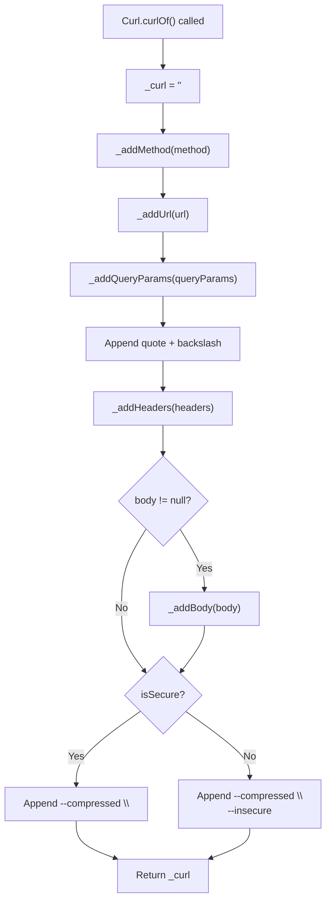
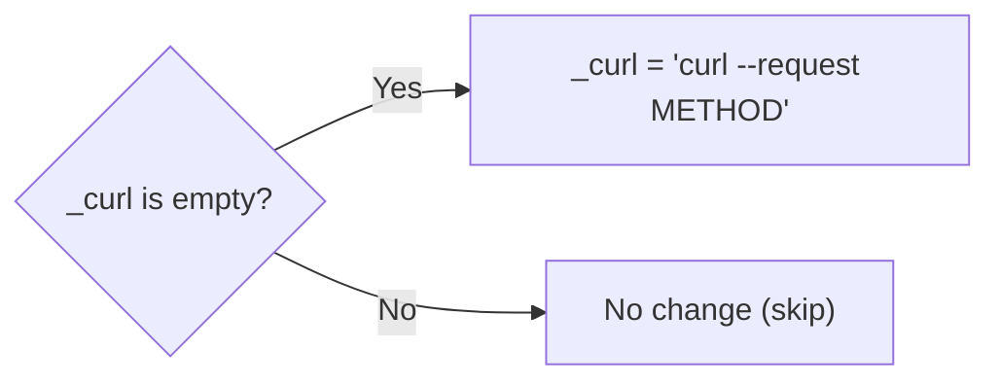
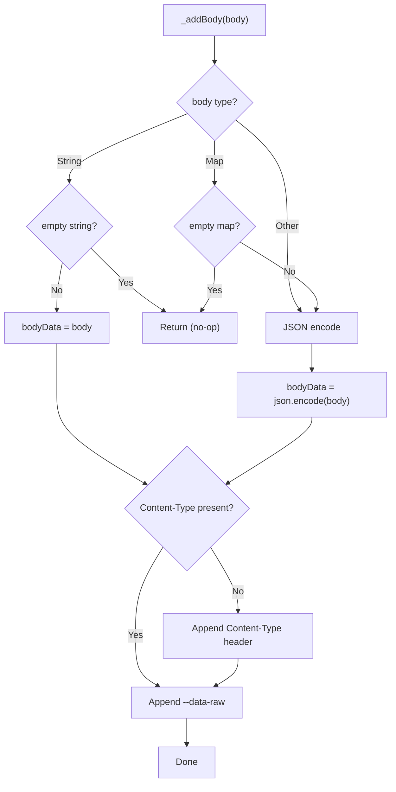
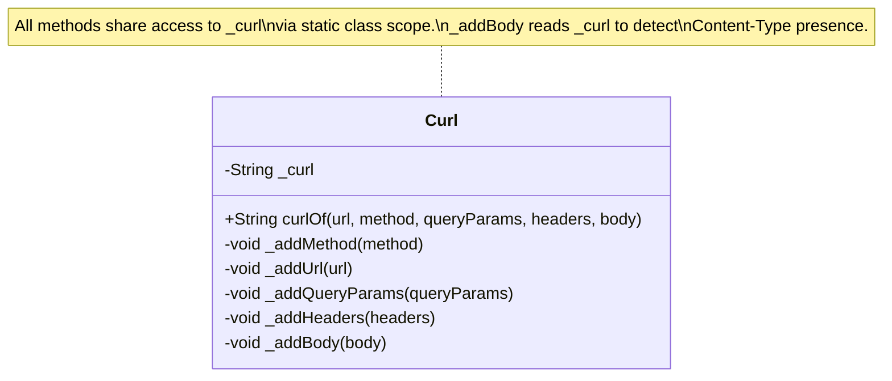

This page examines the two foundational design decisions underpinning the `Curl` class: its **static-only class pattern** and its **mutable string building strategy**. Understanding these patterns reveals why the library behaves the way it does, what trade-offs were made, and how the implementation achieves its goals with minimal overhead.

## The Static Class Pattern

The `Curl` class in [curl.dart](lib/src/curl.dart#L6-L143) employs a deliberate architectural pattern: **a utility class with a private constructor and exclusively static members**. This pattern transforms what would normally be an instantiable class into a pure namespace — a logical container for related functions without any object lifecycle.

```dart
class Curl {
  /// private constructor
  Curl._();

  /// final generated curl.
  static String _curl = '';

  static String curlOf({...}) { ... }
  static void _addMethod(String? method) { ... }
  static void _addUrl(String url) { ... }
  // ... more private static methods
}
```

The private constructor `Curl._()` is the enforcement mechanism. By making it private (using Dart's underscore naming convention), the class prevents external code from writing `Curl()` or `new Curl()`. Every consumer interaction must go through the single public static entry point: `Curl.curlOf()`.

### Why a Static Class Instead of Top-Level Functions

Dart supports top-level functions and variables, which could have achieved the same goal without a class wrapper. The choice of a static class over top-level functions serves specific purposes:

| Approach | Consumer Syntax | Namespace | Extensibility |
|----------|----------------|-----------|---------------|
| Static Class | `Curl.curlOf(url: ...)` | `Curl` prefix provides clear context | Add new static methods to class |
| Top-Level Function | `curlOf(url: ...)` | Implicit (relies on import alias) | Add more top-level functions |
| Instance Class | `Curl(...).generate()` | Object variable name | Polymorphism, dependency injection |

The static class pattern provides a **naming container** that makes the API self-documenting. When a developer writes `Curl.curlOf()`, the class name acts as a semantic prefix that communicates intent — this is a curl-related operation. Top-level functions would lose this contextual namespace unless developers consistently use import aliases (`import '...' as curl`).

Sources: [curl.dart](lib/src/curl.dart#L6-L12)

### The Single Entry Point Principle

The class exposes exactly one public method — `Curl.curlOf()` — with all other methods marked private. This is a rigorous application of the **Facade Pattern**, hiding the internal complexity of string assembly behind a single, predictable interface.

The public contract is narrow and stable:

| Parameter | Type | Required | Purpose |
|-----------|------|----------|---------|
| `url` | `String` | Yes | Target URL for the curl command |
| `method` | `String?` | No | HTTP method (defaults to GET) |
| `queryParams` | `Map<String, String>` | No | Query string parameters |
| `headers` | `Map<String, String>` | No | HTTP headers |
| `body` | `Object?` | No | Request body (String, Map, or encodable object) |

This single-method design means consumers never need to understand the internal decomposition — they describe what they want, and the class figures out how to assemble it.

Sources: [curl.dart](lib/src/curl.dart#L36-L43)

## The String Building Strategy

The most architecturally significant decision in the library is its **mutable static string accumulation** approach. Rather than building the curl command in a single expression or using an immutable builder, the `Curl` class maintains a static `String` field that is progressively modified through a sequence of private method calls.

### The Accumulator Field

At the heart of the strategy lies a single mutable field declared at [curl.dart line 11](lib/src/curl.dart#L11):

```dart
static String _curl = '';
```

This field serves as the **working buffer** for the entire generation pipeline. Every private method reads from and writes to this shared state. The `curlOf()` method resets it to an empty string at the start of each invocation, then orchestrates a sequence of mutations.

### The Generation Pipeline

The `curlOf()` method at [curl.dart lines 44-66](lib/src/curl.dart#L44-L66) orchestrates the string construction as a linear pipeline:



Each step in this pipeline reads the current value of `_curl`, transforms it, and writes the result back. The string grows incrementally as the pipeline progresses.

### Mutation Patterns in the Private Methods

The private methods follow three distinct mutation patterns:

**Pattern 1: Conditional Initialization** (used by `_addMethod`)



The `_addMethod` method at [curl.dart lines 70-76](lib/src/curl.dart#L70-L76) only initializes the string if it is empty, and it skips the operation entirely for GET requests (which is the default method).

**Pattern 2: Unconditional Append** (used by `_addQueryParams`, `_addHeaders`)


The `_addQueryParams` method at [curl.dart lines 83-88](lib/src/curl.dart#L83-L88) and `_addHeaders` at [curl.dart lines 92-97](lib/src/curl.dart#L92-L97) always append their content if the input is non-empty, using Dart's string interpolation to concatenate.

**Pattern 3: Conditional Append with State Inspection** (used by `_addBody`)



The `_addBody` method at [curl.dart lines 104-143](lib/src/curl.dart#L104-L143) is the most complex. It inspects the current state of `_curl` (via `contains('content-type')`) to determine whether to inject an automatic `Content-Type` header before the body data. This state inspection is only possible because all methods share access to the same mutable string.

## Trade-offs and Architectural Analysis

The static mutable string pattern makes specific trade-offs that are worth examining critically.

### Advantages of the Current Approach

**Simplicity of implementation.** Each private method has a single, focused responsibility: transform `_curl` in one specific way. The methods are short (3-8 lines each), easy to reason about, and easy to test in isolation — as demonstrated by the comprehensive [test suite](test/curl_generator_test.dart#L1-L218).

**String interpolation efficiency.** Dart's string interpolation (`'$_curl $segment'`) is optimized by the runtime to avoid unnecessary copying in many scenarios. The incremental approach also makes the output format visible and predictable — each method appends a specific, human-readable segment of the final curl command.

**Pipeline clarity.** The sequential method calls in `curlOf()` read like a declarative specification of the output format. The order of operations directly maps to the structure of the generated curl command.

### Trade-offs

**Mutable shared state.** The `_curl` field is a class-level static variable that persists between calls. If `curlOf()` is called, and before it returns another concurrent operation reads `_curl`, the result would be corrupted. In Dart's single-threaded event loop model this is not a practical concern, but it represents a theoretical fragility. The explicit reset (`_curl = ''`) at the top of `curlOf()` mitigates this.

**String concatenation cost.** Each mutation creates a new `String` object (Dart strings are immutable). For the modest string sizes involved in curl commands, this is negligible — but it represents a pattern that does not scale to large-volume string construction. A `StringBuffer` would be more efficient for high-frequency scenarios.

**Coupling between methods.** The `_addBody` method inspects `_curl` to check for existing `Content-Type` headers. This creates an implicit dependency between methods — `_addHeaders` must run before `_addBody` for the check to work correctly. The pipeline order in `curlOf()` satisfies this dependency, but the constraint is not enforced by the type system.

| Dimension | Current Approach | Alternative: StringBuffer | Alternative: Immutable Builder |
|-----------|-----------------|---------------------------|-------------------------------|
| Readability | High — each step visible | Medium — buffered writes | High — functional composition |
| Performance | Good for small strings | Better for large strings | Allocation overhead |
| State Safety | Mutable static (reset required) | Mutable instance | Immutable — no shared state |
| Complexity | Low | Low | Medium |
| Testability | Requires state reset between tests | Buffer state management | Each step returns new value |

Sources: [curl.dart](lib/src/curl.dart#L44-L66), [curl.dart](lib/src/curl.dart#L104-L143)

## The Static String as Shared Context

The most interesting architectural consequence of the static mutable string is that it acts as an **implicit context object** shared across all methods within the class. Unlike a traditional builder pattern where context is threaded through method returns or stored in an instance field, here the context is a class-level static field accessible to all static methods.



This shared context enables the **state-aware mutation** pattern used by `_addBody`, where the method inspects the current state of the string to decide whether to inject a `Content-Type` header. In a stateless or immutable approach, this kind of contextual awareness would require passing the current state explicitly or maintaining a separate tracking structure.

The trade-off is that the class's internal methods are **order-dependent**. The `_addHeaders` method must execute before `_addBody` for the Content-Type detection to function correctly. This ordering constraint is enforced only by the sequence of calls in `curlOf()`, not by the type system or any formal mechanism.

Sources: [curl.dart](lib/src/curl.dart#L126-L138)

## Integration with the Part File Architecture

The static class pattern integrates seamlessly with the [Library Architecture & Part Directive](12-library-architecture-and-part-directive) described in the previous page. Because the `Curl` class lives in a part file (`src/curl.dart`), its private static members — including `_curl` and all `_add*` methods — are accessible across the shared library scope while remaining invisible to external consumers.

The part file pattern means that the `dart:convert` import (required by `_addBody` for `json.encode`) only needs to be declared once in the library entry point ([curl_generator.dart](lib/curl_generator.dart#L3)), even though it is consumed deep within the static class's implementation. This keeps the `Curl` class itself clean of import declarations, focusing purely on its behavioral logic.

Sources: [curl_generator.dart](lib/curl_generator.dart#L3), [curl.dart](lib/src/curl.dart#L133-L136)

## Next Steps

Having examined the foundational patterns of the `Curl` class, the documentation covers the complete architecture of `curl_generator`. For a holistic view of how this package fits together, return to the [Overview](1-overview). To revisit the entry point and part file pattern that enables this architecture, see [Library Architecture & Part Directive](12-library-architecture-and-part-directive).