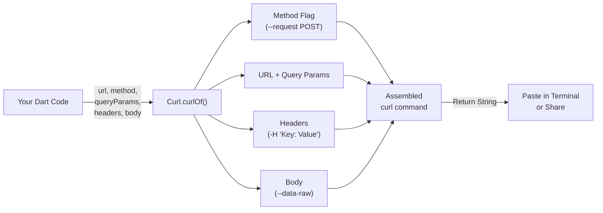

**curl_generator** is a lightweight Dart package that generates ready-to-use `curl` command strings from structured Dart objects — URLs, headers, query parameters, and request bodies. Instead of manually constructing shell commands, you pass your request data to a single static method and receive a correctly escaped, multi-line curl command ready for terminal execution.

This page covers the absolute minimum you need to start generating curl commands in under five minutes. For a complete architectural understanding, see [Overview](1-overview); for deeper API exploration, continue to [The Curl.curlOf Method](4-the-curl-curlof-method).

---

## How It Works

At its core, `curl_generator` follows a simple **assemble-and-render** pipeline: you provide request components, and the library stitches them into a single, correctly escaped curl command string. The diagram below illustrates the data flow from your Dart code to the final shell command:



The pipeline is entirely synchronous and stateless — each call to `Curl.curlOf()` produces an independent result string. Sources: [lib/src/curl.dart#L43-L67](lib/src/curl.dart#L43-L67)

---

## Prerequisites

Before you begin, ensure your environment meets these requirements:

| Requirement | Minimum Version | Notes |
|---|---|---|
| Dart SDK | `^3.5.3` | Checked via `dart --version` |
| Editor | Any | VS Code, IntelliJ, or any text editor |

If you're new to Dart, run the following command to verify your installation:

```bash
dart --version
```

You should see output indicating Dart SDK 3.5.3 or higher.

---

## Installation

Add `curl_generator` to your project's `pubspec.yaml` under the `dependencies` section:

```yaml
dependencies:
  curl_generator: ^1.0.2
```

Then run:

```bash
dart pub get
```

That's it — the package has **zero runtime dependencies**, so installation is fast and the dependency tree stays clean. Sources: [pubspec.yaml#L3-L14](pubspec.yaml#L3-L14)

> **Tip:** For a detailed breakdown of installation scenarios (including monorepos and local path dependencies), see [Installation](3-installation).

---

## Your First Curl Command

The quickest path from zero to a generated curl command is a single static method call. Import the library, call `Curl.curlOf()`, and print the result:

```dart
import 'package:curl_generator/curl_generator.dart';

void main() {
  final curl = Curl.curlOf(
    url: 'https://api.example.com/users',
  );
  print(curl);
}
```

**Output:**

```bash
curl 'https://api.example.com/users' \
  --compressed \
```

That's a fully valid curl command you can paste into your terminal. Sources: [lib/src/curl.dart#L43-L67](lib/src/curl.dart#L43-L67)

---

## Adding Headers and Query Parameters

Real-world API calls rarely consist of a bare URL. You'll typically need authentication headers, content negotiation, or query filters. Here's a more complete example:

```dart
import 'package:curl_generator/curl_generator.dart';

void main() {
  final curl = Curl.curlOf(
    url: 'https://api.example.com/users',
    queryParams: {
      'page': '1',
      'limit': '10',
    },
    headers: {
      'Authorization': 'Bearer my-token-here',
      'Accept': 'application/json',
    },
  );
  print(curl);
}
```

**Output:**

```bash
curl 'https://api.example.com/users?page=1&limit=10' \
  -H 'Authorization: Bearer my-token-here' \
  -H 'Accept: application/json' \
  --compressed \
```

Query parameters are joined with `&` and appended to the URL automatically. Each header becomes a `-H 'Key: Value'` flag on its own line, separated by backslash-newline continuations for readability. Sources: [lib/src/curl.dart#L77-L81](lib/src/curl.dart#L77-L81)

---

## Sending a POST Request with a Body

When you need to send data, pass a `Map` (or any JSON-encodable object) to the `body` parameter. The library automatically serializes it to JSON and adds a `Content-Type: application/json` header if one isn't already present:

```dart
import 'package:curl_generator/curl_generator.dart';

void main() {
  final curl = Curl.curlOf(
    url: 'https://api.example.com/users',
    method: 'POST',
    headers: {
      'Accept': 'application/json',
    },
    body: {
      'name': 'Jane Doe',
      'email': 'jane@example.com',
      'age': 30,
    },
  );
  print(curl);
}
```

**Output:**

```bash
curl --request POST 'https://api.example.com/users' \
  -H 'Accept: application/json' \
  -H 'Content-Type: application/json' \
  --data-raw '{"name":"Jane Doe","email":"jane@example.com","age":30}' \
  --compressed \
```

Notice two things: the `--request POST` flag is prepended (because the method is not `GET`), and the `Content-Type` header is added automatically since one wasn't explicitly provided in your headers map. Sources: [lib/src/curl.dart#L70-L75](lib/src/curl.dart#L70-L75), [lib/src/curl.dart#L104-L141](lib/src/curl.dart#L104-L141)

---

## API Quick Reference

The `Curl` class exposes a single public method. Here's a complete parameter reference:

| Parameter | Type | Required | Default | Description |
|---|---|---|---|---|
| `url` | `String` | ✅ Yes | — | The target URL. Determines HTTP vs HTTPS behavior. |
| `method` | `String?` | No | `null` | HTTP method (`POST`, `PUT`, `DELETE`, etc.). `GET` is ignored (no flag added). |
| `queryParams` | `Map<String, String>` | No | `{}` | Key-value pairs appended as `?key=value&...` to the URL. |
| `headers` | `Map<String, String>` | No | `{}` | Each entry becomes a `-H 'Key: Value'` flag. |
| `body` | `Object?` | No | `null` | Request payload. Strings used as-is; Maps and objects JSON-encoded. |

**Return value:** A `String` containing the complete, multi-line curl command ready for terminal execution.

Sources: [lib/src/curl.dart#L43-L49](lib/src/curl.dart#L43-L49)

---

## Built-in Behaviors You Get for Free

The library handles several details automatically so you don't have to think about them:

| Behavior | How It Works |
|---|---|
| **HTTPS detection** | URLs starting with `https://` omit `--insecure`; HTTP URLs include it automatically. |
| **Content-Type auto-add** | When a `body` is provided and no `Content-Type` header exists, `application/json` is added. |
| **Method flag omission** | `GET` requests produce no method flag; all other methods emit `--request METHOD`. |
| **Body serialization** | `Map` objects are JSON-encoded. Plain strings are passed through unchanged. Non-JSON-encodable values fall back to `.toString()`. |
| **`--compressed` flag** | Always appended, signaling curl to handle compressed responses. |

Sources: [lib/src/curl.dart#L49-L67](lib/src/curl.dart#L49-L67), [lib/src/curl.dart#L104-L143](lib/src/curl.dart#L104-L143)

---

## Complete Working Example

The repository includes a runnable example in the `example/` directory. Here's the full code:

```dart
import 'package:curl_generator/curl_generator.dart';

void initTest() {
  const url = 'https://some.api.com/some/path';
  const params = {
    'some': 'some',
    'params': 'params',
  };
  const header = {
    'some': 'some',
    'header': 'header',
  };
  const body = {
    'some': 'some',
    'body': 'body',
    'value': 123,
    'innerObject': {
      'some': 'some',
      'inner': false,
      'value': 2.5,
    },
  };
  final curl = Curl.curlOf(
    url: url,
    body: body,
    header: header,  // Note: Use 'headers:' (plural) in current API
    queryParams: params,
  );

  print(curl);
}
```

Run it with:

```bash
cd example
dart run
```

> **⚠️ Note:** The example code above uses `header:` (singular), but the current API expects `headers:` (plural). Use `headers:` in your code.

Sources: [example/lib/example.dart#L1-L32](example/lib/example.dart#L1-L32)

---

## Next Steps

Now that you have curl generation working, here's a suggested reading path through the wiki:

1. **[The Curl.curlOf Method](4-the-curl-curlof-method)** — Deep dive into the single public API method and its complete parameter set.
2. **[Generating Basic GET Requests](5-generating-basic-get-requests)** — Understand how simple requests are constructed.
3. **[Adding Query Parameters](6-adding-query-parameters)** — Learn about URL parameter encoding and edge cases.
4. **[Adding Headers](7-adding-headers)** — Master header management and the auto-detection logic.
5. **[Including Request Body](8-including-request-body)** — Explore body serialization for different data types.
6. **[HTTPS vs HTTP Handling](10-https-vs-http-handling)** — Understand the security flag behavior.