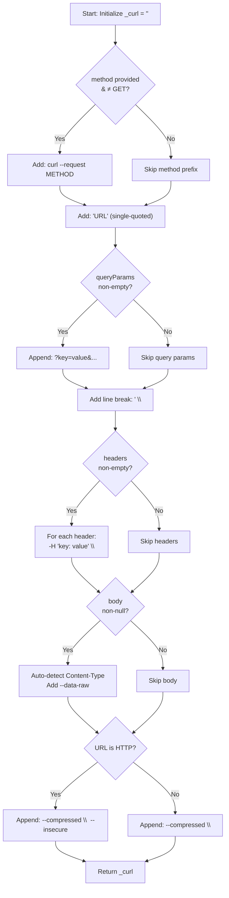

The `Curl.curlOf` method is the sole public entry point of the `curl_generator` library. It is a static factory method that accepts request parameters — a URL, HTTP method, query parameters, headers, and a body — and returns a fully formed `curl` command string ready for execution in a bash terminal. Every other capability in the library flows through this single method.

## Method Signature

The method accepts one required parameter and four optional parameters:

```dart
static String curlOf({
  required String url,
  String? method,
  Map<String, String> queryParams = const {},
  Map<String, String> headers = const {},
  Object? body,
})
```

| Parameter | Type | Required | Default | Purpose |
|---|---|---|---|---|
| `url` | `String` | ✅ | — | The target endpoint URL |
| `method` | `String?` | ❌ | `null` | HTTP method (GET, POST, PUT, DELETE, etc.) |
| `queryParams` | `Map<String, String>` | ❌ | `const {}` | Key-value pairs appended as `?key=value&...` |
| `headers` | `Map<String, String>` | ❌ | `const {}` | Custom HTTP headers rendered as `-H` flags |
| `body` | `Object?` | ❌ | `null` | Request body (String, Map, or JSON-encodable object) |

Sources: [lib/src/curl.dart](lib/src/curl.dart#L43-L49)

## How It Works: The Command Assembly Pipeline

The method builds the curl command through a **sequential assembly pipeline**, delegating to five private helper methods that each append a specific segment to the internal `_curl` string. This pipeline executes in a strict order that mirrors the structure of a real `curl` command:



The key architectural decision here is **mutable static state**. The method resets the private `_curl` field to an empty string at the start of each invocation, then mutates it sequentially through the helper methods. This is safe in single-threaded Dart but introduces implicit coupling between the helpers — each one assumes a specific prior state of `_curl`.

Sources: [lib/src/curl.dart](lib/src/curl.dart#L50-L66)

## The Five Internal Helpers

Each private helper method is responsible for one segment of the final command:

| Helper Method | Lines | Responsibility | Guard Condition |
|---|---|---|---|
| `_addMethod` | L70-L74 | Prepends `curl --request METHOD` prefix | Skips if `null` or `GET` |
| `_addUrl` | L78-L84 | Adds single-quoted URL to command | Initializes `_curl` if empty, appends otherwise |
| `_addQueryParams` | L87-L92 | Appends `?key=value&...` to the URL | Skips if map is empty |
| `_addHeaders` | L95-L100 | Adds `-H 'key: value' \` per header | Skips if map is empty |
| `_addBody` | L108-L141 | Adds `--data-raw 'payload'` and auto Content-Type | Skips if body is null, empty string, or empty map |

Sources: [lib/src/curl.dart](lib/src/curl.dart#L70-L141)

### Method Handling Nuance

The `_addMethod` helper silently ignores `GET` as the method value. When you pass `method: 'GET'`, the output is identical to omitting the method entirely. Any other method string (e.g., `POST`, `PUT`, `DELETE`) is uppercased and prepended as `curl --request METHOD`.

```dart
// These produce identical output:
Curl.curlOf(url: 'https://api.example.com', method: 'GET');
Curl.curlOf(url: 'https://api.example.com');
// → curl 'https://api.example.com' \
//     --compressed \
```

```dart
Curl.curlOf(url: 'https://api.example.com', method: 'POST');
// → curl --request POST 'https://api.example.com' \
//     --compressed \
```

Sources: [lib/src/curl.dart](lib/src/curl.dart#L70-L74), [test/curl_generator_test.dart](test/curl_generator_test.dart#L14-L20)

### Body Handling and Auto Content-Type Detection

The body parameter accepts `Object?`, which means it supports three distinct body types. The `_addBody` helper differentiates between them using Dart's type system:

| Body Type | Behavior | Content-Type Added? |
|---|---|---|
| `String` (non-empty) | Used as-is in `--data-raw` | Only if the string starts with `{` or `[` |
| `Map` (non-empty) or other object | JSON-encoded via `json.encode()` | Always `application/json` |
| `null`, empty `String`, or empty `Map` | Skipped entirely | No |

The Content-Type auto-detection has an important guard: it checks whether the existing `_curl` string already contains a `content-type` header (case-insensitive). If the user has explicitly provided a Content-Type header, the auto-detection is suppressed, preventing duplicate headers.

```dart
// String body that looks like JSON — Content-Type auto-detected:
Curl.curlOf(
  url: 'https://api.example.com',
  body: '{"key": "value"}',
);
// → -H 'Content-Type: application/json' \
//   --data-raw '{"key": "value"}' \

// String body that doesn't look like JSON — no Content-Type:
Curl.curlOf(
  url: 'https://api.example.com',
  body: 'raw text data',
);
// → --data-raw 'raw text data' \

// Map body — always gets Content-Type:
Curl.curlOf(
  url: 'https://api.example.com',
  body: {'key': 'value'},
);
// → -H 'Content-Type: application/json' \
//   --data-raw '{"key":"value"}' \
```

Sources: [lib/src/curl.dart](lib/src/curl.dart#L108-L141), [test/curl_generator_test.dart](test/curl_generator_test.dart#L145-L197)

## Complete Output Examples

### Minimal GET Request

The simplest invocation produces a single-line curl command:

```dart
Curl.curlOf(url: 'https://api.example.com/users');
```

```
curl 'https://api.example.com/users' \
  --compressed \
```

### POST with Query Params, Headers, and Body

A fully populated invocation demonstrates every feature combined:

```dart
Curl.curlOf(
  url: 'https://api.example.com/users',
  method: 'POST',
  queryParams: {'page': '1', 'limit': '10'},
  headers: {
    'Accept': 'application/json',
    'Authorization': 'Bearer token123',
  },
  body: {'name': 'Alice', 'role': 'admin'},
);
```

```
curl --request POST 'https://api.example.com/users?page=1&limit=10' \
  -H 'Accept: application/json' \
  -H 'Authorization: Bearer token123' \
  -H 'Content-Type: application/json' \
  --data-raw '{"name":"Alice","role":"admin"}' \
  --compressed \
```

### HTTP (Non-Secure) Request

When the URL starts with `http://` rather than `https://`, the method appends `--insecure` to disable SSL certificate verification:

```dart
Curl.curlOf(url: 'http://localhost:3000/api');
```

```
curl 'http://localhost:3000/api' \
  --compressed \
  --insecure
```

Sources: [lib/src/curl.dart](lib/src/curl.dart#L59-L65), [test/curl_generator_test.dart](test/curl_generator_test.dart#L136-L143)

## Architectural Trade-offs

The `curlOf` method embodies several design decisions worth understanding:

**Static class with private constructor**: The `Curl` class cannot be instantiated. It exists purely as a namespace for the `curlOf` static method and its internal helpers. This makes the API surface minimal — there is exactly one function to call.

**Mutable static state (`_curl`)**: Rather than passing strings between helper functions, the class mutates a private static field. The method resets `_curl` at the top of each call, so successive invocations do not interfere with each other. However, this pattern is not reentrant-safe in concurrent contexts — something to keep in mind if Dart's isolate model evolves.

**Default method omission**: By silently treating `GET` the same as no method, the API reduces verbosity for the most common case. GET is the default HTTP method and rarely needs explicit declaration in a curl command.

**`--compressed` always included**: The method unconditionally adds the `--compressed` flag, which tells curl to request compressed responses. This is a sensible default for API interactions but means every generated command includes this flag regardless of context.

Sources: [lib/src/curl.dart](lib/src/curl.dart#L3-L142)

## Where to Go Next

Now that you understand the `curlOf` method's signature and internal pipeline, the following pages walk through each feature area in isolation:

- [Generating Basic GET Requests](5-generating-basic-get-requests) — start with the simplest use case
- [Adding Query Parameters](6-adding-query-parameters) — inline vs. structured query params
- [Adding Headers](7-adding-headers) — custom header handling
- [Including Request Body](8-including-request-body) — the three body types in depth
- [Auto Content-Type Detection](9-auto-content-type-detection) — the detection heuristic explained
- [HTTPS vs HTTP Handling](10-https-vs-http-handling) — the `--insecure` flag behavior
- [HTTP Method Support](11-http-method-support) — method handling beyond GET/POST