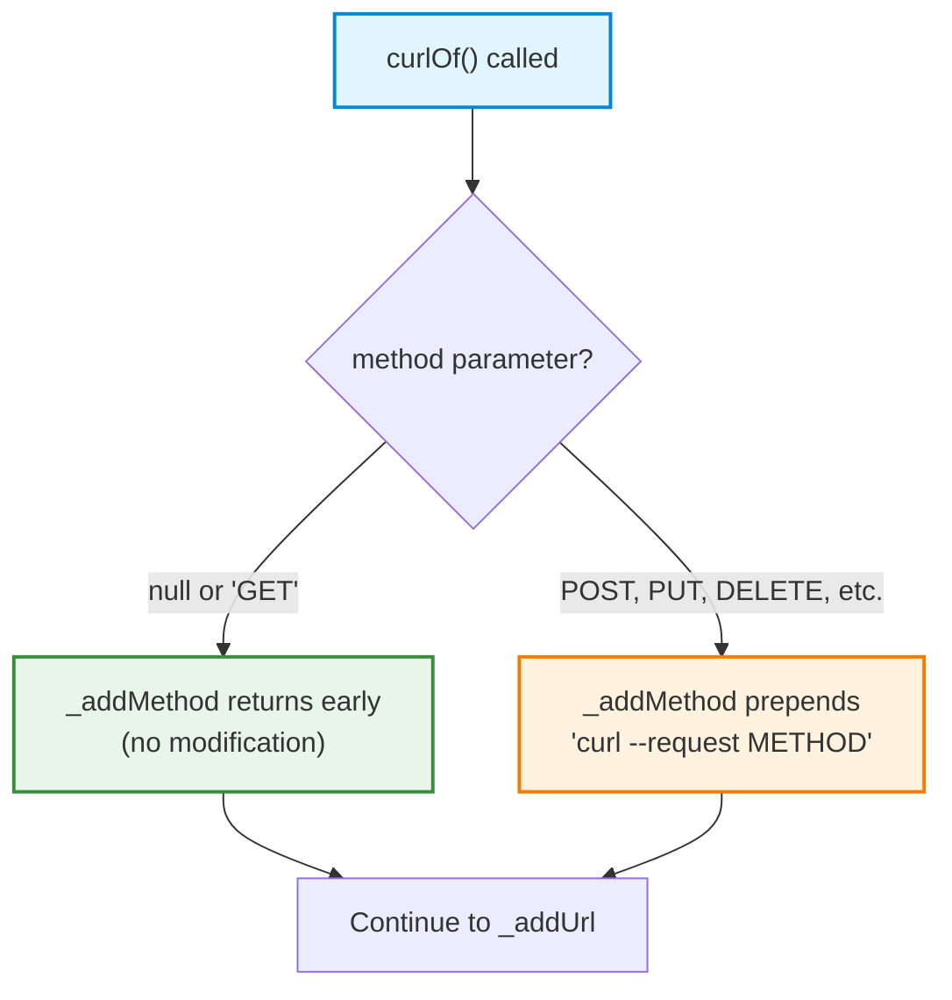
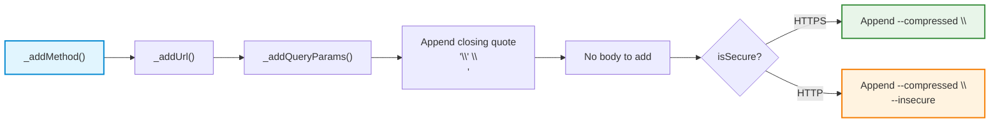

This page explains how to generate the simplest possible curl commands using the `curl_generator` library — GET requests that fetch data from a URL without modifying server state. You will learn the minimal API surface, understand how the library handles the HTTP method parameter for GET, and see how HTTPS vs HTTP URLs produce different output flags.

## The Minimal GET Request

The most basic usage requires only a single parameter — the `url`. When you call `Curl.curlOf()` with just a URL, the library generates a complete, runnable GET command:

```dart
import 'package:curl_generator/curl_generator.dart';

final result = Curl.curlOf(url: 'https://api.example.com/users');
print(result);
```

This produces:

```
curl 'https://api.example.com/users' \
  --compressed \
```

The `--compressed` flag is automatically appended to every generated command, regardless of HTTP method. This flag tells curl to request a compressed response from the server and decompress it transparently — a sensible default for API interactions where bandwidth efficiency matters.

Sources: [lib/src/curl.dart](lib/src/curl.dart#L62-L72), [test/curl_generator_test.dart](test/curl_generator_test.dart#L25-L31)

## Why GET Is Special

The library treats GET differently from all other HTTP methods. Understanding this distinction prevents confusion when reading the source code or expected output.

When you pass `method: 'GET'` explicitly, the `_addMethod` function **returns immediately without modifying the curl string**. This is by design — curl defaults to GET when no `--request` flag is specified. The method parameter only takes effect for non-GET methods like POST, PUT, DELETE, or PATCH.



This means the following three calls produce **identical output**:

| Call | Result |
|------|--------|
| `Curl.curlOf(url: 'https://api.example.com')` | `curl 'https://api.example.com' \` → `--compressed \` |
| `Curl.curlOf(url: 'https://api.example.com', method: 'GET')` | `curl 'https://api.example.com' \` → `--compressed \` |
| `Curl.curlOf(url: 'https://api.example.com', method: 'get')` | `curl 'https://api.example.com' \` → `--compressed \` |

The comparison is case-insensitive — the `_addMethod` function converts the method to uppercase before checking. Sources: [lib/src/curl.dart](lib/src/curl.dart#L68-L73)

## GET Request Generation Pipeline

Every GET request follows a predictable construction sequence through the private static methods. The pipeline for a basic GET is shorter than other methods because there is no body to process:



The `_addUrl` method wraps the URL in single quotes and sets the initial structure of the curl string. If `_curl` is empty (which it always is for GET requests since `_addMethod` returned early), the method creates the `curl '<url>` prefix. If `_curl` already has content (for non-GET methods), it appends the URL to the existing string.

Sources: [lib/src/curl.dart](lib/src/curl.dart#L75-L80), [lib/src/curl.dart](lib/src/curl.dart#L88-L94)

## HTTPS vs HTTP Behavior

The protocol in your URL determines which flags appear at the end of the generated command. This is the most visible difference between GET requests to secure vs non-secure endpoints:

| Protocol | Generated Command | Extra Flags |
|----------|------------------|-------------|
| **HTTPS** | `curl 'https://...' \` → `--compressed \` | None — TLS is used by default |
| **HTTP** | `curl 'http://...' \` → `--compressed \` → `--insecure` | `--insecure` disables SSL certificate verification |

For **HTTPS** endpoints, the command ends cleanly with `--compressed \` and a trailing backslash:

```
curl 'https://api.example.com/users' \
  --compressed \
```

For **HTTP** endpoints, the `--insecure` flag is appended on a separate line without a trailing backslash:

```
curl 'http://api.example.com/users' \
  --compressed \
  --insecure
```

The `--insecure` flag is relevant for HTTP URLs because `curl` may still attempt SSL negotiation in certain configurations. This flag tells curl to skip certificate verification entirely, which is appropriate for plain HTTP endpoints where TLS is not being used. Sources: [lib/src/curl.dart](lib/src/curl.dart#L62-L68), [test/curl_generator_test.dart](test/curl_generator_test.dart#L113-L117)

## Complete GET Request Examples

Here is a reference table showing GET requests across common scenarios, demonstrating the full range of optional parameters you might combine with a basic GET:

| Scenario | Code | Generated Command |
|----------|------|-------------------|
| **Simplest GET** | `Curl.curlOf(url: 'https://api.example.com/items')` | `curl 'https://api.example.com/items' \` → `--compressed \` |
| **HTTP GET** | `Curl.curlOf(url: 'http://localhost:8080/health')` | `curl 'http://localhost:8080/health' \` → `--compressed \` → `--insecure` |
| **GET with Query Params** | `Curl.curlOf(url: 'https://api.example.com/search', queryParams: {'q': 'dart', 'page': '1'})` | `curl 'https://api.example.com/search?q=dart&page=1' \` → `--compressed \` |
| **GET with Headers** | `Curl.curlOf(url: 'https://api.example.com/me', headers: {'Authorization': 'Bearer token123'})` | `curl 'https://api.example.com/me' \` → `-H 'Authorization: Bearer token123' \` → `--compressed \` |
| **GET with Explicit Method** | `Curl.curlOf(url: 'https://api.example.com/items', method: 'GET')` | `curl 'https://api.example.com/items' \` → `--compressed \` |

Notice that in every case, the output starts with `curl` (no `--request` flag) and the `--compressed` flag always appears. The test suite verifies these exact outputs, ensuring backward compatibility across versions. Sources: [test/curl_generator_test.dart](test/curl_generator_test.dart#L17-L31), [test/curl_generator_test.dart](test/curl_generator_test.dart#L33-L48)

## When to Use a GET Request

GET requests are the appropriate HTTP method when you are **retrieving data** without modifying server state. The library generates a proper GET when:

- You pass **only a `url`** parameter (the default behavior)
- You pass `url` with **optional `queryParams`** for filtering, pagination, or search
- You pass `url` with **optional `headers`** for authentication, content negotiation, or custom request metadata
- You explicitly set `method: 'GET'` or `method: 'get'`

If your use case involves sending data to the server (creating resources, updating state, or deleting entries), you need a different HTTP method. See [HTTP Method Support](11-http-method-support) for details on POST, PUT, DELETE, and PATCH. For modifying the query string of your GET request, continue to [Adding Query Parameters](6-adding-query-parameters).