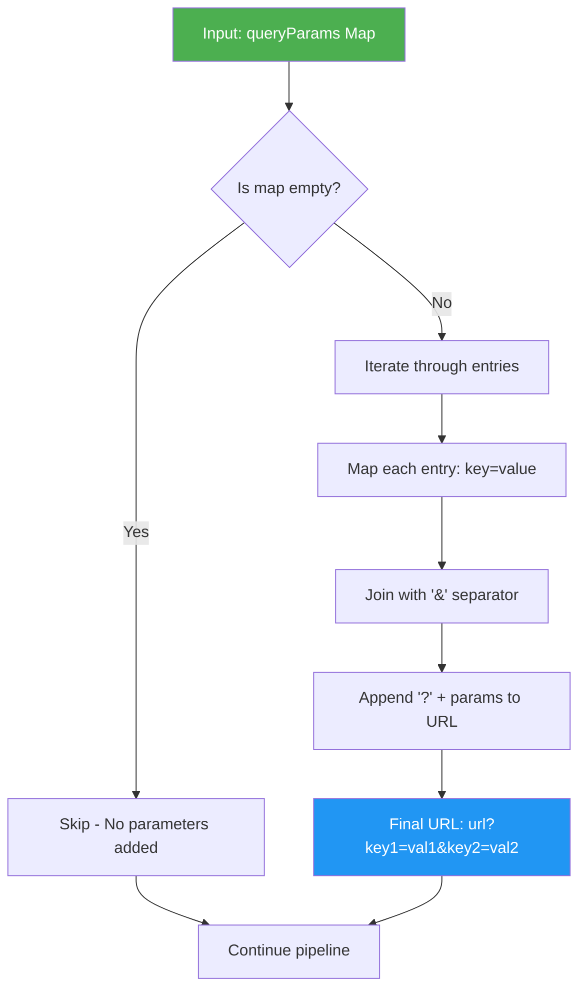
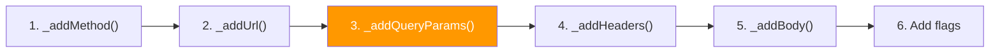
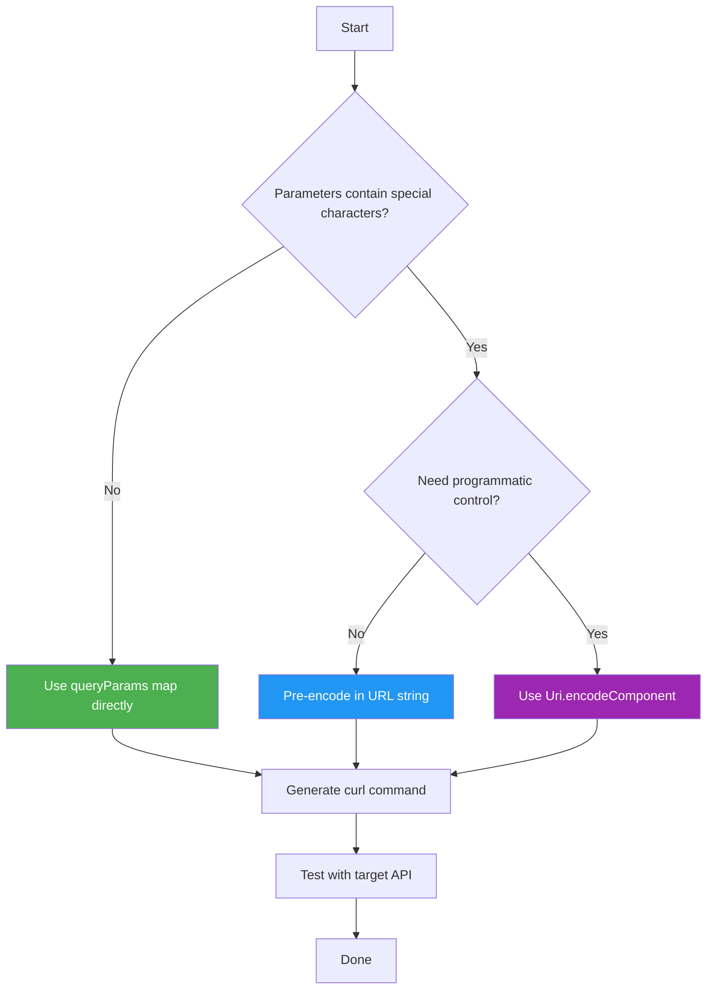

Query parameters are fundamental for filtering results, managing pagination, and passing dynamic data in HTTP requests. The `curl_generator` library provides flexible options for incorporating query parameters into your generated curl commands, each with distinct trade-offs for encoding control and maintainability.

## Two Approaches to Query Parameters

The library supports two distinct methods for adding query parameters to your curl commands, offering flexibility based on your specific needs.

### Approach 1: Inline URL String

The simplest approach embeds query parameters directly within the URL string. This gives you complete control over the format and encoding.

```dart
final curl = Curl.curlOf(
  url: 'https://api.example.com/search?q=dart&limit=10&offset=0',
);
```

**Generated output:**
```bash
curl 'https://api.example.com/search?q=dart&limit=10&offset=0' \
  --compressed
```

**Best for:** Static, pre-encoded URLs where you need precise control over special characters.

Sources: [lib/src/curl.dart](lib/src/curl.dart#L78-L84)

### Approach 2: queryParams Map Parameter

The dedicated `queryParams` parameter accepts a `Map<String, String>`, providing a structured approach that's easier to maintain programmatically.

```dart
final curl = Curl.curlOf(
  url: 'https://api.example.com/search',
  queryParams: {
    'q': 'dart',
    'limit': '10',
    'offset': '0',
  },
);
```

**Generated output:**
```bash
curl 'https://api.example.com/search?q=dart&limit=10&offset=0' \
  --compressed
```

**Best for:** Dynamic parameter construction where parameters are built at runtime.

Sources: [lib/src/curl.dart](lib/src/curl.dart#L86-L92), [test/curl_generator_test.dart](test/curl_generator_test.dart#L38-L49)

## Comparison of Approaches

| Aspect | Inline URL | queryParams Parameter |
|--------|------------|----------------------|
| **Control** | Full control over encoding | Simple key=value concatenation |
| **Maintainability** | Harder to modify dynamically | Easy to add/remove parameters |
| **Readability** | Compact for simple queries | Clearer for complex parameter sets |
| **Special Characters** | User must handle encoding | **No automatic encoding** |
| **Type Safety** | String only | Map<String, String> |
| **Use Case** | Static, pre-encoded URLs | Dynamic parameter construction |

Sources: [lib/src/curl.dart](lib/src/curl.dart#L44-L66)

## How queryParams Parameter Works

The internal `_addQueryParams` method handles the conversion of the parameter map to a URL query string. Understanding this implementation is crucial for knowing what the library does and does not do.

### Processing Flow



Sources: [lib/src/curl.dart](lib/src/curl.dart#L86-L92)

### Implementation Details

The `_addQueryParams` method performs a straightforward transformation:

```dart
static void _addQueryParams(Map<String, String> queryParams) {
  if (queryParams.isEmpty) return;
  final params =
      queryParams.entries.map((e) => '${e.key}=${e.value}').join('&');
  _curl = '$_curl?$params';
}
```

**Key observations:**
1. **Empty map check**: If `queryParams` is empty, the method returns immediately
2. **Simple concatenation**: Each entry becomes `key=value`
3. **Join with ampersand**: Parameters are separated by `&`
4. **Question mark prefix**: The library adds `?` before the first parameter

Sources: [lib/src/curl.dart](lib/src/curl.dart#L86-L92)

## Critical Consideration: No URL Encoding

**Important**: The library does **not** perform automatic URL encoding (percent-encoding) of special characters. This is a deliberate design decision with significant implications.

### What This Means

```dart
final curl = Curl.curlOf(
  url: 'https://api.example.com/search',
  queryParams: {
    'q': 'hello world',  // Space character
    'filter': 'a&b',     // Ampersand character
    'lang': 'en/fr',     // Forward slash
    'symbol': '€',       // Unicode character
  },
);
```

**Generated output (literal values):**
```bash
curl 'https://api.example.com/search?q=hello world&filter=a&b&lang=en/fr&symbol=€' \
  --compressed
```

This output contains **invalid URL characters** that may cause issues with many servers and APIs.

Sources: [lib/src/curl.dart](lib/src/curl.dart#L86-L92)

### Encoding Comparison Table

| Character | Needs Encoding | Encoded Form | Library Output |
|-----------|----------------|--------------|----------------|
| Space (` `) | Yes | `%20` or `+` | ` ` (literal) |
| Ampersand (`&`) | Yes | `%26` | `&` (literal, breaks parsing) |
| Plus (`+`) | Yes | `%2B` | `+` (literal) |
| Equals (`=`) | Yes | `%3D` | `=` (literal, breaks parsing) |
| Slash (`/`) | Sometimes | `%2F` | `/` (literal) |
| Question Mark (`?`) | Yes | `%3F` | `?` (literal) |
| Hash (`#`) | Yes | `%23` | `#` (literal) |
| Unicode (`€`, `ñ`) | Yes | `%E2%82%AC`, `%C3%B1` | `€`, `ñ` (literal) |

Sources: [lib/src/curl.dart](lib/src/curl.dart#L86-L92)

## Recommended Workarounds

### Option 1: Pre-Encode in URL String

If your parameters contain special characters, construct the URL with pre-encoded values:

```dart
final curl = Curl.curlOf(
  url: 'https://api.example.com/search?q=hello%20world&filter=a%26b',
);
```

**Generated output:**
```bash
curl 'https://api.example.com/search?q=hello%20world&filter=a%26b' \
  --compressed
```

### Option 2: Manual Encoding in queryParams

Encode values manually before passing them to the library:

```dart
import 'dart:core';

// Manual URL encoding function
String encodeQueryParam(String value) {
  return Uri.encodeComponent(value);
}

final curl = Curl.curlOf(
  url: 'https://api.example.com/search',
  queryParams: {
    'q': encodeQueryParam('hello world'),     // → 'hello%20world'
    'filter': encodeQueryParam('a&b'),        // → 'a%26b'
    'lang': encodeQueryParam('en/fr'),        // → 'en%2Fr'
  },
);
```

Sources: [lib/src/curl.dart](lib/src/curl.dart#L86-L92)

### Option 3: Use Dart's Uri Class

Leverage Dart's built-in URI handling for complex scenarios:

```dart
final baseUri = Uri.parse('https://api.example.com/search');
final uri = baseUri.replace(queryParameters: {
  'q': 'hello world',
  'filter': 'a&b',
});

final curl = Curl.curlOf(
  url: uri.toString(),  // Automatically encoded
);
```

**Generated output:**
```bash
curl 'https://api.example.com/search?q=hello+world&filter=a%26b' \
  --compressed
```

## Common Usage Patterns

### Pattern 1: Simple Key-Value Parameters

The most common scenario with safe ASCII characters:

```dart
final curl = Curl.curlOf(
  url: 'https://api.example.com/users',
  queryParams: {
    'page': '1',
    'limit': '20',
    'sort': 'name',
    'order': 'asc',
  },
);
```

**Generated output:**
```bash
curl 'https://api.example.com/users?page=1&limit=20&sort=name&order=asc' \
  --compressed
```

Sources: [test/curl_generator_test.dart](test/curl_generator_test.dart#L38-L49)

### Pattern 2: Combining with Headers and Body

Query parameters work seamlessly with other curl options:

```dart
final curl = Curl.curlOf(
  url: 'https://api.example.com/search',
  method: 'GET',
  queryParams: {'q': 'dart', 'lang': 'en'},
  headers: {'Authorization': 'Bearer token123'},
);
```

**Generated output:**
```bash
curl 'https://api.example.com/search?q=dart&lang=en' \
  -H 'Authorization: Bearer token123' \
  --compressed
```

Sources: [test/curl_generator_test.dart](test/curl_generator_test.dart#L75-L86)

### Pattern 3: URL with Existing Query Parameters

When the URL already contains query parameters, the library appends the new ones:

```dart
final curl = Curl.curlOf(
  url: 'https://api.example.com/search?existing=param',
  queryParams: {'new': 'value'},
);
```

**Generated output:**
```bash
curl 'https://api.example.com/search?existing=param?new=value' \
  --compressed
```

**Note**: This creates invalid URL syntax with double `?` characters. For URLs with existing parameters, use the inline approach or handle concatenation manually.

Sources: [lib/src/curl.dart](lib/src/curl.dart#L86-L92)

## Pipeline Position

Query parameter handling occurs as the **third step** in the curl generation pipeline, after method and URL handling but before headers and body:



This ordering ensures that query parameters are appended to the URL before headers and other options are added to the curl command.

Sources: [lib/src/curl.dart](lib/src/curl.dart#L50-L66)

## Testing Query Parameters

The test suite covers several query parameter scenarios to ensure correct behavior:

### Test Coverage Summary

| Test Case | Scenario | Expected Behavior |
|-----------|----------|-------------------|
| URL with embedded params | `?some=some&query=query` in URL | Passes through unchanged |
| queryParams only | `queryParams: {'some': 'some'}` | Appended with `?` prefix |
| Combined with headers | queryParams + headers | Both added correctly |
| All features combined | URL + queryParams + headers + body | Correct ordering and formatting |

Sources: [test/curl_generator_test.dart](test/curl_generator_test.dart#L38-L49), [test/curl_generator_test.dart](test/curl_generator_test.dart#L75-L86), [test/curl_generator_test.dart](test/curl_generator_test.dart#L118-L134)

### Example Test Output

```dart
test('test GET method with query params separated and no headers', () {
  const url = 'https://some.api.com/some/api';
  const expectedReturn =
      'curl \'https://some.api.com/some/api?some=some&param=param\' \\\n'
      '  --compressed \\';
  const params = {
    'some': 'some',
    'param': 'param',
  };
  final result = Curl.curlOf(url: url, queryParams: params);
  expect(expectedReturn, result);
});
```

Sources: [test/curl_generator_test.dart](test/curl_generator_test.dart#L38-L49)

## Best Practices

### Do's

1. **Use for simple, safe ASCII parameters** where no special characters are needed
2. **Pre-encode complex values** when using the `queryParams` parameter
3. **Consider the inline URL approach** for URLs with special characters
4. **Test with your target API** to ensure the generated curl commands work as expected

### Don'ts

1. **Don't rely on automatic encoding** for parameters with spaces, ampersands, or Unicode
2. **Don't mix inline URL params with the `queryParams` parameter** without careful consideration
3. **Don't assume the library handles URL encoding** — it's your responsibility

### Recommended Workflow



## Troubleshooting

### Issue: Invalid URL Characters in Generated Curl

**Symptom**: Generated curl command contains spaces, ampersands, or other special characters that cause API errors.

**Solution**: Pre-encode the parameter values using `Uri.encodeComponent()` or embed them directly in a pre-encoded URL string.

### Issue: Double Question Marks in URL

**Symptom**: URL contains `?existing?new` when combining URL parameters with `queryParams`.

**Solution**: Either remove existing parameters from the URL string or don't use the `queryParams` parameter.

### Issue: Encoded Values Appear Double-Encoded

**Symptom**: URL contains `%2520` instead of `%20`.

**Solution**: The library doesn't encode values, so this indicates you're encoding twice. Use either the URL string approach or the `queryParams` approach, not both with encoding.

## Next Steps

Now that you understand query parameter handling, explore these related topics:

- [HTTPS vs HTTP Handling](10-https-vs-http-handling) — Learn about protocol-specific behaviors and the `--insecure` flag
- [Adding Headers](7-adding-headers) — Add custom headers to your curl commands
- [Including Request Body](8-including-request-body) — Combine query parameters with request bodies
- [Auto Content-Type Detection](9-auto-content-type-detection) — Understand how Content-Type headers are automatically handled