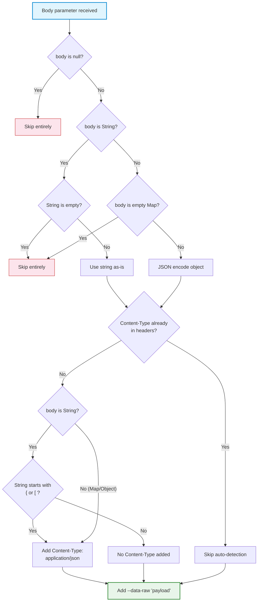

The `curl_generator` library provides a flexible `body` parameter in the `Curl.curlOf` method that accepts various data types for HTTP request bodies. This page explains how to attach request bodies to your generated curl commands, covering different body types, automatic Content-Type detection, and edge case handling. Understanding body handling is essential for generating curl commands for POST, PUT, PATCH, and DELETE requests that require payloads.

Sources: [curl.dart](lib/src/curl.dart#L43-L56)

## The Body Parameter

The `body` parameter is an optional `Object?` that accepts three distinct types of request bodies. The library processes each type differently, ensuring the generated curl command is both correct and human-readable.

```dart
static String curlOf({
  required String url,
  String? method,
  Map<String, String> queryParams = const {},
  Map<String, String> headers = const {},
  Object? body,  // Optional: String, Map, or any JSON-encodable object
})
```

| Body Type | Behavior | JSON Encoding | Content-Type Added? |
|---|---|---|---|
| `String` (non-empty) | Used as-is in `--data-raw` flag | No encoding | Only if string starts with `{` or `[` |
| `Map` (non-empty) or other object | JSON-encoded via `json.encode()` | Yes | Always `application/json` |
| `null`, empty `String`, or empty `Map` | Skipped entirely | N/A | No |

Sources: [curl.dart](lib/src/curl.dart#L108-L127)

## String Bodies: Raw Data and JSON Strings

When you pass a `String` as the body, it is included verbatim in the generated curl command. This is useful for raw text data, pre-formatted JSON strings, or any content that doesn't require encoding.

```dart
// Raw text body
final curl1 = Curl.curlOf(
  url: 'https://api.example.com/data',
  body: 'This is raw text data',
);
// Output: --data-raw 'This is raw text data' \
// (No Content-Type header added)

// Pre-formatted JSON string
final curl2 = Curl.curlOf(
  url: 'https://api.example.com/data',
  body: '{"key": "value", "number": 42}',
);
// Output: -H 'Content-Type: application/json' \
//         --data-raw '{"key": "value", "number": 42}' \
```

The library automatically detects whether a string body looks like JSON by checking if it starts with `{` or `[`. This heuristic triggers automatic addition of the `Content-Type: application/json` header.

Sources: [curl.dart](lib/src/curl.dart#L111-L117), [curl.dart](lib/src/curl.dart#L132-L138)

## Map and Object Bodies: Automatic JSON Encoding

When you pass a `Map` or any other object (not a `String`), the library automatically JSON-encodes it using Dart's `json.encode()` function. This is the most common use case for API requests that send structured data.

```dart
// Simple Map body
final curl1 = Curl.curlOf(
  url: 'https://api.example.com/data',
  body: {
    'name': 'John Doe',
    'age': 30,
    'active': true,
  },
);
// Output: -H 'Content-Type: application/json' \
//         --data-raw '{"name":"John Doe","age":30,"active":true}' \

// Nested Map body
final curl2 = Curl.curlOf(
  url: 'https://api.example.com/data',
  body: {
    'user': {
      'name': 'Alice',
      'settings': {
        'theme': 'dark',
        'notifications': true,
      }
    },
    'timestamp': 1699900000,
  },
);
```

For objects that cannot be directly converted to JSON (like custom classes), the library uses a `toEncodable` callback that converts them to their string representation via `toString()`.

```dart
// Object with toString() fallback
final curl3 = Curl.curlOf(
  url: 'https://api.example.com/data',
  body: {
    'name': 'Test',
    'customObject': Curl,  // The Curl class itself
  },
);
// Output: --data-raw '{"name":"Test","customObject":"Curl"}' \
```

Sources: [curl.dart](lib/src/curl.dart#L121-L127), [test/curl_generator_test.dart](test/curl_generator_test.dart#L199-L216)

## Auto Content-Type Detection

One of the most valuable features of the library is its intelligent **automatic Content-Type detection**. When you provide a body without explicitly setting a `Content-Type` header, the library inspects the body and conditionally adds `Content-Type: application/json`.



The auto-detection logic follows these rules:

1. **Case-insensitive check**: The library checks if any existing header contains the string `content-type` (lowercase comparison), regardless of casing
2. **Map/Object bodies**: Always get `Content-Type: application/json` added
3. **String bodies**: Only get the header added if the string starts with `{` or `[`
4. **User-provided Content-Type**: Always respected, never duplicated

Sources: [curl.dart](lib/src/curl.dart#L129-L138)

## Edge Cases: Empty and Null Bodies

The library handles empty bodies gracefully to prevent generating malformed curl commands:

```dart
// Null body — no effect on output
final curl1 = Curl.curlOf(url: 'https://api.example.com/data');
// Output: curl 'https://api.example.com/data' \
//         --compressed \

// Empty string body — ignored
final curl2 = Curl.curlOf(url: 'https://api.example.com/data', body: '');
// Output: Same as curl1

// Empty Map body — ignored
final curl3 = Curl.curlOf(url: 'https://api.example.com/data', body: {});
// Output: Same as curl1
```

| Scenario | Body Value | Result |
|---|---|---|
| No body parameter | `null` (default) | No body in curl command |
| Empty string | `''` or `'   '` | Skipped entirely |
| Empty map | `{}` | Skipped entirely |
| Whitespace-only string | `'  \n\t  '` | Skipped (after trim) |

Sources: [curl.dart](lib/src/curl.dart#L111-L120)

## Complete Examples

### POST Request with JSON Body

The most common scenario for request bodies is a POST request with JSON data:

```dart
final curl = Curl.curlOf(
  url: 'https://api.example.com/users',
  method: 'POST',
  headers: {
    'Accept': 'application/json',
    'Authorization': 'Bearer abc123',
  },
  body: {
    'name': 'John Doe',
    'email': 'john@example.com',
    'role': 'developer',
  },
);
```

This generates:

```
curl --request POST 'https://api.example.com/users' \
  -H 'Accept: application/json' \
  -H 'Authorization: Bearer abc123' \
  -H 'Content-Type: application/json' \
  --data-raw '{"name":"John Doe","email":"john@example.com","role":"developer"}' \
  --compressed \
```

### PUT Request with Pre-formatted JSON String

When you need to send pre-formatted JSON (perhaps with specific formatting requirements), pass it as a String:

```dart
final curl = Curl.curlOf(
  url: 'https://api.example.com/users/123',
  method: 'PUT',
  body: '{"id": 123, "status": "active", "updated_at": "2024-01-15T10:30:00Z"}',
);
```

### Custom Content-Type Override

When you need a non-JSON content type, explicitly provide it in the headers. The library will respect your choice and skip auto-detection:

```dart
final curl = Curl.curlOf(
  url: 'https://api.example.com/upload',
  method: 'POST',
  headers: {
    'Content-Type': 'multipart/form-data; boundary=----WebKitFormBoundary',
  },
  body: '------WebKitFormBoundary\r\nContent-Disposition: form-data; name="file"\r\n\r\nFile content\r\n------WebKitFormBoundary--',
);
```

This ensures the library does not add its own `Content-Type: application/json` header, preserving your custom content type.

Sources: [test/curl_generator_test.dart](test/curl_generator_test.dart#L165-L197), [curl.dart](lib/src/curl.dart#L129-L138)

## Body and Headers Interaction

The order of parameters matters. Headers are processed before the body in the assembly pipeline, which enables the Content-Type detection logic to check for existing headers. Here's the sequence:

1. **Headers are rendered first** — Each header becomes a `-H` flag
2. **Body is processed** — The library checks if `Content-Type` was already provided
3. **Conditional Content-Type addition** — Only added if not already present
4. **Body payload added** — `--data-raw` flag with the payload

```dart
// Headers provided → Content-Type respected
final curl1 = Curl.curlOf(
  url: 'https://api.example.com/data',
  headers: {'Content-Type': 'application/xml'},
  body: '<root><data>value</data></root>',
);
// Output includes YOUR Content-Type, not auto-detected JSON

// No Content-Type in headers → auto-detected for Map body
final curl2 = Curl.curlOf(
  url: 'https://api.example.com/data',
  headers: {'Accept': 'application/json'},
  body: {'key': 'value'},
);
// Output adds Content-Type: application/json automatically
```

Sources: [lib/src/curl.dart](lib/src/curl.dart#L59-L66), [lib/src/curl.dart](lib/src/curl.dart#L129-L138)

## Best Practices

| Practice | Reason |
|---|---|
| Use `Map` for structured JSON data | Automatic encoding and Content-Type detection |
| Use `String` for raw/custom formats | Full control over payload content |
| Provide explicit `Content-Type` for non-JSON | Prevents auto-detection from adding wrong type |
| Avoid empty strings or maps | They are silently ignored, which may confuse |
| Use `method: 'POST'` or other methods | Ensures `--request` flag is included in output |

For API debugging and testing, the library's automatic Content-Type detection means you can often omit both the `Content-Type` header and the `method` parameter when using Map bodies — the library infers both correctly.

For more details on how headers interact with body processing, see [Adding Headers](7-adding-headers). For understanding the complete method signature and assembly pipeline, see [The Curl.curlOf Method](4-the-curl-curlof-method).